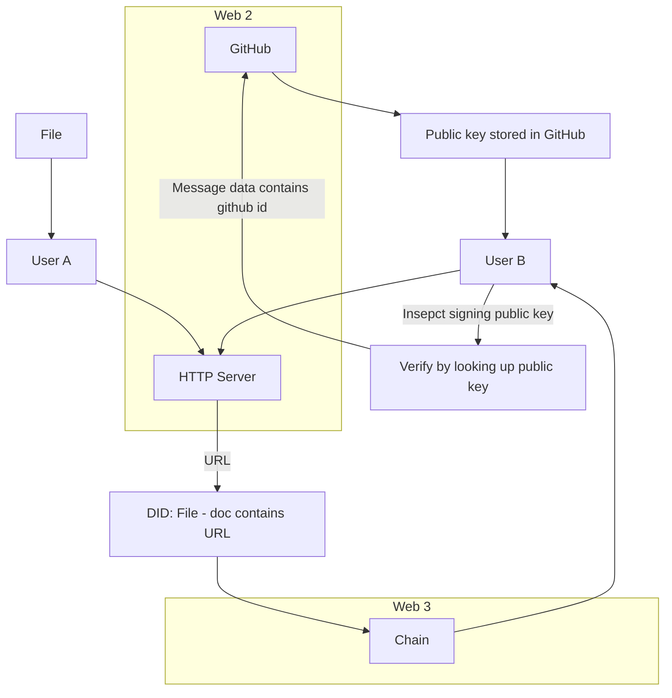

- https://www.thedigitalcatonline.com/blog/2021/06/03/public-key-cryptography-openssh-private-keys/#can-we-convert-private-openssh-keys-into-pem
  - > Can we convert private OpenSSH keys into PEM?[¶](https://www.thedigitalcatonline.com/blog/2021/06/03/public-key-cryptography-openssh-private-keys/#can-we-convert-private-openssh-keys-into-pem)
  - > As OpenSSL doesn't understand the OpenSSH private keys format, a common question among programmers and devops is if it is possible to convert it into a PEM format. As you might have guessed reading the previous sections, the answer is no. The PEM format for private keys uses PKCS#5, so it supports only the standard implementation of PBKDF2.
- We may be able to use step
  - https://github.com/smallstep/certificates/issues/151
- what we mine has real value, system contexts. We can execute them on/off chain to create something of value as determined by ad-hoc batter systems. We are trading services and assets. There is no need for currency.
- did:githubkey: similar to peerdid. Rename method and you have the did:key. And you know how to go verify by treating this the cut off prefix of the method name as an inlut to your did verifying/whatever it is that peerdid lobrary does and do it via a dataflow / system context for each lookup with dataflow as class method being the sepefic type of key (the prefix, so github or keybase, ideally keybase
- Be true to yourself via which organizations tou align with and how your shared effort can overlap with your strategic plans / principles/ passions
- pinciples.yml. Possibly On devlipers repo named after their username. Helps you understand what they care about. Their public facing straregic principles. inclue any models / system contexts with strategic plans that can be used to predict if they would want to work on an issue or not and be a good i fit experience wize in the first place. Similar to agents auto accpting bids. Were an agreed upon bid is what job being done (system co text) and what reward is to be distributed in what ways acording to what triggers (schedule, etc, cancelatuon)
- input network woth geaphql support which auto exposes if desired cached vs dynamicly collected data. Dataflow sent with query to specify how graph nodes should be updated. Almost like an operation which we apply similar to how we do with the prioritizer by wrapping all instantiated  implementations on dataflow inital cont
  - the self fulfilling supply chain
- The software development model must be fully instrumented so as to identify integration opportunities at large and create the cleanest possible architecture for any job(s).
  - what is software fundamentally? Its whatever is not cost effective to put in hardware due to the degree to which your components have become commodities or are on their way to becoming at all stages in your supply chain. Factor in r&d scaled for your neiche application (system context/dataflow) based on past data from research of heard form others (revoews / credentials). Alice will build and manage these supplh chains to foful the goals outlined by her strategic plans in accordance with her principles (gatekeeper and piroritizer) and as optimally as possible as measured by startegic principles.
- `did:web:` is how we prove a link between the key that signed a `did` and a domain / path for sub methods (additional `:`). Example:
  - `did:web:w3c-ccg.github.io:user:alice` -> `https://w3c-ccg.github.io/user/alice/did.json`
  - Could be interesting as we get into ODIC and auth within jobs within kcp
- TODO
  - [ ] Alice, grab me all my org-xyz TODOs from the past 2 weeks
    - [ ] We can do anlaysis on past dropped tasks to see what the chaos metric is
    - [ ] Flag tasks for either backburner (leveled) or need or time warning, identify help to get task done, add to help over time as you identify new ways or appraoches to a task
      - [ ] This allows Alice to take on multiple tasks at once, it's not critical she finish everything right away, this flows into prioritzaiton and if tasksa re missed and it really did mater then we should have seen a negative effect somewehre in a stragegic plan output or lower prinicple values

