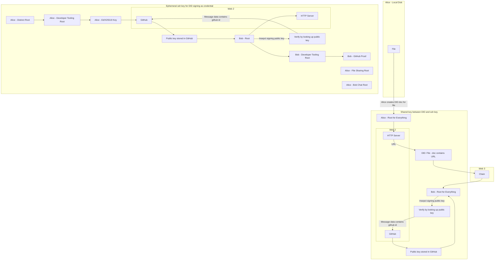
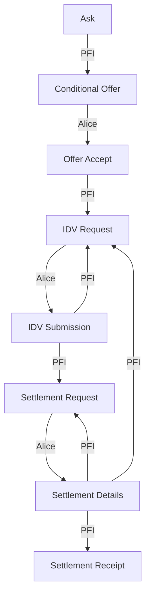

- Part 30

```mermaid

graph TD
subgraph web3[Web 3]
  chain[Chain]
end
subgraph local_disk_alice[Alice - Local Disk]
  file[File]
end

subgraph shared_key_between_did_and_ssh_key[Shared key between DID and ssh key]
  subgraph shared_web2[Web 2]
    shared_github[GitHub]
    shared_http_server[HTTP Server]
  end

  alice_root_for_everything[Alice - Root for Everything]
  bob_root_for_everything[Bob - Root for Everything]

  file -->|Alice creates DID doc for file| alice_root_for_everything --> shared_http_server

  shared_http_server -->|URL| did_doc[DID: File - doc contains URL]

  did_doc --> chain
  chain --> bob_root_for_everything

  bob_root_for_everything -->|Insepct signing public key| verify_message_bob_root_for_everything[Verify by looking up public key]
  verify_message_bob_root_for_everything --> |Message data contains github id| shared_github
  shared_github --> shared_public_key[Public key stored in GitHub] --> bob_root_for_everything
end

subgraph ephemeral_ssh_key_for_did_signing_as_credential[Ephemeral ssh key for DID signing as credential]
  subgraph ephemeral_web2[Web 2]
    ephemeral_github[GitHub]
    ephemeral_http_server[HTTP Server]
  end
  alice_distinct_root[Alice - Distinct Root]
  alice_dev_tools_root[Alice - Developer Tooling Root]
  alice_file_sharing_root[Alice - File Sharing Root]
  alice_bob_chat_root[Alice - Bob Chat Root]
  alice_github_proof[Alice - Ed/X25519 Key]
  bob_distinct_root[Bob - Root]
  bob_dev_tools_root[Bob - Developer Tooling Root]
  bob_github_proof[Bob - GitHub Proof]

  alice_distinct_root --> alice_dev_tools_root --> alice_github_proof --> ephemeral_github
  bob_distinct_root --> bob_dev_tools_root --> bob_github_proof

  bob_distinct_root -->|Insepct signing public key| verify_message_bob_github_proof[Verify by looking up public key]
  verify_message_bob_github_proof --> |Message data contains github id| ephemeral_github
  ephemeral_github --> ephemeral_public_key[Public key stored in GitHub] --> bob_distinct_root
  bob_distinct_root --> ephemeral_http_server
end

```

- Diagram upstream: https://github.com/TBD54566975/tbdex-protocol/blob/1dec6c5ef91a5768d88714f44ae6061bb3919559/lib/README.md

```mermaid
flowchart TD
    Ask --> |PFI| COND_OFFER[Conditional Offer]
    COND_OFFER --> |Alice| OFFER_ACCEPT[Offer Accept]
    OFFER_ACCEPT --> |PFI| IDV_REQ[IDV Request]
    IDV_REQ ---> |Alice| IDV_SUB[IDV Submission]
    IDV_SUB --> |PFI| IDV_REQ
    IDV_SUB --> |PFI| SETTL_REQ[Settlement Request]
    SETTL_REQ --> |Alice| SETTL_DETAIL[Settlement Details]
    SETTL_DETAIL --> |PFI| IDV_REQ
    SETTL_DETAIL ---> |PFI| SETTL_REQ
    SETTL_DETAIL --> |PFI| SETTL_RECEIPT[Settlement Receipt]
```