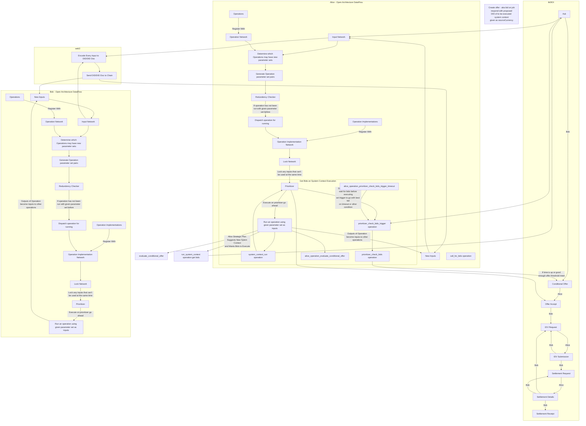

- https://www.youtube.com/watch?v=4D4rGDDh7Q0&list=PLtzAOVTpO2jaHsS4o-sDzDyHEug-1KRbK&index=33&t=1083
- Alice co maintain this distro package, or this set of distro packages
- mermaid to operations based on dataflow which does best guess fuzzy find for pulling operations from inventories (could be accessed via DIDs)
- Given YAML or JSON examples, build dataclasses with correct observed types
- https://github.com/decentralized-identity/decentralized-web-node/issues/136#issuecomment-1085832891
  - > There is no custom tbDEX interface, tbDEX is just a set of schema'd objects sent over Threads and data objects fetchable in Collections. The point of this tech is specifically that you don't create new interfaces or API surfaces, your messages are your own API that you get by simply defining their schemas and how to handle them. You'll never see a tbDEX-specific feature, because tbDEX is literally just a set of message types that are defined independently
  - > Jack, I'm not sure, but I think you may again be twisting up Decentralized Identifiers with Verifiable Credentials. No one issues DIDs, users just have them, and Issuers issue credentials. That said, you can tell which Issuers can issue which credentials by looking for Credential Manifest objects present in their Collections. Credential Manifests are schema'd objects that define what credentials an Issuer can issue.
  - https://github.com/decentralized-identity/decentralized-web-node/issues/136#issuecomment-1107530144
- https://dffml.github.io/dffml-pre-image-removal/master/concepts/dataflow.html
  - Worked through drawing out dataflow on paper combined with tbDEX flow.

