- https://www.youtube.com/watch?v=4D4rGDDh7Q0&list=PLtzAOVTpO2jaHsS4o-sDzDyHEug-1KRbK&index=33&t=1083
- Alice co maintain this distro package, or this set of distro packages
- https://twitter.com/csuwildcat/status/1507798183316901889
  - >  DWA flow: get a DID for your app, write clientside PWA signed w/ your app's DID, publish it in your app's Identity Hub. Users run the app and all data is stored in the user's Identity Hub. No centralized domain, no CA certs, and all activities/data remain far more private/secure
    > Well, DIDs are already here, the datastore part is slated to be beta in July, and writing the glue code for signing/execution of such a 'DWA' variant of a **PWA** would probably take a few weeks, so let's call it **September** to be safe.
- Asked on tbDEX discord
  - https://discord.gg/C7PFJpt4xt
  -  Is there a quickstart on the current tbDEX stack bringup? If not where would be the right place to contribute it and what resources might be good to bring it up? I've been looking at https://github.com/TBD54566975/collaboration/blob/main/milestones/MILESTONE_001.md
  - > [3:35 PM] decentralgabe: our website is under construction and will have exactly what you're looking for...stay tuned 
in the meantime, feel free to bring things up here or as a discussion here https://github.com/TBD54566975/collaboration/discussions
  - The DFFML project is trying to trade of program flow executions on top of tbDEX, just broadcasting here in case anyone wants to collaborate 🙂 https://www.youtube.com/watch?v=4D4rGDDh7Q0&list=PLtzAOVTpO2jaHsS4o-sDzDyHEug-1KRbK&index=35&t=1083s & https://github.com/intel/dffml/discussions/1369#discussioncomment-2747261
  - in the open-source channel on the tbDEX server
    - > [May 4th 2022 7:14 AM] codi0: I've been thinking a bit recently about the ecosystem that might be necessary to support adoption of the DID/VC/DWN stack, particularly for the average person who likely won't be hosting their own node etc, and the potential challenges they may face in adopting. Just interested to start a conversation around what might be most important to that, and potential solutions.
      > Some examples might be:
      > - 1.) Key management - I assume the same problem that applies to wallets could apply to DWNs. If you lose your private key, you lose access to your node and its data. I don't know what's at the cutting edge of key management solutions at the moment, but I would also assume DWNs would become a target of key theft attempts, in order to get to sensitive personal data. 
      > - 2.) Data storage - IPFS pinning seems the obvious solution, though I think there's a lack of a decentralised option there if not running your own node (that isn't blockchain driven). I wonder if DWNs themselves could one day enable an open pinning marketplace? It's a bug-bear of mine that the default IPFS node implementation doesn't allow for permission-driven remote pinning, and PL was unresponsive to questions about it.
      > - 3.) Code storage/execution - IPCS seems to be in early R&D, which could allow for a WASM-compiled version of the DWN code to be stored and executed on the IPFS network itself. Given that's probably some way off, would DWNs have the capability to process requests on behalf of multiple DIDs that aren't controlled by the node owner (without being too much of a security risk), in the same way that pinning extends file storage capabilities?
      > [8:59 AM] pdxjohnny: If 3 is what I think it is then the DFFML project is looking at 3) https://discord.com/channels/937858703112155166/937858703820980296/975064748502691910
      > [1:29 PM] pdxjohnny: @codi0 For 3) we are thinking about forming an Open Architecture working group, where we could iron our methodology for execution on top of DIDs, DWN, ODAP, and tbDEX. We're at the initial stages right now and are trying to figure out who all would be interested in working together. https://raw.githubusercontent.com/intel/dffml/main/docs/rfcs/0000-Open-Architecture.txt 
      > [1:31 PM] pdxjohnny: 2) also from our perspective kind of crosses with 3) because we could leverage execution to facilitate store/load off chain data. But I may not fully understand the angle you're looking at it from. Would love to chat sometime
- mermaid to operations based on dataflow which does best guess fuzzy find for pulling operations from inventories (could be accessed via DIDs)
- Given YAML or JSON examples, build dataclasses with correct observed types
- https://github.com/decentralized-identity/decentralized-web-node/issues/136#issuecomment-1085832891
  - > There is no custom tbDEX interface, tbDEX is just a set of schema'd objects sent over Threads and data objects fetchable in Collections. The point of this tech is specifically that you don't create new interfaces or API surfaces, your messages are your own API that you get by simply defining their schemas and how to handle them. You'll never see a tbDEX-specific feature, because tbDEX is literally just a set of message types that are defined independently
  - > Jack, I'm not sure, but I think you may again be twisting up Decentralized Identifiers with Verifiable Credentials. No one issues DIDs, users just have them, and Issuers issue credentials. That said, you can tell which Issuers can issue which credentials by looking for Credential Manifest objects present in their Collections. Credential Manifests are schema'd objects that define what credentials an Issuer can issue.
  - https://github.com/decentralized-identity/decentralized-web-node/issues/136#issuecomment-1107530144
- https://dffml.github.io/dffml-pre-image-removal/master/concepts/dataflow.html
  - Worked through drawing out dataflow on paper combined with tbDEX flow.
    - The below is still work in progress

```mermaid
flowchart TD
    subgraph notes[Notes]
      tbDEX_all_messages_communicated_via_chain[All tbDEX Messages]
    end

    subgraph web3
      input_to_did[Encode Every Input to DID/DID Doc]
      input_to_chain[Send DID/DID Doc to Chain]

      subgraph tbDEX
        Ask --> |Bob| COND_OFFER[Conditional Offer]
        COND_OFFER --> |Alice| OFFER_ACCEPT[Offer Accept]
        OFFER_ACCEPT --> |Bob| IDV_REQ[IDV Request]
        IDV_REQ ---> |Alice| IDV_SUB[IDV Submission]
        IDV_SUB --> |Bob| IDV_REQ
        IDV_SUB --> |Bob| SETTL_REQ[Settlement Request]
        SETTL_REQ --> |Alice| SETTL_DETAIL[Settlement Details]
        SETTL_DETAIL --> |Bob| IDV_REQ
        SETTL_DETAIL ---> |Bob| SETTL_REQ
        SETTL_DETAIL --> |Bob| SETTL_RECEIPT[Settlement Receipt]
      end
    end

    subgraph alice_open_architecture_dataflow[Alice - Open Architecture DataFlow]
      alice_inputs[New Inputs]
      alice_operations[Operations]
      alice_opimps[Operation Implementations]

      alice_ictx[Input Network]
      alice_opctx[Operation Network]
      alice_opimpctx[Operation Implementation Network]
      alice_rctx[Redundency Checker]
      alice_lctx[Lock Network]

      alice_opctx_operations[Determine which Operations may have new parameter sets]
      alice_ictx_gather_inputs[Generate Operation parameter set pairs]
      alice_opimpctx_dispatch[Dispatch operation for running]
      alice_opimpctx_run_operation[Run an operation using given parameter set as inputs]

      alice_operation_system_context_run[system_context_run operation]
      alice_operation_prioritizer_check_bids[prioritizer_check_bids operation]
      alice_operation_prioritizer_check_bids_trigger[prioritizer_check_bids_trigger operation]
      alice_operation_call_for_bids[call_for_bids operation]

      alice_inputs --> alice_ictx

      alice_operations -->|Register With| alice_opctx
      alice_opimps -->|Register With| alice_opimpctx

      alice_ictx --> alice_opctx_operations
      alice_opctx --> alice_opctx_operations

      alice_opctx_operations --> alice_ictx_gather_inputs
      alice_ictx_gather_inputs --> alice_rctx
      alice_rctx --> |If operation has not been run with given parameter set before| alice_opimpctx_dispatch

      alice_opimpctx_dispatch --> alice_opimpctx

      alice_opimpctx --> alice_lctx

      alice_lctx --> |Lock any inputs that can't be used at the same time| alice_prioritizer

      alice_opimpctx_run_operation --> |Outputs of Operation become inputs to other operations| alice_inputs

      subgraph alice_subgraph_prioritizer[Prioritization]
        alice_prioritizer[Prioritizer]
        alice_new_system_context[New System Context]
        alice_execute_system_context[Alice Execute System Context]
        alice_get_bids[Get Bids on System Context Execution]
        alice_ensure_context_on_chain[Get Bids on System Context Execution]
        alice_check_on_bids[Check on Bids]

        alice_prioritizer -->|New System Context Executed In House| alice_execute_system_context
        alice_prioritizer -->|New System Context Explore Outsourcing Oppertunities| alice_get_bids
        alice_prioritizer -->|System Context Bid Recieved| alice_check_on_bids
        alice_prioritizer -->|Timeout for System Context Bid Selection| alice_check_on_bids

        alice_get_bids -->|Esnure System Context on Chain and<br>Clearly Broadcasted Request for Bids to Chain| alice_ensure_context_on_chain

        alice_ensure_context_on_chain --> input_to_chain

        alice_opimpctx_run_operation --> alice_operation_system_context_run
        alice_opimpctx_run_operation --> alice_operation_evaluate_conditional_offer

        alice_operation_system_context_run --> alice_prioritizer
        alice_prioritizer -->|Determins we want to<br>wait for bids before executing<br>set trigger to go with best bid<br>on timeout or other condition| alice_operation_prioritizer_check_bids_trigger
        alice_operation_prioritizer_check_bids_trigger --> alice_operation_prioritizer_check_bids

        alice_operation_prioritizer_check_bids_trigger_timeout --> alice_operation_prioritizer_check_bids_trigger

        alice_operation_prioritizer_check_bids -->|If time is up or good enough offer threshold meet| COND_OFFER

        alice_prioritizer --> OFFER_ACCEPT
      end
      
      alice_execute_system_context -->|Execute on prioritizer go ahead| alice_opimpctx_run_operation
    end

    subgraph bob_open_architecture_dataflow[Bob - Open Architecture DataFlow]
      bob_inputs[New Inputs]
      bob_operations[Operations]
      bob_opimps[Operation Implementations]
      bob_prioritizer[Prioritizer]

      bob_ictx[Input Network]
      bob_opctx[Operation Network]
      bob_opimpctx[Operation Implementation Network]
      bob_rctx[Redundency Checker]
      bob_lctx[Lock Network]

      bob_opctx_operations[Determine which Operations may have new parameter sets]
      bob_ictx_gather_inputs[Generate Operation parameter set pairs]
      bob_opimpctx_dispatch[Dispatch operation for running]
      bob_opimpctx_run_operation[Run an operation using given parameter set as inputs]

      bob_inputs --> bob_ictx

      bob_operations -->|Register With| bob_opctx
      bob_opimps -->|Register With| bob_opimpctx

      bob_ictx --> bob_opctx_operations
      bob_opctx --> bob_opctx_operations

      bob_opctx_operations --> bob_ictx_gather_inputs
      bob_ictx_gather_inputs --> bob_rctx
      bob_rctx --> |If operation has not been run with given parameter set before| bob_opimpctx_dispatch

      bob_opimpctx_dispatch --> bob_opimpctx

      bob_opimpctx --> bob_lctx

      bob_lctx --> |Lock any inputs that can't be used at the same time| bob_prioritizer
      
      bob_prioritizer -->|Execute on prioritizer go ahead| bob_opimpctx_run_operation

      bob_opimpctx_run_operation --> |Outputs of Operation become inputs to other operations| bob_inputs

      subgraph bob_subgraph_prioritizer[Prioritization]
        bob_prioritizer[Prioritizer]
        bob_new_system_context[New System Context]
        bob_execute_system_context[Bob Execute System Context]

        bob_prioritizer -->|New System Context From External Entity Bid<br>Create offer - aka bid on job.<br>Determine ability to create valid system context<br>given top level system context and assets at disposal.<br>Respond with proposed<br>DID of to be executed system context<br>given as sourceCurrency| Ask

        bob_ensure_context_on_chain --> input_to_chain

        bob_opimpctx_run_operation --> bob_operation_system_context_run
        bob_opimpctx_run_operation --> bob_operation_evaluate_conditional_offer

        bob_operation_system_context_run --> bob_prioritizer
        bob_prioritizer -->|Determins we want to<br>wait for bids before executing<br>set trigger to go with best bid<br>on timeout or other condition| bob_operation_prioritizer_check_bids_trigger
        bob_operation_prioritizer_check_bids_trigger --> bob_operation_prioritizer_check_bids

        bob_operation_prioritizer_check_bids_trigger_timeout --> bob_operation_prioritizer_check_bids_trigger

        bob_operation_prioritizer_check_bids -->|If time is up or good enough offer threshold meet| COND_OFFER

        bob_prioritizer --> OFFER_ACCEPT
      end
      
      bob_execute_system_context -->|Execute on prioritizer go ahead| bob_opimpctx_run_operation
    end


    alice_ictx --> input_to_did
    bob_ictx --> input_to_did

    input_to_did --> input_to_chain

    input_to_chain --> alice_inputs
    input_to_chain --> bob_inputs

    alice_opimpctx_run_operation --> evaluate_conditional_offer

    run_system_context_operation_get_bids[run_system_context operation get bids]

    alice_opimpctx_run_operation -->|Alice Strategic Plan Suggests New Sytem Context<br>and Wants Bids to Execute| run_system_context_operation_get_bids

    tbDEX_all_messages_communicated_via_chain -->|Communicated via Chain for POC| input_to_did
```

