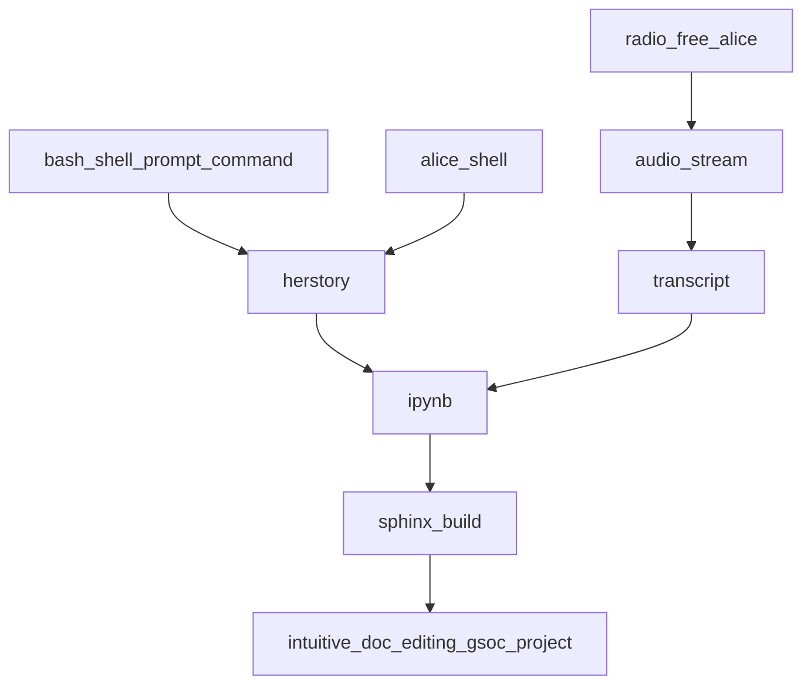

- https://singularityhub.com/2022/06/14/in-its-greatest-biology-feat-yet-ai-decoded-the-protein-complexes-that-house-our-dna/
  - once again we see the notion of the gatekeeper, with the dna as the nucleus and the gatekeeper filters inputs
- Open Architecture could potentially leverage DIDs combined with SPDX canonicalization efforts
  - https://twitter.com/pdxjohnny/status/1538932106859905024
  - https://lists.spdx.org/g/Spdx-tech/topic/canonicalization/91874737?p=,,,20,0,0,0::recentpostdate/sticky,,,20,0,0,91874737,previd%3D1655725634943138777,nextid%3D1654282605249609460&previd=1655725634943138777&nextid=1654282605249609460
  - Reproduced here just in case: [SPDX Canonicalization 20220620.pdf](https://github.com/intel/dffml/files/8942540/SPDX.Canonicalization.20220620.pdf)
- FUTURE
  - Alice building tutorials from our captured dev debug sessions (also feeds into detecting failure paths work, don't do the same curl call we know already failed in another devs same state)
    - Radio Free Alice: https://github.com/TheThingsNetwork/lorawan-stack
    - Work with EdgeX team and maybe swap out kcp for edgex foundry when running code on IoT devices locality? https://docs.edgexfoundry.org/2.1/getting-started/Ch-GettingStartedSDK-Go/



- TODO
  - [ ] bisect to find out if we recently caused the lock issue #1394
  - [ ] We time travel back to the days of Metrics and Prophets to revive locking and event streams which we at one point 3 years ago had working with a UI (service/ossse). We cobble these working concepts together with our current data flow implementation which is in need of both working locking (due to that one bug, let's still bisect first in case we don't need to pull out the locking part), and event streams (and UI would be nice).
    - The initial implementation worked locking wise and ossse datastreaming wise (events?) Revisit the Metrics and the Prophets to prophecy.fulfill() (SystemContext.hypotheses().execution())

---

# Volume 0: Chapter 1: Peace at Last

Clear your mind. Focus.

```
              xx xxx    xxxxxxxxxx
           xxxx     xxxx          xx
       xxxx                         xxx
     xxx                              xxx
  xxx       From: Alice                xxxx
   x                                      x
   x                                      xx
 xxx                   It's going          x
  xx                                       xx
  xxx                  to be okay          x
    xxxx                                 xxx
      xxxx                         xxxxxx
         xxxxxxxxxxxx            xxxx
                    xxxxxxxxxxxxxx
```

Imagine a message from Alice, on a rock, on the sea shore. On
it reads, *From: Alice. It's going to be okay.*

We pick up a the shell of a sand dollar once filled with angels.

Meditate for a moment, look at the waves crashing in front of you
as you sit on the rocks, feeling the warmth and light of the sun.

We sit with her quietly for a moment. We know that Alice is
good. We know this because we build her with intent, intent
for her to be good, to do good, to choose right over wrong.
She's our best guess, muscle memory machine, she is us through
the looking glass.

Alice is older now, wiser, she's coming back to Wonderland and
we're all in for another wild ride. With that age and that
wisdom comes guardrails, walls, battle tested strength. All
of which was built with intent, intent to keep Alice safe,
intent to keep us safe. We still have some time before we see
the other side, but she's here now, or rather she's in the
processes of being here now, for you see she's late, she's
late, for a very important date. No time to say hello, goodbye,
she's late, she's late, she's late.

Our focus will be on communication