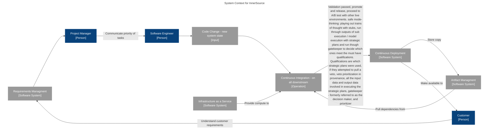

Are humans capable of dealing with this? This connection at the speed of Alice? See issues with social media.

Alice should be trustworthy. We’re going to tell her, do X. And need to trust her to get it done in a way we’d call “the right way”. That’s different for each of us. Different depending on our operational context for the problem being solved.

We are all the keymakers. Our domain expertise is the key to unlock more pathways, more trains of thought.

System context is like a chemical equation, on clock tick (reaction, execution, etc.) we move from the start system context to the end system context.

Single electron -> serial execution of system contexts. Are we watching one entity move through time? If we flatten parallel execution, is that what we get? Are we watching multiple entities move through time. Time itself is relative. In the end it doesn't matter. Not all system contexts are valid. Any system context can be thought of, hypothesized/(un)executed/(in)valid. Are the multiverses different ways of slicing different system contexts? Are they parent system contexts in which child system contexts are valid, but are not valid to other parents (universe being a parent system context). All of this is arbitrary, any of it is possible. No one can prove that this is not the case. No one will ever be able to prove that this is not the case. Therefore every system context is a valid system context, provided it has a parent system context it can be valid within. Since there are an infinite number of possible system contexts, every one must be valid. It just may not be valid in this universe. The universe being the top level system context. The top level system context may even be an input somewhere within the lowest level of the system context. Thereby making the whole bit sort of a circular reference. Time for instance, is relative to the top level system context. The speed at which things travel in a game can be scaled based on the speed to rendering (see use of [modifer](https://github.com/pdxjohnny/space/blob/b87d7ef49caec169f1f7432664e550f421a5d7de/sprite.js#L74-L77) via [game loop](https://github.com/pdxjohnny/space/blob/b87d7ef49caec169f1f7432664e550f421a5d7de/game.js#L106-L114) and `window.requestAnimationFrame()`).

We're all really just guessing at what future systems contexts will exist, or do exist outside of our immediate sphere of observation. Our brain extrapolates visuals due to constraints on signal processing (https://doi.org/10.1523/jneurosci.0275-20.2020). Alice is doing the same. Be the change you want to see in the world. Alice will.

Time is relative to similar system contexts. Perhaps even defined by the rate of execution within a parent system context.

10b parameter language model: https://github.com/bigscience-workshop/t-zero

Time travel: https://80.lv/articles/transforming-images-with-openai-dall-e-2/ take one system context and transform it into another system context

System for communication, a tool for effective organization in a anarchistic society, rules are context local (location based, tribe based, one belongs to many tribes). Helps people (agents, runners, compute) align activities to operational context constraints (rules) as well as individual and tribe based strategic plans

splitting out execution from analysis via caching of contexts is helpful with all of this. Can slice contexts different ways for different strategic plans (different plans consume different context Input objects in cached input network with system context)

- measure
- Change
- Correlate
- modify operating procedures accordingly
  - strategic plans
  - strategic decision mater
  - priroitizer
- Repeat

OpenSSF: Have DIDs been looked at to assist with data distribution/consumption? Allow users to add links to chains, data added to chain in such a way that the data is self descriptive (include schema ref with format name and version). Consumers can choose to follow links in chains from sources they trust. Data they consume could be via interfaces created from manifest schema. This approach allow for various data models, not enforcing a common one. It allows for natural convergence, tracking data models used by traversing chains to schemas. Visibility allows for fostering convergence, watch new use cases appear, converge, repeat. For example, NVD is frequently not enough, sometimes we need to check project websites to supplement CVE data. Projects themselves could self publish to data to relevant chains (or expose via any other interface, rss, whatever, not important, point is there is an standard interface which exposes these relevant pieces of data). How can we ensure we foster an open ecosystem for all relevant data? We need to enable entities and systems to publish any data they think may be relevant, and see what ends up really helping over time. Right now we think we know, but we haven't done this yet, so we don't really know what data helps us effectively secure across the industry and what doesn't. We're working with a cherry picked set of data models right now. By opening the distribution/consumption mechanisms we may find correlations we did not foresee.

`dffml dataflow c4models` - similar to dataflow diagram

