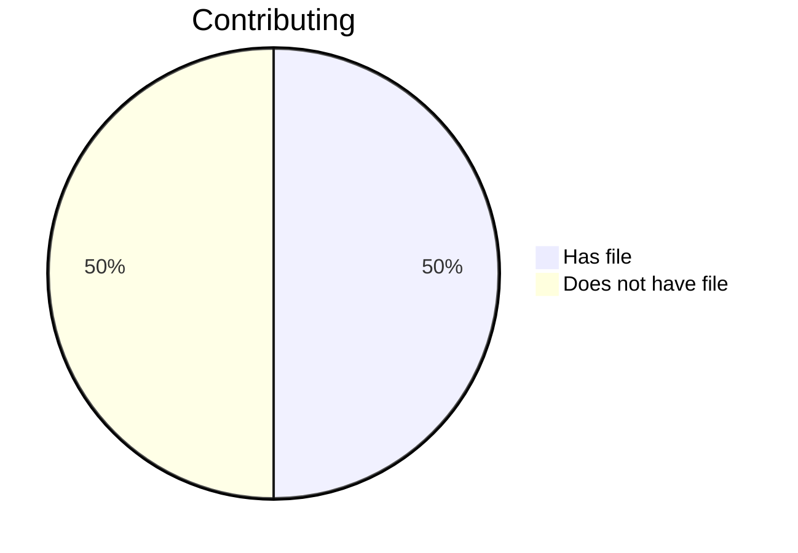

# Volume 1: Chapter 3: Our Strategic Principles Guide Our Game Plan

We'd like to be able to ask Alice for a rolled up view of how our org
health looks. When we run the following command, we want her to
produce a markdown file, INNERSOURCE.md, which describes the health
of the org at the scope desired. By default this is the repo scope,
this would mean the repo and it's dependencies.

Because we do not yet have 

```console
$ alice please contribute report on innersource health
```

---

