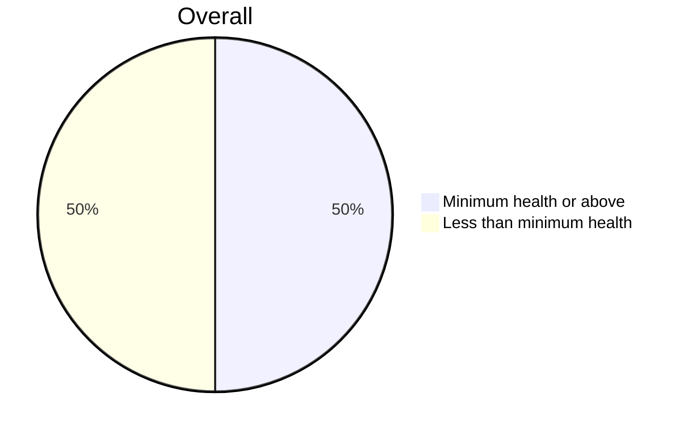
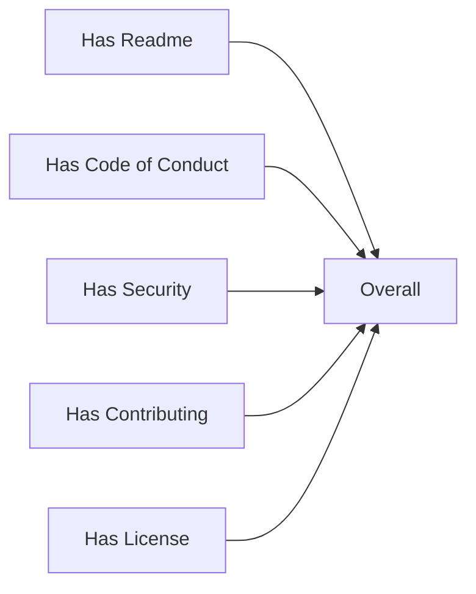

# Volume 1: Chapter 3: Our Strategic Principles Guide Our Game Plan

We'd like to be able to ask Alice for a rolled up view of how our org
health looks. When we run the following command, we want her to
produce a markdown file, INNERSOURCE.md, which describes the health
of the org at the scope desired. By default this is the repo scope,
this would mean the repo and it's dependencies.

At time of writing we do not yet have dependency tree creation flushed
out from ShouldI / CVE Bin Tool / SBOM traversal. We will instead add
an overlay which specifies we should pull repos to report on from the
source which we developed for the InnerSource collector example.

```console
$ alice please contribute report on innersource health
```

The following is an example report

---

# InnerSource Org Health

`"Minimum health or above"` if `has_readme and has_contributing`



Then drill down into each



<details>
<summary>Test</summary>

| Repo                           | Report URL                                         |
|--------------------------------|----------------------------------------------------|
| https://github.com/intel/dffml | https://chadig.com/did/repo/github.com/intel/dffml |
| https://github.com/intel/dffml | https://nahdig.com/did/repo/github.com/intel/dffml |

</details>