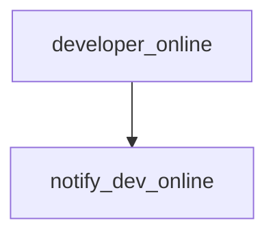

# Architecting Alice: A Shared Stream of Consciousness

> Moved to: https://github.com/intel/dffml/blob/alice/docs/tutorials/rolling_alice/0000_architecting_alice/0005_stream_of_consciousness.md

In this tutorial we use dataflow as class to build Input, Redundancy,
Lock, Operation, and Operation Implementation Networks which interact
with ActiveMQ and Redis. These will enable us to overlay them on
Alice's process local memory resident implementations to facilitate
a shared stream of consciousness.

We then show how two different instances of Alice can communicate where
some operation implementations are instantiated in one process space,
and some in another, we'll then watch them run a simple flow which
print the message "Alice Online" and "Bob Online" to each side.



```python
def developer_online() -> DeveloperOnlineName:
    return getpass.getuser()

def notify_dev_online(developer: DeveloperOnlineName):
    print(f"{developer.title() Online")
```

Later in Architecting Alice, we'll add in rekor to get data
provenance and put the whole bit behind an HTTP API. We validate data
using SCITT. We could optionally require passes from filter operations.
Could add in more mixins to rekor to check on addition.

In Coach Alice, we'll see these techniques used to support caching of
complex inputs such as directory trees (creating new inputs on load
by inspecting cached state overlayed). Our work with the OpenSSF
means that we'll want to be scanning lots of VCS (git, svn, etc.) repos.
We'll use this to cache those repos and restore repos from cached state,
then run an update for the delta, then save back to cache. This way
we can avoid running the full download for larger repos. Small repos
we can examine past runs to estimate size and just clone every time
to avoid resource usage of caching. This will building on our Architecting Alice Webhook Based Distributed Compute leveraging Jenkins (~~if rate limit for github doesnt apply to workflow dispatch then build off that~~ https://docs.github.com/en/actions/learn-github-actions/usage-limits-billing-and-administration#usage-limits) and the Manifest concept.

In Coach Alice we'll also see how we can use this distributed stream
of consciousness to assist with developer communication. We can enable
developers to give Alice dataflows which she runs in the background.
She can then say oh the dev API server restarted (maybe it's your or
your friends laptop running the API, or a real server). This gives
the same impact for both users, a little `notify-send` popup.

- References
  - https://activemq.apache.org/python
    - For Python support we recommend the [Python Stomp Client](http://stomp.github.com/implementations.html)
    - https://stomp.github.io/implementations.html
- Future
  - Notify on diff to discussion thread or git repo with upleveling