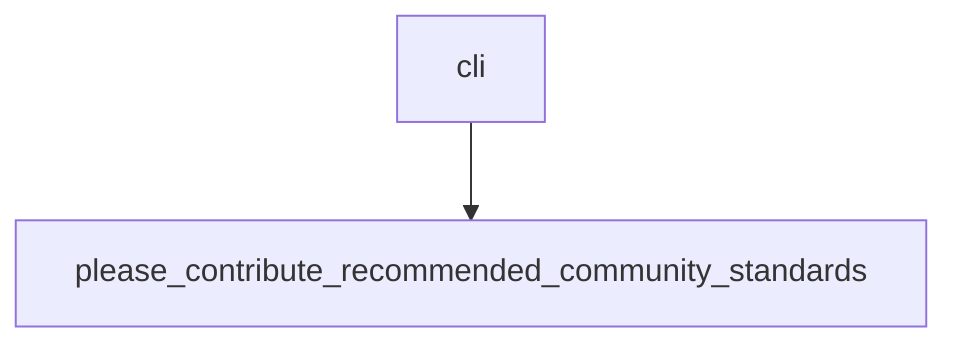

## 2022-09-19 Alice Architecture

- TODO
  - [ ] Write a function that takes a `DataFlow` and produces another `DataFlow`
        that is not executable, but is conceptual, an upleveling of the underlying
        flow.
    - [ ] Write tutorial on how we do this
    - [ ] Start with static mapping
    - [ ] Operation which inserts operations within dataflow into input network (via return)
    - [ ] Optional chains of thought (links between data) can be formed by downstream operations
          which take the output of `running_context_dataflow_operations`. The output is of type
          `Operation`, `expand` is used on the `@op`.

