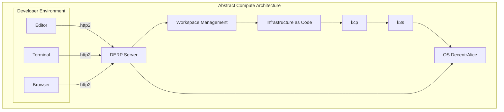

## 2022-10-17 @pdxjohnny Engineering Logs

- https://w3c.github.io/dpv/dpv/
- https://github.com/GLEIF-IT/sally
- https://github.com/comunica/comunica/tree/master/engines/query-sparql#readme
  - https://www.w3.org/TR/sparql11-update/
  - Could be used during tbDEX negotiation of compute contract
- https://ruben.verborgh.org/blog/2018/12/28/designing-a-linked-data-developer-experience/ 
  - https://comunica.github.io/Article-ISWC2018-Demo-GraphQlLD/
  - https://comunica.github.io/Article-ISWC2018-Resource/
    - > Local and remote dataset dumps in RDF serializations
      - https://ontola.io/blog/rdf-serialization-formats/#tldr
      - https://comunica.dev/research/link_traversal/
      - https://comunica.github.io/comunica-feature-link-traversal-web-clients/builds/solid-prov-sources/#transientDatasources=https%3A%2F%2Fwww.rubensworks.net%2F
        - could post cached serializations to github pages to uodate as CMS
        - Could extend to execute data flows on resolution (hiting and endpoint)
        - Need to figure out how to serialize, will analyze data from demos to look for patterns in links and resolvable URLS
        - Will try to use localhost run and python builtin http.server to query data
          - Stand up query server if nessicary
          - Wget mirror to cache everything or something like that
          - Then need to figure out sigstore / rekor provenance
          - http://videolectures.net/iswc2014_verborgh_querying_datasets/
          - https://github.com/rdfjs/comunica-browser
          - https://github.com/LinkedDataFragments/Server.js/blob/6bdb7f4af0af003213c4765065961ca77594aa63/packages/datasource-sparql/lib/datasources/SparqlDatasource.js#L31-L76
- Cloud Development Environments
  - https://github.com/coder/coder/tree/main/examples/templates/do-linux
  - https://github.com/nestybox/sysbox
  - https://coder.com/docs/coder-oss/latest/templates/change-management
  - https://coder.com/docs/coder-oss/latest/secrets#dynamic-secrets
    - > Dynamic secrets are attached to the workspace lifecycle and automatically injected into the workspace. With a little bit of up front template work, they make life simpler for both the end user and the security team. This method is limited to [services with Terraform providers](https://registry.terraform.io/browse/providers), which excludes obscure API providers.
      - https://coder.com/docs/coder-oss/latest/admin/automation
      - Example uses https://registry.terraform.io/providers/RJPearson94/twilio/latest/docs/resources/iam_api_key
        - https://github.com/RJPearson94/terraform-provider-twilio/blob/07460ebdef45d59a52eef13f8bdb9ff0a7219c83/twilio/provider.go#L46
          - > `Sensitive:   true,`
          - https://github.com/RJPearson94/terraform-provider-twilio/blob/61b96f0beb6e5827037ddf2db7b160b52df7c666/examples/credentials/aws/outputs.tf
      - https://github.com/hashicorp/terraform-provider-external/blob/1aff6be074b053de5cc86ca3dc5cac122e8cedcd/internal/provider/test-programs/tf-acc-external-data-source/main.go#L34-L37
      - https://www.terraform.io/language/functions/sensitive
  - https://coder.com/docs/coder-oss/latest/dotfiles
  - https://coder.com/docs/coder-oss/latest/templates#parameters
  - https://registry.terraform.io/providers/hashicorp/external/latest/docs/data-sources/data_source
    - Store secrets in GitHub
    - Run workflow
    - Network with DERP
      - Start callback endpoint on port 0 for random port (`dffml-service-http`)
      - https://pkg.go.dev/tailscale.com/derp
      - > Package derp implements the Designated Encrypted Relay for Packets (DERP) protocol. DERP routes packets to clients using *curve25519* keys as addresses. DERP is used by Tailscale nodes to proxy encrypted WireGuard packets through the Tailscale cloud servers when a direct path cannot be found or opened. DERP is a last resort. Both sides between very aggressive NATs, firewalls, no IPv6, etc? Well, DERP.
    - Send back secrets and OIDC token to callback endpoint using public key provided as input (TODO KERI)
- Web UI Testing
  - https://github.com/mobile-dev-inc/maestro
- DID
  - https://github.com/orgs/w3c/repositories?language=&q=did&sort=&type=all
  - https://w3c.github.io/did-imp-guide/
  - https://github.com/w3c/did-spec-registries/compare/main...pdxjohnny:did-spec-registries:open-architecture-and-alice
    - Need to understand if this is appropriate
      - Goal: Define how DID operations could be used to execute the content addressable contracts
        - See kontian.me references and notes towards bottom of today's engineering logs
          - `did:alice:sha256:01`
          - https://identity.foundation/keri/did_methods/
          - https://w3c.github.io/did-rubric/

### DID Method Registration

As a DID method registrant, I have ensured that my DID method registration complies with the following statements:

- [ ] The DID Method specification [defines the DID Method Syntax](https://w3c.github.io/did-core/#method-syntax).
- [ ] The DID Method specification [defines the Create, Read, Update, and Deactivate DID Method Operations](https://w3c.github.io/did-core/#method-operations).
- [ ] The DID Method specification [contains a Security Considerations section](https://w3c.github.io/did-core/#security-requirements).
- [ ] The DID Method specification [contains a Privacy Considerations section](https://w3c.github.io/did-core/#privacy-requirements).
- [ ] The JSON file I am submitting has [passed all automated validation tests below](#partial-pull-merging).
- [x] The JSON file contains a `contactEmail` address [OPTIONAL].
- [x] The JSON file contains a `verifiableDataRegistry` entry [OPTIONAL].
  - There will be a registry but primarily this our goal is to enable sandboxed distributed compute

---

- DFFML
  - Write operations, use octx.ictx directly:
    - memory_input_network_input_context_to_dict
      - dict_to_json
      - dict_to_did_serialized
        - Takes Credential Manifest (and wallet ref?)
    - memory_ memory_ memory_input_network_input_context_merge_from_dict
      - dict_from_json
      - dict_to_did_serialized
        - Takes Credential Manifest? Or JSON-LD / graphql-ld or maybe just data flow to validate verifiable credentials needed are present (and wallet ref?)
        - https://w3c.github.io/did-rubric/
    - memory_input_network_serve_strawberry_graphql
    - graphql_query
    - watch_for_compute_contracts
      - Watch stream of consciousness for new compute contracts read / verify via container image on demand registry
  - Eventually overlay for input network and associated operations to keep more performant series snapshot data. `List[memory_input_network_input_context_to_dict.outputs.result]` for each change to the input network. Enables rollback to any point as cached state or modification throughout.
- Kubernetes
  - https://k3s.io/
    - https://github.com/k3s-io/k3s/releases/tag/v1.25.2%2Bk3s1
      - Add to OS DecentrAlice
- apko
  - https://github.com/chainguard-dev/apko/tree/main/examples
- KCP
  - https://github.com/kcp-dev/kcp
    - > kcp is a Kubernetes-like control plane focusing on: A control plane for many independent, isolated "clusters" known as workspaces
    - Great, this could satisfy our workspace manager component requirement
      within the abstract compute architecture.
      - Add to OS DecentrAlice
        - Need to figure out how to DWN network on boot and establish webrtc channels
          (or other channels).
        - Need to figure out how to automate and make cluster config / discovery dynamic
          and transparent on each running user instance of OS DecentrAlice.
          - Enable two use cases
            - Automated deployment, autostart on boot systemd config UNIX socket for kcp
            - End user on system, autostart on boot user login systemd config UNIX socket for kcp

  - https://github.com/kcp-dev/kcp/blob/main/docs/concepts.md
  - https://github.com/kcp-dev/kcp/blob/main/docs/virtual-workspaces.md
  - https://github.com/kcp-dev/kcp/blob/main/docs/content/en/main/concepts/workspaces.md
    - > Multi-tenancy is implemented through workspaces. A workspace is a Kubernetes-cluster-like HTTPS endpoint, i.e. an endpoint usual Kubernetes client tooling (client-go, controller-runtime and others) and user interfaces (kubectl, helm, web console, ...) can talk to like to a Kubernetes cluster.
- Downstream validation / stream of consciousness tutorial part
  - Automating an entities post to the daily engineering logs
    - Via receipt of downstream event and trigger of graphql comment
      reply addition to thread.
- TODO
  - [ ] SECURITY Check KCP hard/soft multi-tenancy threat model info
        or ascertain if not present.