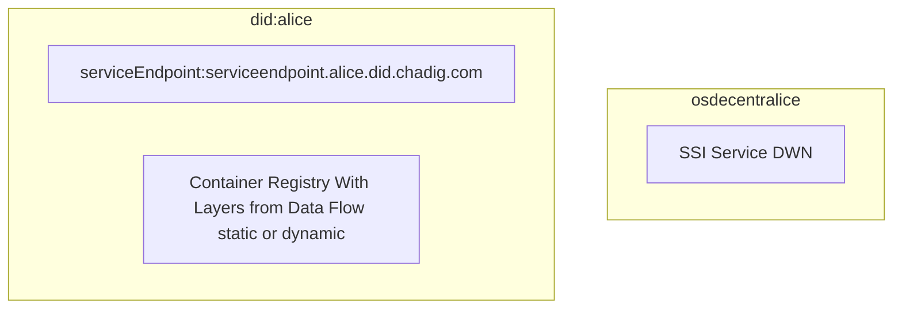

## 2022-10-18 @pdxjohnny Engineering Logs

- https://github.com/OR13/didme.me
  - Goal: Connect this to our content addressable (container images) compute contract stuff
  - Seeing ipfs project id errors on did resolution in deployed demo
    - Cloning to see what's up...
  - https://classic.yarnpkg.com/en/docs/install#centos-stable
  - https://github.com/transmute-industries/verifiable-actions
  - https://lucid.did.cards/identifiers/did:key:z6MkrJx9cCCpu7D1Scy7QovGeWShHzfSPHJXxNq5TwbZzkRF
  - https://api.did.actor/v/eJylkluTmjAAhf9L9lVuQRHy1PVa1hV1FW-dTidA0CgCkiDqjv-9Qbfu5a3tDC-QMyfnfIdX8M1PYk6OHKAfYM15ypCiFEUhF7qcZCsFqpqp-BkJSMwpjphy0EDlXajT4Co7-FJGDomPOU1iKaKMS1CFaqn-WQE0AAjkWYzynAZIgx7ENQNKej2sSlWz6kkWVLFkaoFp-pDU61gXd_BTSspQU5LRkGIvIs17jKspYznJhHEgPLfkhM5Gf8vp-LzvWNt9EbjmdBs0esea0V6c52G6ip2h-9g9xyn1HToLY3DzwLFPWpiLu4Aoq0qqJp6JZiGoI1hdCtV7_THHPGcAvd4q_cGAUyqLFDL2eZIpX0AwRZM3LIkf1Hsp8HKXPAtFSerNuQKyT0d2HJAjQOrX7x9Q_GUMcPlUKPc2xOf3RiVLcsS7NCJiJ70Up1mShKXgLXs7gLWaZo3pKhaRM1L-ITdIAmJwpQihJEBq5gRCpBqoapYUD9cdb4n6hK-T4D-2e_iHsa9FhnmWJqzsgRkj2YcwFbApxLSAnJ7WXtenA_rUWbZfJqOxzeydDZ2mbSx3HeZDV7w7Jzwf0UHE6GKzUO1Is2R519nXnPHam-xC95dUJaQlhaee1js0u43mqWX2oNtsuI5r9fXFLHkeH767Z1Lf14c5nLoR59Cw54O6ZzT0Ge8VZDRtF_PHEbhcfgMlFDfZ
  - https://stackoverflow.com/questions/69692842/error-message-error0308010cdigital-envelope-routinesunsupported

[](https://github.com/intel/dffml/blob/alice/docs/tutorials/rolling_alice/0000_easter_eggs.md#use-the-source-)

```console
$ git clone https://github.com/OR13/didme.me
$ yarn install
$ yarn start
failure...
$ npx next
ready - started server on 0.0.0.0:3000, url: http://localhost:3000
info  - Using webpack 4 in Next.js is deprecated. Please upgrade to using webpack 5: https://nextjs.org/docs/messages/webpack5
warn  - You have enabled experimental feature(s).
warn  - Experimental features are not covered by semver, and may cause unexpected or broken application behavior. Use them at your own risk.

node:internal/crypto/hash:71
  this[kHandle] = new _Hash(algorithm, xofLen);
                  ^

Error: error:0308010C:digital envelope routines::unsupported
    at new Hash (node:internal/crypto/hash:71:19)
    at Object.createHash (node:crypto:133:10)
    at module.exports.__webpack_modules__.18768.module.exports (/home/pdxjohnny/didme.me/node_modules/next/dist/compiled/webpack/bundle4.js:78057:62)
    at NormalModule._initBuildHash (/home/pdxjohnny/didme.me/node_modules/next/dist/compiled/webpack/bundle4.js:51469:16)
    at handleParseError (/home/pdxjohnny/didme.me/node_modules/next/dist/compiled/webpack/bundle4.js:51523:10)
    at /home/pdxjohnny/didme.me/node_modules/next/dist/compiled/webpack/bundle4.js:51555:5
    at /home/pdxjohnny/didme.me/node_modules/next/dist/compiled/webpack/bundle4.js:51410:12
    at /home/pdxjohnny/didme.me/node_modules/next/dist/compiled/webpack/bundle4.js:20871:3
    at iterateNormalLoaders (/home/pdxjohnny/didme.me/node_modules/next/dist/compiled/webpack/bundle4.js:20712:10)
    at Array.<anonymous> (/home/pdxjohnny/didme.me/node_modules/next/dist/compiled/webpack/bundle4.js:20703:4) {
  opensslErrorStack: [ 'error:03000086:digital envelope routines::initialization error' ],
  library: 'digital envelope routines',
  reason: 'unsupported',
  code: 'ERR_OSSL_EVP_UNSUPPORTED'
}

Node.js v18.11.0
pdxjohnny@fedora-s-4vcpu-8gb-sfo3-01 didme.me $ npx next --help^C
pdxjohnny@fedora-s-4vcpu-8gb-sfo3-01 didme.me $
pdxjohnny@fedora-s-4vcpu-8gb-sfo3-01 didme.me $ NODE_OPTIONS=--openssl-legacy-provider npx next
ready - started server on 0.0.0.0:3000, url: http://localhost:3000
info  - Using webpack 4 in Next.js is deprecated. Please upgrade to using webpack 5: https://nextjs.org/docs/messages/webpack5
warn  - You have enabled experimental feature(s).
warn  - Experimental features are not covered by semver, and may cause unexpected or broken application behavior. Use them at your own risk.

event - compiled successfully
Attention: Next.js now collects completely anonymous telemetry regarding usage.
This information is used to shape Next.js' roadmap and prioritize features.
You can learn more, including how to opt-out if you'd not like to participate in this anonymous program, by visiting the following URL:
https://nextjs.org/telemetry


```

- Live at http://pdxjohnny.devbox.nahdig.com:3000/


- Same error, but with traceback popup modal

```
Unhandled Runtime Error
HTTPError: project id required

Call Stack
<unknown>
httperror: project id required
Object.errorHandler [as handleError]
node_modules/ipfs-http-client/src/lib/core.js (67:0)
async Client.fetch
node_modules/ipfs-utils/src/http.js (140:0)
async addAll
node_modules/ipfs-http-client/src/add-all.js (19:0)
async last
node_modules/it-last/index.js (13:0)
$ git grep ipfs-http-client
core/ipfs.ts:const ipfsHttpClient = require("ipfs-http-client");
```

- Attempting to fix IPFS HTTP client code to auth to valid server
- References
  - https://github.com/OR13/didme.me/blob/14da8e47d8a1a4bef3cc1c85968c9f8b6963d269/core/ipfs.ts
    - https://infura.io/product/ipfs
      - Requires API keys, can we run IPFS to HTTP API ourself?
  - https://github.com/fission-codes/ipfs-cluster-aws
  - https://duckduckgo.com/?q=ipfs+did&ia=web
  - https://ipfscluster.io/documentation/deployment/
  - https://npm.devtool.tech/ipfs-did-document
  - https://github.com/ipfs/js-ipfs/tree/master/packages/ipfs-http-client#readme
  - https://github.com/ipfs-examples/js-ipfs-examples/tree/master#ipfs-or-ipfs-core
  - https://github.com/ipfs/js-ipfs/tree/master/packages/ipfs-http-server
- Starting javascript ipfs-http-server

```console
$ yarn add --dev ipfs ipfs-http-server
$ ./node_modules/.bin/jsipfs daemon --offline
Initializing IPFS daemon...
System version: x64/linux
Node.js version: 18.11.0
Swarm listening on /ip4/127.0.0.1/tcp/4002/p2p/12D3KooWRunqtKfjPSHsF24iPdrxVQ2gnhBNtBMBKsz6zj6KoXTR
Swarm listening on /ip4/143.110.152.152/tcp/4002/p2p/12D3KooWRunqtKfjPSHsF24iPdrxVQ2gnhBNtBMBKsz6zj6KoXTR
Swarm listening on /ip4/10.48.0.5/tcp/4002/p2p/12D3KooWRunqtKfjPSHsF24iPdrxVQ2gnhBNtBMBKsz6zj6KoXTR
Swarm listening on /ip4/10.124.0.2/tcp/4002/p2p/12D3KooWRunqtKfjPSHsF24iPdrxVQ2gnhBNtBMBKsz6zj6KoXTR
Swarm listening on /ip4/10.88.0.1/tcp/4002/p2p/12D3KooWRunqtKfjPSHsF24iPdrxVQ2gnhBNtBMBKsz6zj6KoXTR
Swarm listening on /ip4/127.0.0.1/tcp/4003/ws/p2p/12D3KooWRunqtKfjPSHsF24iPdrxVQ2gnhBNtBMBKsz6zj6KoXTR
js-ipfs version: 0.16.1
HTTP API listening on /ip4/127.0.0.1/tcp/5002/http
gRPC listening on /ip4/127.0.0.1/tcp/5003/ws
Gateway (read only) listening on /ip4/127.0.0.1/tcp/9090/http
Web UI available at http://127.0.0.1:5002/webui
Daemon is ready
(node:415890) ExperimentalWarning: The Fetch API is an experimental feature. This feature could change at any time
(Use `node --trace-warnings ...` to show where the warning was created)
```


```console
$ ./node_modules/.bin/jsipfs cat /ipfs/QmRaaUwTNfwgFZpeUy8qrZwrp2dY4kCKmmB5xEqvH3vtD1/readme
(node:288039) ExperimentalWarning: The Fetch API is an experimental feature. This feature could change at any time
(Use `node --trace-warnings ...` to show where the warning was created)
Hello and Welcome to IPFS!

██╗██████╗ ███████╗███████╗
██║██╔══██╗██╔════╝██╔════╝
██║██████╔╝█████╗  ███████╗
██║██╔═══╝ ██╔══╝  ╚════██║
██║██║     ██║     ███████║
╚═╝╚═╝     ╚═╝     ╚══════╝

If you're seeing this, you have successfully installed
IPFS and are now interfacing with the ipfs merkledag!

 -------------------------------------------------------
| Warning:                                              |
|   This is alpha software. Use at your own discretion! |
|   Much is missing or lacking polish. There are bugs.  |
|   Not yet secure. Read the security notes for more.   |
 -------------------------------------------------------

Check out some of the other files in this directory:

  ./about
  ./help
  ./quick-start     <-- usage examples
  ./readme          <-- this file
  ./security-notes
```

- https://github.com/ipfs/js-ipfs/search?l=JavaScript&p=1&q=js-ipfs+version
  - https://github.com/ipfs/js-ipfs/blob/74aee8b3d78f233c3199a3e9a6c0ac628a31a433/packages/ipfs-cli/src/commands/daemon.js#L103
  - https://www.npmjs.com/package/@libp2p/logger
  - https://github.com/ipfs/js-ipfs/blob/74aee8b3d78f233c3199a3e9a6c0ac628a31a433/packages/ipfs-cli/src/commands/daemon.js#L83-L84
  - https://github.com/ipfs/js-ipfs/blob/dfc43d4e9be67fdf25553677f469379d966ff806/packages/ipfs-daemon/src/index.js#L11

```console
$ echo '{"Addresses": ["0.0.0.0"]}' | python -m json.tool | tee init_config.json
$ echo -e 'export PATH="${PATH}:${HOME}/didme.me/node_modules/.bin"' | tee -a ~/.bashrc ~/.bash_profile
$ DEBUG=ipfs:* ./node_modules/.bin/jsipfs daemon --offline --init-config init_config.json 2>&1 | tee output.txt  Initializing IPFS daemon...
System version: x64/linux
Node.js version: 18.11.0
2022-10-19T02:03:35.088Z ipfs:daemon starting
2022-10-19T02:03:35.098Z ipfs:repo opening at: /home/pdxjohnny/.jsipfs
2022-10-19T02:03:35.099Z ipfs:repo init check
2022-10-19T02:03:35.111Z ipfs:repo:lock:fs locking /home/pdxjohnny/.jsipfs/repo.lock
2022-10-19T02:03:35.122Z ipfs:repo acquired repo.lock
2022-10-19T02:03:35.125Z ipfs:repo:version comparing version: 12 and 12
2022-10-19T02:03:35.132Z ipfs:repo creating datastore
2022-10-19T02:03:35.146Z ipfs:repo creating blocks
2022-10-19T02:03:35.148Z ipfs:repo creating keystore
2022-10-19T02:03:35.149Z ipfs:repo creating pins
2022-10-19T02:03:35.150Z ipfs:repo all opened
2022-10-19T02:03:35.289Z ipfs:components:ipns initializing IPNS keyspace (offline)
2022-10-19T02:03:35.341Z ipfs:daemon Using wrtc for webrtc support
2022-10-19T02:03:42.943Z ipfs:mfs:stat Fetching stats for /
2022-10-19T02:03:42.968Z ipfs:mfs:utils:with-mfs-root Loaded MFS root /ipfs/QmUNLLsPACCz1vLxQVkXqqLX5R1X345qqfHbsf67hvA3Nn
2022-10-19T02:03:43.467Z ipfs:mfs-preload monitoring MFS root QmUNLLsPACCz1vLxQVkXqqLX5R1X345qqfHbsf67hvA3Nn
2022-10-19T02:03:43.468Z ipfs:http-api starting
2022-10-19T02:03:45.190Z ipfs:cli TypeError: Cannot read properties of undefined (reading 'info')
    at HttpApi.start (file:///home/pdxjohnny/didme.me/node_modules/ipfs-http-server/src/index.js:119:52)
    at async Daemon.start (file:///home/pdxjohnny/didme.me/node_modules/ipfs-daemon/src/index.js:43:5)
    at async Object.handler (file:///home/pdxjohnny/didme.me/node_modules/ipfs-cli/src/commands/daemon.js:99:7)
```

---

- https://github.com/laurent85v/archuseriso
- https://mags.zone/help/arch-usb.html
  - This website is awesome


- https://github.com/dylanaraps/pywal
- https://github.com/arcmags/ramroot
- https://github.com/justinpinkney/stable-diffusion#fine-tuning
  - See if we can do software / open architecture/ data flow / alice as input/output
- https://github.com/google/prompt-to-prompt
- https://github.com/dragonflydb/dragonfly
- Content addressable service endpoints
  - Resolvable via system context execution
    - How to chain Verifiable Credential requests and executions?
- Questions for Orie
  - Where to focus implementation work?
  - What processes to be aware of?
    - Best practices
    - Spec writing
      - DID method
        - Applicability with content addressable hybrid off chain execution via services endpoints?
- What groups to be aware of?
- https://github.com/intel/dffml/blob/alice/docs/tutorials/rolling_alice/0000_architecting_alice/0006_os_decentralice.md
  - Updated from engineering logs: [2022-10-13 Rolling Alice: Architecting Alice: OS DecentrAlice: Engineering Logs](https://github.com/intel/dffml/discussions/1406?sort=new#discussioncomment-3870218)
  - Next steps
    - https://www.packer.io/plugins/builders/qemu
- https://hackaday.io/project/187780-wifi-cam-20
- https://github.com/chainguard-dev/text4shell-policy/blob/284462ddb9cd9025ca0efa1d9f74c8f681ed622e/slsa.csv 
- https://docs.google.com/document/d/17n8hfdPfqfpbPj4ss-ep4nCkpp9ZBoy6U2Q1t7j-knI/edit
  - https://twitter.com/mfosterio/status/1582089134436294656
- https://www.youtube.com/watch?v=LUF7plExdv8
  - https://json-ld.org/
  - https://twitter.com/mfosterio/status/1582072270083993600
  - https://github.com/rubensworks/jsonld-streaming-parser.js
    - We don't care about parsing yet (we might when loading caching)
    - We'll prototype with serialization and query via https://comunica.dev
  - https://github.com/rubensworks/jsonld-streaming-serializer.js
  - https://json-ld.org/contexts/person.jsonld
    - http://xmlns.com/foaf/0.1/#term_Agent
  - https://github.com/digitalbazaar/pyld
    - SECURITY Unmaintained since Aug 6th 2020
    - `jsonld.set_document_loader(jsonld.aiohttp_document_loader(timeout=...))`
    - https://github.com/digitalbazaar/pyld/tree/master/lib/pyld/documentloader
    - https://github.com/digitalbazaar/pyld/blob/master/lib/pyld/documentloader/aiohttp.py
      - We can write a document loader that similar to our `serviceEndpoint` work,
        encodes the system context to a string.
        - The shim (loader) might parse that and based on the context (parsing
          json-ld) determine that a URL is a dataflow which says to fetch the
          resource.
- https://gitlab.alpinelinux.org/alpine/ca-certificates/-/blob/8ccb7c2c2672966030af65dc135890d636c576d1/Makefile#L31

### Validating QEMU Packer build boots and can execute Alice CLI from `/wolfi` chroot

- References
  - https://www.packer.io/plugins/builders/qemu
  - https://docs.fedoraproject.org/en-US/fedora/latest/install-guide/appendixes/Kickstart_Syntax_Reference/#sect-kickstart-commands-sshpw
  - https://www.packer.io/community-tools#templates
    - https://github.com/boxcutter/fedora
      - No strong signs of maintenance but, packer APIs are stable,
        and templates provided are pinned to versions.
      - https://github.com/boxcutter/fedora/blob/6e5fccff745f4ce7b2951ab6d19cd960f61be32d/fedora29-ws.json
      - https://github.com/boxcutter/fedora/blob/main/http/ks-fedora29-ws.cfg
      - https://github.com/boxcutter/fedora/blob/6e5fccff745f4ce7b2951ab6d19cd960f61be32d/fedora29-server.json
      - https://github.com/boxcutter/fedora/blob/main/http/ks-fedora29-server.cfg
      - https://github.com/boxcutter/fedora/blob/6e5fccff745f4ce7b2951ab6d19cd960f61be32d/script/sshd.sh
      - https://github.com/boxcutter/fedora/blob/main/LICENSE
  - https://alt.fedoraproject.org/cloud/

```console
pdxjohnny@fedora-s-4vcpu-8gb-sfo3-01 ~ $ curl -fLOC - https://download.fedoraproject.org/pub/fedora/linux/releases/36/Cloud/x86_64/images/Fedora-Cloud-Base-36-1.5.x86_64.qcow2
  % Total    % Received % Xferd  Average Speed   Time    Time     Time  Current
                                 Dload  Upload   Total   Spent    Left  Speed
  0     0    0     0    0     0      0      0 --:--:-- --:--:-- --:--:--     0
100  427M  100  427M    0     0   268M      0  0:00:01  0:00:01 --:--:--  355M
pdxjohnny@fedora-s-4vcpu-8gb-sfo3-01 ~ $ sha256sum Fedora-Cloud-Base-36-1.5.x86_64.qcow2
ca9e514cc2f4a7a0188e7c68af60eb4e573d2e6850cc65b464697223f46b4605  Fedora-Cloud-Base-36-1.5.x86_64.qcow2
````

- Added Fedora 36 Cloud support to boxcutter Fedora packer templates

```console
pdxjohnny@fedora-s-4vcpu-8gb-sfo3-01 boxcutter-fedora $ git log -n 1
commit 6e5fccff745f4ce7b2951ab6d19cd960f61be32d (HEAD -> main, origin/main, origin/HEAD)
Author: Mischa Taylor <57647141+taylorific@users.noreply.github.com>
Date:   Fri May 28 07:21:41 2021 -0700

    Update README.md
```

```diff
diff --git a/fedora.json b/fedora.json
index 851882f..20b7f62 100644
--- a/fedora.json
+++ b/fedora.json
@@ -1,6 +1,33 @@
 {
   "_command": "Build with `packer build fedora.json`",
   "builders": [
+    {
+      "boot_command": [
+        "<tab> linux inst.text biosdevname=0 inst.ks=http://{{ .HTTPIP }}:{{ .HTTPPort}}/{{ user `kickstart` }}<enter><enter>"
+      ],
+      "boot_wait": "10s",
+      "disk_size": "{{ user `disk_size` }}",
+      "http_directory": "http",
+      "iso_checksum": "{{ user `iso_checksum` }}",
+      "iso_urls": [
+        "{{ user `iso_path` }}/{{ user `iso_name` }}",
+        "{{ user `iso_url` }}"
+      ],
+      "shutdown_command": "{{ user `shutdown_command` }}",
+      "ssh_password": "{{ user `ssh_password` }}",
+      "ssh_username": "{{ user `ssh_username` }}",
+      "ssh_timeout": "10000s",
+      "type": "qemu",
+      "output_directory": "output_fedora_{{ user `vm_name` }}",
+      "format": "qcow2",
+      "accelerator": "kvm",
+      "net_device": "virtio-net",
+      "disk_interface": "virtio",
+      "headless": true,
+      "vm_name": "{{ user `vm_name` }}",
+      "memory": "{{ user `memory` }}",
+      "cpus": "{{ user `cpus` }}"
+    },
     {
       "boot_command": [
         "<tab> linux text biosdevname=0 ks=http://{{ .HTTPIP }}:{{ .HTTPPort}}/{{ user `kickstart` }}<enter><enter>"
@@ -10,7 +37,6 @@
       "headless": "{{ user `headless` }}",
       "http_directory": "http",
       "iso_checksum": "{{ user `iso_checksum` }}",
-      "iso_checksum_type": "{{ user `iso_checksum_type` }}",
       "iso_urls": [
         "{{ user `iso_path` }}/{{ user `iso_name` }}",
         "{{ user `iso_url` }}"
@@ -37,7 +63,6 @@
       "headless": "{{ user `headless` }}",
       "http_directory": "http",
       "iso_checksum": "{{ user `iso_checksum` }}",
-      "iso_checksum_type": "{{ user `iso_checksum_type` }}",
       "iso_urls": [
         "{{ user `iso_path` }}/{{ user `iso_name` }}",
         "{{ user `iso_url` }}"
@@ -66,7 +91,6 @@
       "guest_os_type": "{{ user `parallels_guest_os_type` }}",
       "http_directory": "http",
       "iso_checksum": "{{ user `iso_checksum` }}",
-      "iso_checksum_type": "{{ user `iso_checksum_type` }}",
       "iso_urls": [
         "{{ user `iso_path` }}/{{ user `iso_name` }}",
         "{{ user `iso_url` }}"
diff --git a/fedora36-server.json b/fedora36-server.json
new file mode 100644
index 0000000..e0c506c
--- /dev/null
+++ b/fedora36-server.json
@@ -0,0 +1,12 @@
+{
+  "_comment": "Build with `packer build -var-file=fedora36-server.json fedora.json`",
+  "vm_name": "fedora36-server",
+  "cpus": "1",
+  "disk_size": "65536",
+  "iso_checksum": "421c4c6e23d72e4669a55e7710562287ecd9308b3d314329960f586b89ccca19",
+  "iso_name": "Fedora-Server-netinst-x86_64-36-1.5.iso",
+  "iso_url": "https://forksystems.mm.fcix.net/fedora/linux/releases/36/Server/x86_64/iso/Fedora-Server-netinst-x86_64-36-1.5.iso",
+  "kickstart": "ks-fedora36-server.cfg",
+  "memory": "2048",
+  "update": "true"
+}
diff --git a/script/sshd.sh b/script/sshd.sh
index 0d75547..5a5cae2 100644
--- a/script/sshd.sh
+++ b/script/sshd.sh
@@ -6,3 +6,13 @@ echo "==> Turning off sshd DNS lookup to prevent timeout delay"
 echo "UseDNS no" >> /etc/ssh/sshd_config
 echo "==> Disabling GSSAPI authentication to prevent timeout delay"
 echo "GSSAPIAuthentication no" >> /etc/ssh/sshd_config
+
+echo "==> Downloading DecentrAlice sshd banner"
+# TODO(security) Don't run curl as root
+curl -fLo /etc/ssh/sshd_banner https://gist.github.com/pdxjohnny/5f358e749181fac74a750a3d00a74b9e/raw/42d3d810948fd3326c36dd33d7ebc668b61e0642/sshd_banner
+sha256sum -c - <<<'8ac49ba9114076b59d95b62308adcee046d997e9572f565dcebc97f4e8d6e219  /etc/ssh/sshd_banner' || rm -f /etc/ssh/sshd_banner
+echo "==> Enabling OS DecentrAlice sshd banner"
+echo "Banner /etc/ssh/sshd_banner" >> /etc/ssh/sshd_config
+
+echo "==> Enabling Chroot Directory for Wolfi based OS DecentrAlice"
+echo "ChrootDirectory /wolfi" >> /etc/ssh/sshd_config
```

- It's hung
  - https://phoenixnap.com/kb/ssh-port-forwarding

```console
$ ssh -nNT -L 5900:127.0.0.1:5966 -i ~/.ssh/nahdig -o UserKnownHostsFile=/dev/null -o StrictHostKeyChecking=no -o PasswordAuthentication=no $USER@143.110.152.152
```


- Found out `ks` is invalid, unused in new versions of fedora
  - https://cobbler.github.io/
  - https://docs.fedoraproject.org/en-US/fedora/latest/install-guide/advanced/Kickstart_Installations/
  - https://docs.fedoraproject.org/en-US/fedora/latest/install-guide/advanced/Network_based_Installations/
  - https://duckduckgo.com/?q=ks+is+deprecated+and+has+been+removed&ia=web
  - https://bugzilla.redhat.com/show_bug.cgi?id=1907566
  - https://github.com/beaker-project/beaker/issues/83
  - https://access.redhat.com/documentation/en-us/red_hat_enterprise_linux/7/html/installation_guide/chap-anaconda-boot-options#sect-boot-options-deprecated-removed


- Okay we got a new error: `auth has been removed`


- Then we got: `install has been removed`
- https://github.com/hashicorp/packer-plugin-qemu
  - https://github.com/hashicorp/packer-plugin-qemu/blob/main/builder/qemu/step_create_vtpm.go


- `$ journalctl -xeu anaconda`




- TODO
  - [ ] Update Manifest ADR / docs with JSON-LD learnings / make it included
  - [ ] Update shim with JSON-LD learnings / make it included
  - [ ] Explore https://github.com/arcmags/ramroot