## 2022-11-03 @pdxjohnny Engineering Logs

- https://identity.foundation/presentation-exchange/spec/v2.0.0/
- https://github.com/geyang/plan2vec
- http://tkipf.github.io/
  - https://github.com/tkipf/gae
    - Graph Auto Encoders
  - https://github.com/tkipf/c-swm
    - > Contrastive Learning of Structured World Models
      > Abstract: A structured understanding of our world in terms of objects, relations, and hierarchies is an important component of human cognition. Learning such a structured world model from raw sensory data remains a challenge. As a step towards this goal, we introduce Contrastively-trained Structured World Models (C-SWMs). C-SWMs utilize a contrastive approach for representation learning in environments with compositional structure. We structure each state embedding as a set of object representations and their relations, modeled by a graph neural network. This allows objects to be discovered from raw pixel observations without direct supervision as part of the learning process. We evaluate C-SWMs on compositional environments involving multiple interacting objects that can be manipulated independently by an agent, simple Atari games, and a multi-object physics simulation. Our experiments demonstrate that C-SWMs can overcome limitations of models based on pixel reconstruction and outperform typical representatives of this model class in highly structured environments, while learning interpretable object-based representations.
- https://filebase.com/blog/5-ipfs-use-cases-you-havent-thought-of-yet/ (or maybe they're exactly what we've thought of ;)
  - > 1. Distributed Package Management
    > Package managers, like NPM, are typically stored and managed in a centralized manner. By hosting software packages on IPFS, they can be stored in a distributed manner that is publicly available. Any changes to the package’s versions, like a bug fix, will be reflected by a new CID value, allowing for verification of updates and tracking package development.
    >
    > 2. Hosting Software Containers
    > Software containers, like Docker containers, are available through registries like the Docker registry. This is similar to pulling a package from NPM, but for software containers rather than packages. By using IPFS to host your own registry, there isn’t any domain hosting configuration, DNS management, or user permission management. Simply use the IPFS CID with an IPFS HTTP gateway inside a curl command rather than use a docker pull command to download the container’s image.
    >
    > 3. Decentralized eCommerce websites
    > Through packages like DeCommerce, spinning up your own eCommerce website is as simple as uploading the DeCommerce folder to your Filebase bucket, then navigating to the IPFS HTTP gateway URL of your folder’s CID. Since you’re equipped with all the necessary webpages and configurations, you can spend time customizing the CSS files to style your website and upload your products, rather than spending time managing a domain, SSL certificates, or figuring out how to accept crypto payments (which DeCommerce comes equipped with by default!).
    >
    > 4. Decentralized Operating Systems
    > Along with decentralized software packages and containers, decentralized operating systems are another form of software that can benefit from being hosted on IPFS. A handful of decentralized, blockchain-based operating systems have emerged, but storing the data for these operating systems on their native blockchain is typically against best practices since it can be expensive and have high latency. For this reason, many layer-1 blockchains will either store data externally, like on IPFS, or they’ll use a layer-2 chain to handle data storage. Therefore, decentralized operating systems that run on a blockchain can highly benefit from being hosted on IPFS while they communicate externally with the blockchain network.
    >
    > 5. Decentralized Peer Reviews of Academic Research Papers
    > In addition to JPEG art being minted as NFT collections, pieces of writing such as blog posts, eBooks, and whitepapers have begun to gain traction as NFTs as well. Written content benefits from being minted on a blockchain since it verifies who the original writer of the content is, allowing for easier clarification when it comes to copyright, plagiarism, or other duplication of writing. Any text document or Microsoft Word document can be hosted on IPFS and then referenced inside of a smart contract that is deployed on Ethereum or Polygon, creating a permanent record of that piece of writing being created by the author.
    > For academic papers, this is a real game changer. Users can mint their research papers as an NFT that uses PDF or text documents hosted on IPFS, and then gain a verifiable reputation for their research and any peer reviews they contribute to other researchers. In addition to the smart contract’s verifiable address, the IPFS CID can be used as an additional form of verification that the content was created by the original author and hasn’t been altered since publication.
- Carbon aware SDK
  - https://github.com/Green-Software-Foundation/carbon-aware-sdk
- Metrics for carbon measurement
  - Software Carbon Intensity (SCI) - taking action
  - Greenhouse Gas Protocol (GHG) - reporting
- Carbon measurement telemetry
  - https://github.com/sustainable-computing-io/kepler
    - > Kepler (Kubernetes-based Efficient Power Level Exporter) uses eBPF to probe energy related system stats and exports as Prometheus metrics
  - https://github.com/hubblo-org/scaphandre
    - >  Energy consumption metrology agent. Let "scaph" dive and bring back the metrics that will help you make your systems and applications more sustainable !

```console
$ pip install -e entities/alice
$ dffml service dev entrypoints list dffml.overlays.alice.please.log.todos
OverlayCLI = alice.please.log.todos.todos:OverlayCLI -> alice 0.0.1 (/home/pdxjohnny/.local/lib/python3.9/site-packages)
OverlayRecommendedCommunityStandards = alice.please.log.todos.todos:AlicePleaseLogTodosDataFlowRecommendedCommnuityStandardsGitHubIssues -> alice 0.0.1 (/home/pdxjohnny/.local/lib/python3.9/site-packages)
$ dffml service dev export -configloader json alice.cli:AlicePleaseLogTodosCLIDataFlow | tee logtodos.json
$ (echo '```mermaid' && dffml dataflow diagram logtodos.json && echo '```') | gh gist create -f "LOG_TODOS_DATAFLOW_DIAGRAM.md" -
```

- Oneliner: `dffml service dev export -configloader json alice.cli:AlicePleaseLogTodosCLIDataFlow | tee logtodos.json && (echo '```mermaid' && dffml dataflow diagram logtodos.json && echo '```') | gh gist create -f "LOG_TODOS_DATAFLOW_DIAGRAM.md" -`

```mermaid
graph TD
subgraph a759a07029077edc5c37fea0326fa281[Processing Stage]
style a759a07029077edc5c37fea0326fa281 fill:#afd388b5,stroke:#a4ca7a
subgraph d9f2c7ced7f00879629c15363c8e307d[alice.please.log.todos.todos.AlicePleaseLogTodosDataFlow:guess_repo_string_is_url]
style d9f2c7ced7f00879629c15363c8e307d fill:#fff4de,stroke:#cece71
37178be7db9283b44a1786fef58ffa8d[alice.please.log.todos.todos.AlicePleaseLogTodosDataFlow:guess_repo_string_is_url]
5c7743e872c165030dcf051c712106fc(repo_string)
5c7743e872c165030dcf051c712106fc --> 37178be7db9283b44a1786fef58ffa8d
8d32e3f614b2c8f9d23e7469eaa1da12(result)
37178be7db9283b44a1786fef58ffa8d --> 8d32e3f614b2c8f9d23e7469eaa1da12
end
subgraph ed8e05e445eabbcfc1a201e580b1371e[alice.please.log.todos.todos.AlicePleaseLogTodosDataFlow:guessed_repo_string_is_operations_git_url]
style ed8e05e445eabbcfc1a201e580b1371e fill:#fff4de,stroke:#cece71
f129d360149fb01bbfe1ed8c2f9bbaa2[alice.please.log.todos.todos.AlicePleaseLogTodosDataFlow:guessed_repo_string_is_operations_git_url]
77a8695545cb64a7becb9f50343594c3(repo_url)
77a8695545cb64a7becb9f50343594c3 --> f129d360149fb01bbfe1ed8c2f9bbaa2
d259a05785074877b9509ed686e03b3a(result)
f129d360149fb01bbfe1ed8c2f9bbaa2 --> d259a05785074877b9509ed686e03b3a
end
subgraph 0fb0b360e14eb7776112a5eaff5252de[alice.please.log.todos.todos.OverlayCLI:cli_has_repos]
style 0fb0b360e14eb7776112a5eaff5252de fill:#fff4de,stroke:#cece71
81202a774dfaa2c4d640d25b4d6c0e55[alice.please.log.todos.todos.OverlayCLI:cli_has_repos]
7ba42765e6fba6206fd3d0d7906f6bf3(cmd)
7ba42765e6fba6206fd3d0d7906f6bf3 --> 81202a774dfaa2c4d640d25b4d6c0e55
904eb6737636f1d32a6d890f449e9081(result)
81202a774dfaa2c4d640d25b4d6c0e55 --> 904eb6737636f1d32a6d890f449e9081
end
subgraph 964c0fbc5f3a43fce3f0d9f0aed08981[alice.please.log.todos.todos.OverlayCLI:cli_is_meant_on_this_repo]
style 964c0fbc5f3a43fce3f0d9f0aed08981 fill:#fff4de,stroke:#cece71
b96195c439c96fa7bb4a2d616bbe47c5[alice.please.log.todos.todos.OverlayCLI:cli_is_meant_on_this_repo]
2a071a453a1e677a127cee9775d0fd9f(cmd)
2a071a453a1e677a127cee9775d0fd9f --> b96195c439c96fa7bb4a2d616bbe47c5
f6bfde5eece6eb52bb4b4a3dbc945d9f(result)
b96195c439c96fa7bb4a2d616bbe47c5 --> f6bfde5eece6eb52bb4b4a3dbc945d9f
end
subgraph 2e2e8520e9f9420ffa9e54ea29965019[alice.please.log.todos.todos.OverlayCLI:cli_run_on_repo]
style 2e2e8520e9f9420ffa9e54ea29965019 fill:#fff4de,stroke:#cece71
f60739d83ceeff1b44a23a6c1be4e92c[alice.please.log.todos.todos.OverlayCLI:cli_run_on_repo]
0ac5645342c7e58f9c227a469d90242e(repo)
0ac5645342c7e58f9c227a469d90242e --> f60739d83ceeff1b44a23a6c1be4e92c
6e82a330ad9fcc12d0ad027136fc3732(result)
f60739d83ceeff1b44a23a6c1be4e92c --> 6e82a330ad9fcc12d0ad027136fc3732
end
subgraph b8e0594907ccea754b3030ffc4bdc3fc[alice.please.log.todos.todos:gh_issue_create_support]
style b8e0594907ccea754b3030ffc4bdc3fc fill:#fff4de,stroke:#cece71
6aeac86facce63760e4a81b604cfab0b[alice.please.log.todos.todos:gh_issue_create_support]
dace6da55abe2ab1c5c9a0ced2f6833d(file_present)
dace6da55abe2ab1c5c9a0ced2f6833d --> 6aeac86facce63760e4a81b604cfab0b
d2a58f644d7427227cefd56492dfcef9(repo)
d2a58f644d7427227cefd56492dfcef9 --> 6aeac86facce63760e4a81b604cfab0b
7f2eb20bcd650dc00cde5ca0355b578f(issue_url)
6aeac86facce63760e4a81b604cfab0b --> 7f2eb20bcd650dc00cde5ca0355b578f
end
subgraph cd002409ac60a3eea12f2139f2743c52[alice.please.log.todos.todos:git_repo_to_git_repository_checked_out]
style cd002409ac60a3eea12f2139f2743c52 fill:#fff4de,stroke:#cece71
e58ba0b1a7efba87321e9493d340767b[alice.please.log.todos.todos:git_repo_to_git_repository_checked_out]
00a9f6e30ea749940657f87ef0a1f7c8(repo)
00a9f6e30ea749940657f87ef0a1f7c8 --> e58ba0b1a7efba87321e9493d340767b
bb1abf628d6e8985c49381642959143b(repo)
e58ba0b1a7efba87321e9493d340767b --> bb1abf628d6e8985c49381642959143b
end
subgraph d3ec0ac85209a7256c89d20f758f09f4[check_if_valid_git_repository_URL]
style d3ec0ac85209a7256c89d20f758f09f4 fill:#fff4de,stroke:#cece71
f577c71443f6b04596b3fe0511326c40[check_if_valid_git_repository_URL]
7440e73a8e8f864097f42162b74f2762(URL)
7440e73a8e8f864097f42162b74f2762 --> f577c71443f6b04596b3fe0511326c40
8e39b501b41c5d0e4596318f80a03210(valid)
f577c71443f6b04596b3fe0511326c40 --> 8e39b501b41c5d0e4596318f80a03210
end
subgraph af8da22d1318d911f29b95e687f87c5d[clone_git_repo]
style af8da22d1318d911f29b95e687f87c5d fill:#fff4de,stroke:#cece71
155b8fdb5524f6bfd5adbae4940ad8d5[clone_git_repo]
eed77b9eea541e0c378c67395351099c(URL)
eed77b9eea541e0c378c67395351099c --> 155b8fdb5524f6bfd5adbae4940ad8d5
8b5928cd265dd2c44d67d076f60c8b05(ssh_key)
8b5928cd265dd2c44d67d076f60c8b05 --> 155b8fdb5524f6bfd5adbae4940ad8d5
4e1d5ea96e050e46ebf95ebc0713d54c(repo)
155b8fdb5524f6bfd5adbae4940ad8d5 --> 4e1d5ea96e050e46ebf95ebc0713d54c
6a44de06a4a3518b939b27c790f6cdce{valid_git_repository_URL}
6a44de06a4a3518b939b27c790f6cdce --> 155b8fdb5524f6bfd5adbae4940ad8d5
end
subgraph 98179e1c9444a758d9565431f371b232[dffml_operations_innersource.operations:code_of_conduct_present]
style 98179e1c9444a758d9565431f371b232 fill:#fff4de,stroke:#cece71
fb772128fdc785ce816c73128e0afd4d[dffml_operations_innersource.operations:code_of_conduct_present]
f333b126c62bdbf832dddf105278d218(repo)
f333b126c62bdbf832dddf105278d218 --> fb772128fdc785ce816c73128e0afd4d
1233aac886e50641252dcad2124003c9(result)
fb772128fdc785ce816c73128e0afd4d --> 1233aac886e50641252dcad2124003c9
end
subgraph d03657cbeff4a7501071526c5227d605[dffml_operations_innersource.operations:contributing_present]
style d03657cbeff4a7501071526c5227d605 fill:#fff4de,stroke:#cece71
8da2c8a3eddf27e38838c8b6a2cd4ad1[dffml_operations_innersource.operations:contributing_present]
2a1ae8bcc9add3c42e071d0557e98b1c(repo)
2a1ae8bcc9add3c42e071d0557e98b1c --> 8da2c8a3eddf27e38838c8b6a2cd4ad1
52544c54f59ff4838d42ba3472b02589(result)
8da2c8a3eddf27e38838c8b6a2cd4ad1 --> 52544c54f59ff4838d42ba3472b02589
end
subgraph da39b149b9fed20f273450b47a0b65f4[dffml_operations_innersource.operations:security_present]
style da39b149b9fed20f273450b47a0b65f4 fill:#fff4de,stroke:#cece71
c8921544f4665e73080cb487aef7de94[dffml_operations_innersource.operations:security_present]
e682bbcfad20caaab15e4220c81e9239(repo)
e682bbcfad20caaab15e4220c81e9239 --> c8921544f4665e73080cb487aef7de94
5d69c4e5b3601abbd692ade806dcdf5f(result)
c8921544f4665e73080cb487aef7de94 --> 5d69c4e5b3601abbd692ade806dcdf5f
end
subgraph 062b8882104862540d584516edc60008[dffml_operations_innersource.operations:support_present]
style 062b8882104862540d584516edc60008 fill:#fff4de,stroke:#cece71
5cc75c20aee40e815abf96726508b66d[dffml_operations_innersource.operations:support_present]
f0e4cd91ca4f6b278478180a188a2f5f(repo)
f0e4cd91ca4f6b278478180a188a2f5f --> 5cc75c20aee40e815abf96726508b66d
46bd597a57e034f669df18ac9ae0a153(result)
5cc75c20aee40e815abf96726508b66d --> 46bd597a57e034f669df18ac9ae0a153
end
end
subgraph a4827add25f5c7d5895c5728b74e2beb[Cleanup Stage]
style a4827add25f5c7d5895c5728b74e2beb fill:#afd388b5,stroke:#a4ca7a
end
subgraph 58ca4d24d2767176f196436c2890b926[Output Stage]
style 58ca4d24d2767176f196436c2890b926 fill:#afd388b5,stroke:#a4ca7a
end
subgraph inputs[Inputs]
style inputs fill:#f6dbf9,stroke:#a178ca
6e82a330ad9fcc12d0ad027136fc3732 --> 5c7743e872c165030dcf051c712106fc
8d32e3f614b2c8f9d23e7469eaa1da12 --> 77a8695545cb64a7becb9f50343594c3
128516cfa09b0383023eab52ee24878a(seed<br>dffml.util.cli.CMD)
128516cfa09b0383023eab52ee24878a --> 7ba42765e6fba6206fd3d0d7906f6bf3
128516cfa09b0383023eab52ee24878a(seed<br>dffml.util.cli.CMD)
128516cfa09b0383023eab52ee24878a --> 2a071a453a1e677a127cee9775d0fd9f
904eb6737636f1d32a6d890f449e9081 --> 0ac5645342c7e58f9c227a469d90242e
f6bfde5eece6eb52bb4b4a3dbc945d9f --> 0ac5645342c7e58f9c227a469d90242e
46bd597a57e034f669df18ac9ae0a153 --> dace6da55abe2ab1c5c9a0ced2f6833d
bb1abf628d6e8985c49381642959143b --> d2a58f644d7427227cefd56492dfcef9
4e1d5ea96e050e46ebf95ebc0713d54c --> 00a9f6e30ea749940657f87ef0a1f7c8
d259a05785074877b9509ed686e03b3a --> 7440e73a8e8f864097f42162b74f2762
d259a05785074877b9509ed686e03b3a --> eed77b9eea541e0c378c67395351099c
a6ed501edbf561fda49a0a0a3ca310f0(seed<br>git_repo_ssh_key)
a6ed501edbf561fda49a0a0a3ca310f0 --> 8b5928cd265dd2c44d67d076f60c8b05
8e39b501b41c5d0e4596318f80a03210 --> 6a44de06a4a3518b939b27c790f6cdce
bb1abf628d6e8985c49381642959143b --> f333b126c62bdbf832dddf105278d218
bb1abf628d6e8985c49381642959143b --> 2a1ae8bcc9add3c42e071d0557e98b1c
bb1abf628d6e8985c49381642959143b --> e682bbcfad20caaab15e4220c81e9239
bb1abf628d6e8985c49381642959143b --> f0e4cd91ca4f6b278478180a188a2f5f
end
```




```console
$ alice please log todos -log debug -repos https://github.com/pdxjohnny/testaaa
```

- Got `alice please log todos` (slimmed down version of `alice please contribute`) working https://github.com/intel/dffml/commit/adf32b4e80ad916de7749fc0b6e99485fb4107b7
  - This will allow us to not deal with the pull request code unless triggered.
  - Without the overlay infra complete it's harder to remove ops / modify flows than it is to add to them (static overlay application is what we have and is easy, it's just auto flow the definitions together)
- TODO
  - [ ] Added `alice please log todos` command adf32b4e80ad916de7749fc0b6e99485fb4107b7
    - [ ] Find tutorial location for this, maybe just with data flows stuff
- Future
  - [ ] Alice refactor and optimize for reduced carbon emissions
    - [ ] Integrate into PR feedback loop