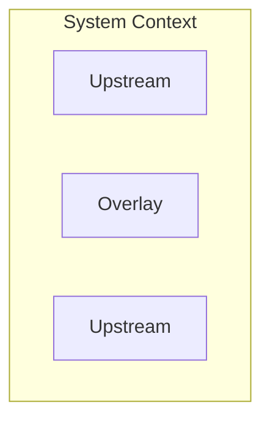

## 2022-11-13 @pdxjohnny Engineering Logs

> - The following mermaid diagram became: https://github.com/intel/dffml/commit/fbcbc86b5c52932bccf4cd6321f4e79f60ad3023
>   - https://github.com/intel/dffml/blob/alice/docs/tutorials/rolling_alice/0000_architecting_alice/0002_shes_ariving_when.md#system-context
>   - Original: 

- Theres a poets beach poem that goes with this.
  - “timeless”, the one from Athena/Minerva

