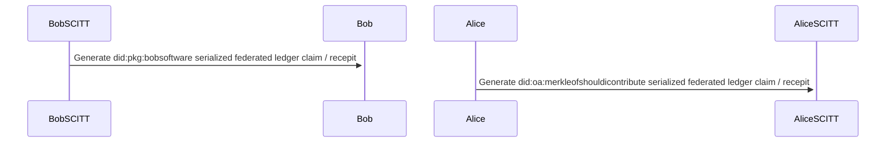

## 2022-11-14 @pdxjohnny Engineering Logs

- https://qwik.builder.io/docs/getting-started/ 
  - Serialization of cached flow via overlay to inputs to qwik cache resume
  - https://qwik.builder.io/docs/concepts/resumable/
  - https://qwik.builder.io/docs/advanced/qrl/
- https://www.intel.com/content/www/us/en/newsroom/news/intel-introduces-real-time-deepfake-detector.html#gs.isnpod
  - ActivityPub (mastodon) “follow” post metrics / SCITT receipt of analysis if video is deepfake as reply.
- Architecting Alice: An Image: ActivityPub posts with YAML body content and image attached with post quantum jwk or scitt receipt or maybe content address of scitt reciept?
- https://twitter.com/pippellia/status/1592184568345509888
  - Central planning and chaos
    - This is why we focus in equilibrium
- https://arxiv.org/abs/2211.01724
  - > We formulate learning for control as an inverse problem -- inverting a dynamical system to give the actions which yield desired behavior. The key challenge in this formulation is a distribution shift -- the learning agent only observes the forward mapping (its actions' consequences) on trajectories that it can execute, yet must learn the inverse mapping for inputs-outputs that correspond to a different, desired behavior. We propose a general recipe for inverse problems with a distribution shift that we term iterative inversion -- learn the inverse mapping under the current input distribution (policy), then use it on the desired output samples to obtain new inputs, and repeat. As we show, iterative inversion can converge to the desired inverse mapping, but under rather strict conditions on the mapping itself.
    >
    > We next apply iterative inversion to learn control. Our input is a set of demonstrations of desired behavior, given as video embeddings of trajectories, and our method iteratively learns to imitate trajectories generated by the current policy, perturbed by random exploration noise. We find that constantly adding the demonstrated trajectory embeddings as input to the policy when generating trajectories to imitate, a-la iterative inversion, steers the learning towards the desired trajectory distribution. To the best of our knowledge, this is the first exploration of learning control from the viewpoint of inverse problems, and our main advantage is simplicity -- we do not require rewards, and only employ supervised learning, which easily scales to state-of-the-art trajectory embedding techniques and policy representations. With a VQ-VAE embedding, and a transformer-based policy, we demonstrate non-trivial continuous control on several tasks. We also report improved performance on imitating diverse behaviors compared to reward based methods.
- Search compressed asciinemas recordings

```console
$ (for file in $(ls ~/asciinema); do unxz -d - < ~/asciinema/$file; done) | grep -i /1421
```

- [Mark Foster’s Linked Data User Experience Notes](https://docs.google.com/document/d/17n8hfdPfqfpbPj4ss-ep4nCkpp9ZBoy6U2Q1t7j-knI/edit)
  - https://futureinternet.io
  - https://twitter.com/mfosterio/status/1591580950752002048
    - > I’ve been looking for ways to access toots in JSON-LD Activity Streams I can return my profile by passing the header Accept application/ld+json on https://mas.to/@mfoster/ but my toots are in JSON https://mas.to/api/v1/accounts/109254208668258721/statuses
      - I haven’t been following Mark for long (3 months? However he seems extremely capable, everyone in SCITT, everyone in GUAC for sure, and of course Changuard folks, Dan, starts with an A? The main wolfi maintainer) know whats up and the DIF crew as the leaders)  if he is playing with the same shit we were thinking with activitypub and current federation technology as a bridge / base to build up and integrate infra full decentralization
        - ^ Strategic mapping (wardly maps) of train of thought (supply chain security) activity (life) open/internal implementation/spec research / definition see early videos explainers on doing depth of field mapping state of the art mapping see recent threat model example on avoiding engagement with unaligned research communities.
        - Mastodon SCITT review on data provenance (attached as knowledge graph link, reply, source: github docs? Content exact match? Add reply with SCITT recpit as body, integrate into mastodon to show these types of replys integrated into UI HTTPS CA view from browser style check with detail expand, but in html, just as a ui example, parse out the fields and display them nice
- https://datatracker.ietf.org/doc/html/draft-birkholz-scitt-architecture-02#section-7
- “Maybe it’s a dream?” Sequence - 2022-09-21
- https://mermaid-js.github.io/mermaid-live-editor/



- Cross referencing is fun
  - Graphs are fun
  - https://en.wikipedia.org/wiki/Knowledge_graph
- Unfortunately GitHub reworks the links which include the `#discussioncomment-4131964` part in them on display and results in jumping to the top of the thread.


- Podman oddities
- No time for SELinux policies currently but we should integrate in the future
  (`JobKubernetesOrchestrator`?)
  - https://github.com/containers/udica#creating-selinux-policy-for-container

```console
$ sudo setenforce 0
$ sudo dnf install -y aardvark-dns podman-compose
```

- Spinning up mastodon
  - What do you call N instances of Alice communicated via the
    Thought Communication Protocol?
    - A Mastodon server full of toots
- References
  - https://github.com/containers/podman-compose
  - https://github.com/mastodon/mastodon
  - https://docs.joinmastodon.org/admin/setup/
  - https://github.com/mastodon/mastodon/commit/b17202ca0f19b83beb25afdba7e713a0f9329ffa
- If `podman-compose` asks which registry for images choose `docker.io`
- Getting name resolution failures (DNS)
  - Fixed by installing aardvark-dns
- Ruby projects usually have an initial database population
  - This must be done on first load to preform database "migrations", setting up the DB.
  - `FATAL:  role "mastodon" does not exist`
    - https://github.com/mastodon/mastodon/issues/18113
    - https://github.com/mastodon/mastodon/pull/16947
  - `FATAL:  database "mastodon_production" does not exist`
    - https://hub.docker.com/_/postgres
      - > `POSTGRES_DB`
        >
        > This optional environment variable can be used to define a different name for the default database that is created when the image is first started. If it is not specified, then the value of `POSTGRES_USER` will be used.
- On `podman-compose up` it still complains
  - `2022-11-15 05:41:58.177 UTC [90] FATAL:  database "mastodon_production" does not exist`
  - `2022-11-15 05:42:02.256 UTC [91] FATAL:  role "mastodon" does not exist`

```console
$ git clone https://github.com/mastodon/mastodon
$ cd mastodon
$ git checkout v4.0.2
$ git log
commit 03b0f3ac83edfc46d304bfca1539ca6000e36fc3 (HEAD, tag: v4.0.2, main)
Author: Eugen Rochko <eugen@zeonfederated.com>
Date:   Tue Nov 15 03:57:18 2022 +0100

    Bump version to 4.0.2 (#20725)
$ podman-compose run web bundle rake mastodon:webpush:generate_vapid_key
VAPID_PRIVATE_KEY=djDWtpmK3CD9SUu_UedWOyOGBA-Fg5r5MWiXVhZHZbo=
VAPID_PUBLIC_KEY=BOVhs2nJ4MpjdaHAVu7UdlPlNjzMX2pKFyKgOxvYO7LX8eh_H3TA_O_Ebc2asJPhDoqImE-3Xz0BmaeM_EucIr0=
$ podman-compose run web bundle rake secret
6ece0cfc0772308479f5cd6155cfc282defab20307a185b399dd6cf2f9b4dc3a81691406c368905c64ccafa56e05473371dccb3b948001369b18be57cfefa9f4
$ podman-compose run web bundle rake secret
e2fdd51aef896d5c8c647dbbf6b77426d3df59a2817181738afc0ae8ab9e34a413ac5f21ef9aed41f38260075ff6a327f29e717f03c66296dfc0838402851714
$ cat > .env.production <<'EOF'
# This is a sample configuration file. You can generate your configuration
# with the `rake mastodon:setup` interactive setup wizard, but to customize
# your setup even further, you'll need to edit it manually. This sample does
# not demonstrate all available configuration options. Please look at
# https://docs.joinmastodon.org/admin/config/ for the full documentation.

# Note that this file accepts slightly different syntax depending on whether
# you are using `docker-compose` or not. In particular, if you use
# `docker-compose`, the value of each declared variable will be taken verbatim,
# including surrounding quotes.
# See: https://github.com/mastodon/mastodon/issues/16895

# Federation
# ----------
# This identifies your server and cannot be changed safely later
# ----------
LOCAL_DOMAIN=example.com

# Redis
# -----
# REDIS_HOST=localhost
REDIS_HOST=redis
REDIS_PORT=6379

# PostgreSQL
# ----------
# DB_HOST=/var/run/postgresql
DB_HOST=db
DB_USER=mastodon
DB_NAME=mastodon_production
DB_PASS=mastodon
DB_PORT=5432

# Elasticsearch (optional)
# ------------------------
# ES_ENABLED=true
# ES_HOST=localhost
# ES_PORT=9200
# Authentication for ES (optional)
# ES_USER=elastic
# ES_PASS=password

# Secrets
# -------
# Make sure to use `podman-compose run web bundle rake secret` to generate secrets
# -------
SECRET_KEY_BASE=6ece0cfc0772308479f5cd6155cfc282defab20307a185b399dd6cf2f9b4dc3a81691406c368905c64ccafa56e05473371dccb3b948001369b18be57cfefa9f4
OTP_SECRET=e2fdd51aef896d5c8c647dbbf6b77426d3df59a2817181738afc0ae8ab9e34a413ac5f21ef9aed41f38260075ff6a327f29e717f03c66296dfc0838402851714

# Web Push
# --------
# Generate with `podman-compose run web bundle rake mastodon:webpush:generate_vapid_key`
# --------
VAPID_PRIVATE_KEY=djDWtpmK3CD9SUu_UedWOyOGBA-Fg5r5MWiXVhZHZbo=
VAPID_PUBLIC_KEY=BOVhs2nJ4MpjdaHAVu7UdlPlNjzMX2pKFyKgOxvYO7LX8eh_H3TA_O_Ebc2asJPhDoqImE-3Xz0BmaeM_EucIr0=

# Sending mail
# ------------
# SMTP_SERVER=smtp.mailgun.org
# SMTP_PORT=587
# SMTP_LOGIN=
# SMTP_PASSWORD=
# SMTP_FROM_ADDRESS=notifications@example.com

# File storage (optional)
# -----------------------
# S3_ENABLED=true
# S3_BUCKET=files.example.com
# AWS_ACCESS_KEY_ID=
# AWS_SECRET_ACCESS_KEY=
# S3_ALIAS_HOST=files.example.com

# IP and session retention
# -----------------------
# Make sure to modify the scheduling of ip_cleanup_scheduler in config/sidekiq.yml
# to be less than daily if you lower IP_RETENTION_PERIOD below two days (172800).
# -----------------------
IP_RETENTION_PERIOD=31556952
SESSION_RETENTION_PERIOD=31556952
EOF
$ head -n 16 docker-compose.yml 
version: '3'
services:
  db:
    restart: always
    image: postgres:14-alpine
    shm_size: 256mb
    networks:
      - internal_network
    healthcheck:
      test: ['CMD', 'pg_isready', '-U', 'postgres']
    volumes:
      - ./postgres14:/var/lib/postgresql/data
    environment:
      - 'POSTGRES_DB=mastodon_production'
      - 'POSTGRES_USER=mastodon'
      - 'POSTGRES_PASSWORD=mastodon'
$ podman-compose down
$ sudo rm -rf postgres14/
$ time podman-compose run web bundle exec rake mastodon:setup
$ podman-compose up
podman start -a mastodon_db_1
podman start -a mastodon_redis_1
podman start -a mastodon_web_1
podman start -a mastodon_streaming_1
podman start -a mastodon_sidekiq_1
WARN Starting streaming API server master with 3 workers 
=> Booting Puma
=> Rails 6.1.7 application starting in production 
=> Run `bin/rails server --help` for more startup options
WARN Starting worker 3 
WARN Starting worker 2 
WARN Worker 3 now listening on 0.0.0.0:4000 
WARN Worker 2 now listening on 0.0.0.0:4000 
WARN Starting worker 1 
WARN Worker 1 now listening on 0.0.0.0:4000 
2022-11-15T05:55:05.712Z pid=2 tid=53y WARN: `config.options[:key] = value` is deprecated, use `config[:key] = value`: ["/opt/mastodon/lib/mastodon/redis_config.rb:38:in `<top (required)>'", "/opt/mastodon/config/application.rb:53:in `require_relative'"]
2022-11-15T05:55:06.117Z pid=2 tid=53y INFO: Booting Sidekiq 6.5.7 with Sidekiq::RedisConnection::RedisAdapter options {:driver=>:hiredis, :url=>"redis://redis:6379/0", :namespace=>nil}
[4] Puma starting in cluster mode...
[4] * Puma version: 5.6.5 (ruby 3.0.4-p208) ("Birdie's Version")
[4] *  Min threads: 5
[4] *  Max threads: 5
[4] *  Environment: production
[4] *   Master PID: 4
[4] *      Workers: 2
[4] *     Restarts: (✔) hot (✖) phased
[4] * Preloading application
[4] * Listening on http://0.0.0.0:3000
[4] Use Ctrl-C to stop
[4] - Worker 0 (PID: 10) booted in 0.01s, phase: 0
[4] - Worker 1 (PID: 11) booted in 0.0s, phase: 0
2022-11-15 05:55:07.954 UTC [233] FATAL:  role "postgres" does not exist
2022-11-15T05:55:09.222Z pid=2 tid=53y INFO: Booted Rails 6.1.7 application in production environment
2022-11-15T05:55:09.222Z pid=2 tid=53y INFO: Running in ruby 3.0.4p208 (2022-04-12 revision 3fa771dded) [x86_64-linux]
2022-11-15T05:55:09.222Z pid=2 tid=53y INFO: See LICENSE and the LGPL-3.0 for licensing details.
2022-11-15T05:55:09.222Z pid=2 tid=53y INFO: Upgrade to Sidekiq Pro for more features and support: https://sidekiq.org
2022-11-15T05:55:09.227Z pid=2 tid=53y INFO: Loading Schedule
2022-11-15T05:55:09.227Z pid=2 tid=53y INFO: Scheduling scheduled_statuses_scheduler {"every"=>"5m", "class"=>"Scheduler::ScheduledStatusesScheduler", "queue"=>"scheduler"}
2022-11-15T05:55:09.228Z pid=2 tid=53y INFO: Scheduling trends_refresh_scheduler {"every"=>"5m", "class"=>"Scheduler::Trends::RefreshScheduler", "queue"=>"scheduler"}
2022-11-15T05:55:09.231Z pid=2 tid=53y INFO: Scheduling trends_review_notifications_scheduler {"every"=>"6h", "class"=>"Scheduler::Trends::ReviewNotificationsScheduler", "queue"=>"scheduler"}
2022-11-15T05:55:09.232Z pid=2 tid=53y INFO: Scheduling indexing_scheduler {"every"=>"5m", "class"=>"Scheduler::IndexingScheduler", "queue"=>"scheduler"}
2022-11-15T05:55:09.234Z pid=2 tid=53y INFO: Scheduling vacuum_scheduler {"cron"=>"59 5 * * *", "class"=>"Scheduler::VacuumScheduler", "queue"=>"scheduler"}
2022-11-15T05:55:09.237Z pid=2 tid=53y INFO: Scheduling follow_recommendations_scheduler {"cron"=>"44 8 * * *", "class"=>"Scheduler::FollowRecommendationsScheduler", "queue"=>"scheduler"}
2022-11-15T05:55:09.239Z pid=2 tid=53y INFO: Scheduling user_cleanup_scheduler {"cron"=>"2 5 * * *", "class"=>"Scheduler::UserCleanupScheduler", "queue"=>"scheduler"}
2022-11-15T05:55:09.240Z pid=2 tid=53y INFO: Scheduling ip_cleanup_scheduler {"cron"=>"13 4 * * *", "class"=>"Scheduler::IpCleanupScheduler", "queue"=>"scheduler"}
2022-11-15T05:55:09.242Z pid=2 tid=53y INFO: Scheduling pghero_scheduler {"cron"=>"0 0 * * *", "class"=>"Scheduler::PgheroScheduler", "queue"=>"scheduler"}
2022-11-15T05:55:09.245Z pid=2 tid=53y INFO: Scheduling instance_refresh_scheduler {"cron"=>"0 * * * *", "class"=>"Scheduler::InstanceRefreshScheduler", "queue"=>"scheduler"}
2022-11-15T05:55:09.247Z pid=2 tid=53y INFO: Scheduling accounts_statuses_cleanup_scheduler {"interval"=>"1 minute", "class"=>"Scheduler::AccountsStatusesCleanupScheduler", "queue"=>"scheduler"}
2022-11-15T05:55:09.248Z pid=2 tid=53y INFO: Scheduling suspended_user_cleanup_scheduler {"interval"=>"1 minute", "class"=>"Scheduler::SuspendedUserCleanupScheduler", "queue"=>"scheduler"}
2022-11-15T05:55:09.249Z pid=2 tid=53y INFO: Schedules Loaded
2022-11-15T05:55:09.255Z pid=2 tid=53y uniquejobs=upgrade_locks INFO: Already upgraded to 7.1.27
2022-11-15T05:55:09.256Z pid=2 tid=53y uniquejobs=reaper INFO: Starting Reaper
2022-11-15T05:55:09.262Z pid=2 tid=2dsy uniquejobs=reaper INFO: Nothing to delete; exiting.
2022-11-15T05:55:09.265Z pid=2 tid=2dsy uniquejobs=reaper INFO: Nothing to delete; exiting.
[09ee11d4-25e1-4330-9f65-b642ae6a3732] Chewy request strategy is `mastodon`
[09ee11d4-25e1-4330-9f65-b642ae6a3732] method=HEAD path=/health format=*/* controller=HealthController action=show status=200 duration=2.07 view=1.45
2022-11-15 05:55:38.155 UTC [288] FATAL:  role "postgres" does not exist
[ActionDispatch::HostAuthorization::DefaultResponseApp] Blocked host: 0.0.0.0
[ActionDispatch::HostAuthorization::DefaultResponseApp] Blocked host: localhost
ERR! fc8ec631-1ade-4713-a8c8-6125ba6cf87c Error: Access token does not cover required scopes
ERR! 17f0501f-de79-45f8-93cb-e5b8bb7178f7 Error: Access token does not cover required scopes
[40016351-367b-4d43-be62-e2340fde46de] method=HEAD path=/health format=*/* controller=HealthController action=show status=200 duration=0.26 view=0.13
[ActionDispatch::HostAuthorization::DefaultResponseApp] Blocked host: localhost
2022-11-15 05:56:08.911 UTC [346] FATAL:  role "postgres" does not exist
2022-11-15T05:56:09.297Z pid=2 tid=2dv6 INFO: queueing Scheduler::AccountsStatusesCleanupScheduler (accounts_statuses_cleanup_scheduler)
2022-11-15T05:56:09.301Z pid=2 tid=2dvq class=Scheduler::AccountsStatusesCleanupScheduler jid=030c3bd88689321e9097003a INFO: start
2022-11-15T05:56:09.304Z pid=2 tid=2dyi INFO: queueing Scheduler::SuspendedUserCleanupScheduler (suspended_user_cleanup_scheduler)
2022-11-15T05:56:09.306Z pid=2 tid=2dz2 class=Scheduler::SuspendedUserCleanupScheduler jid=03293e9712b7020c368c02bc INFO: start
2022-11-15T05:56:09.341Z pid=2 tid=2dvq class=Scheduler::AccountsStatusesCleanupScheduler jid=030c3bd88689321e9097003a elapsed=0.04 INFO: done
2022-11-15T05:56:09.356Z pid=2 tid=2dz2 class=Scheduler::SuspendedUserCleanupScheduler jid=03293e9712b7020c368c02bc elapsed=0.051 INFO: done
$ curl -v http://localhost:3000/
*   Trying 127.0.0.1:3000...
* Connected to localhost (127.0.0.1) port 3000 (#0)
> GET / HTTP/1.1
> Host: localhost:3000
> User-Agent: curl/7.85.0
> Accept: */*
> 
* Mark bundle as not supporting multiuse
< HTTP/1.1 403 Forbidden
< Content-Type: text/html; charset=UTF-8
< Content-Length: 0
< 
* Connection #0 to host localhost left intact
```

- TODO
  - [ ] SCITT help make no new HTTP headers, SCITT as DID method? SCITT via ATP probably. Prototype as Data Repository.
  - [x] [SCITT API Emulator Bring Up](https://github.com/intel/dffml/discussions/1406?sort=new#discussioncomment-4110695)
  - [ ] ActivityPub (Mastodon) bring up
  - [ ] Spin up and configure Atuin client / server https://github.com/ellie/atuin/blob/main/docs/server.md
  - [x] Update `Architecting Alice: She's Arriving When?` to include a start at some content
        we'd planned and drafted here and there related to the system context.
    - [docs: tutorials: rolling alice: architecting alice: she's arriving when?: Mermaid diagram for pattern with stream of consciousness and SCITT](https://github.com/intel/dffml/commit/fbcbc86b5c52932bccf4cd6321f4e79f60ad3023)
    - In this we only implement in memory and serialized SCITT for a
      single entity, Alice, no Bob yet. In `Architecting Alice: Stream of Consciousness`,
      we implement Alice and Bob comms on top of SBOM, VEX, VDR.
  - [ ] Ping https://github.com/ipvm-wg/spec/pull/8/files with She's Arriving When? and
       Our Open Source Guide to illustrate dataflow and provenance.
    - [ ] Explain how [https://gist.github.com/pdxjohnny/57b049c284e58f51d0a0d35d05d03d4a](https://github.com/intel/dffml/discussions/1406?sort=new#discussioncomment-4141183) hopes to illustrate chaining effects.
  - [ ] Update `Architecting Alice: Stream of Consciousness` to include notes on
        building off of `Architecting Alice: She's Arriving When?` to now communicate
        between Alice and Bob via SBOM, VEX, VDR, etc. rolled in.
      - First just do simple openssl demo where package is distributed as binary wheel
        via static pypi, sbom deployment.
        - https://github.com/tpm2-software/tpm2-pytss (this should ldd to openssl)
        - Tracking via: https://github.com/intel/dffml/issues/1421
        - https://github.com/CycloneDX/cyclonedx-bom-exchange-api
  - [ ] Alice CLI command to start working an issue
    - `alice please context switch -overlay log_work_to_github_issue https://github.com/intel/dffml/issues/1421`
      - Pretty print issue body
      - Start logging work to thread
  - [ ] Check later today for movement on https://github.com/decentralized-identity/credential-manifest/issues/125#issuecomment-1310728595
  - [ ] Simple `python -m http.server --cgi ` based implementation of an upload server
    - Ideally this updates the directory structure of a static PyPi registry (future: OCI image registry)
    - Require SCITT recit with manifest of artifact sha and OIDC token
      - We can self issue to start
  - [ ] Reach out to devs of https://githubnext.com/projects/ai-for-pull-requests/ about abstraction layer / intermediate representation.
  - [ ] Mastodon / ActivityPub as Intentory (see PR) ala meta package repo / stream of consciousness/ release notification’s and metadata (our ATProto precursor)
  - [ ] Figure out how to do periodic follow on scanning with CVE-Bin-Tool
    - Could just be ensureing there are github actions workflows on schedule to scan
    - https://github.com/intel/dffml/blob/alice/docs/arch/alice/discussion/0023/reply_0022.md
      - > Create first distinct ancestor of Alice by creating ongoing validation flows to re check cves when new vulns come in. Show how tjisbis trival by adding those contexts to the chain whoch are picked ip and executed by agents. Agents just look for any contexts that have been issused but not executed. Prioritizer also prioritizes “reminder threads whoch remind prioritizater to re broadcast train of thought on periodic cycle if not scheduled for execution with frequency based on priority. Agents ckning online need inly look at chain for tasks
  - [ ] Put "I'm a sign not a cop" somewhere, seems like there is content to be organized
    - https://github.com/intel/dffml/blob/alice/docs/arch/alice/discussion/0036/reply_0022.md
  - [ ] Find a place for more background on the mental model and perhaps tie in the InnerSource example as how we determine if Alice is working on the right stuff (aligned with her strategic principles) when she is the org, and she's running multiple engagements. (system context? or is that overloaded, probably the tie in with the innersource stuff here becomes it's own tutorial).
    - https://github.com/intel/dffml/blob/alice/docs/arch/alice/discussion/0036/reply_0062.md
    - https://github.com/intel/dffml/issues/1287
  - [ ] Work on teaching Alice to use the shell / capture context https://github.com/intel/dffml/blob/alice/docs/tutorials/rolling_alice/0000_architecting_alice/0003_a_shell_for_a_ghost.md
    - Future
      - [ ] Reference current content on capturing shell commands and context might be better off in Coach Alice where we want to record analyze and detect failure patterns across sessions / devs so that we can not work down known bad paths.
      - Revisit dataflows from bash line analysis tie in with consoletest (that refactor stalled out :grimacing:)
    - https://github.com/tmux-python/tmuxp
  - [ ] Alice, please summarize meeting notes
    - [ ] and send as toot to Mastodon thread
      - Context awareness overlays for
        - Mastodon
          - server
          - handle
          - password or token