## 2022-11-17 @pdxjohnny Engineering Logs

- Verifiable Credentials
  - https://verite.id/verite/appendix/primer
  - https://github.com/uport-project/veramo
  - 
- OIDC
  - https://docs.github.com/en/actions/deployment/security-hardening-your-deployments/about-security-hardening-with-openid-connect#getting-started-with-oidc
- docs/arch/alice/discussion/0001/reply_0007.md BJJ analogy, land in Coach Alice?
- Alignment
  - GSoC rubric as way of grading proposed compute contract /
    engagement / manifest (instance) / work item / GitHub issue / work.
    - https://dffml.github.io/dffml-pre-image-removal/contributing/gsoc/rubric.html


https://github.com/intel/dffml/blob/3530ee0d20d1062605f82d1f5055f455f8c2c68f/docs/contributing/gsoc/rubric.rst#L1-L134

- This thread stopped working / loading on my phone :(
  - Light laptop also apparently crumbling under weight of GitHub rendered thread
- Thread needs to become something VEX/SBOM/WEB3/5 soon
  - Very soon this is unusable. one things fixed (Linux PC) and another thing breaks
    the thread. Such is the life of those of Chaos.
- PWA with root of trust as brave wallet?
  - Offline sync of data with provenance by local SCITT with root of trust to brave wallet.
  - See "SCITT for NVD style feed data" children/downstream(links)/sub-bullet points (trying to figure out most ergonomic wording, child parent is antiquated/not descriptive enough (it's a one to many when looking from bulletpoint item at ancestry, tree, knowledge graph, links) with online cloning so we need to keep thinking) [2022-11-16 @pdxjohnny Engineering Logs](https://github.com/intel/dffml/discussions/1406?sort=new#discussioncomment-4157129)
  - https://github.com/pdxjohnny/use-cases/blob/openssf_metrics/openssf_metrics.md
    - > As a follow on to the OpenSSF Metrics use case document and [Living Threat Models are better than Dead Threat Models](https://www.youtube.com/watch?v=TMlC_iAK3Rg&list=PLtzAOVTpO2jYt71umwc-ze6OmwwCIMnLw) [Rolling Alice: Volume 1: Coach Alice: Chapter 1: Down the Dependency Rabbit-Hole Again](https://github.com/intel/dffml/blob/alice/docs/tutorials/rolling_alice/0001_coach_alice/0001_down_the_dependency_rabbit_hole_again.md) will cover how we identify and query provenance on dependencies where caching on data flow execution is assisted via quering public SCITT infrastructure and sourcing cached state from trustworthy parties.

```console
$ dffml service dev export -configloader json alice.cli:AlicePleaseLogTodosCLIDataFlow | tee logtodos.json && (echo '```mermaid' && dffml dataflow diagram logtodos.json && echo '```') | gh gist create -f "LOG_TODOS_DATAFLOW_DIAGRAM.md" -`
```

**alice.cli:AlicePleaseLogTodosCLIDataFlow**

```mermaid
graph TD
subgraph a759a07029077edc5c37fea0326fa281[Processing Stage]
style a759a07029077edc5c37fea0326fa281 fill:#afd388b5,stroke:#a4ca7a
subgraph d9f2c7ced7f00879629c15363c8e307d[alice.please.log.todos.todos.AlicePleaseLogTodosDataFlow:guess_repo_string_is_url]
style d9f2c7ced7f00879629c15363c8e307d fill:#fff4de,stroke:#cece71
37178be7db9283b44a1786fef58ffa8d[alice.please.log.todos.todos.AlicePleaseLogTodosDataFlow:guess_repo_string_is_url]
5c7743e872c165030dcf051c712106fc(repo_string)
5c7743e872c165030dcf051c712106fc --> 37178be7db9283b44a1786fef58ffa8d
8d32e3f614b2c8f9d23e7469eaa1da12(result)
37178be7db9283b44a1786fef58ffa8d --> 8d32e3f614b2c8f9d23e7469eaa1da12
end
subgraph ed8e05e445eabbcfc1a201e580b1371e[alice.please.log.todos.todos.AlicePleaseLogTodosDataFlow:guessed_repo_string_is_operations_git_url]
style ed8e05e445eabbcfc1a201e580b1371e fill:#fff4de,stroke:#cece71
f129d360149fb01bbfe1ed8c2f9bbaa2[alice.please.log.todos.todos.AlicePleaseLogTodosDataFlow:guessed_repo_string_is_operations_git_url]
77a8695545cb64a7becb9f50343594c3(repo_url)
77a8695545cb64a7becb9f50343594c3 --> f129d360149fb01bbfe1ed8c2f9bbaa2
d259a05785074877b9509ed686e03b3a(result)
f129d360149fb01bbfe1ed8c2f9bbaa2 --> d259a05785074877b9509ed686e03b3a
end
subgraph 0fb0b360e14eb7776112a5eaff5252de[alice.please.log.todos.todos.OverlayCLI:cli_has_repos]
style 0fb0b360e14eb7776112a5eaff5252de fill:#fff4de,stroke:#cece71
81202a774dfaa2c4d640d25b4d6c0e55[alice.please.log.todos.todos.OverlayCLI:cli_has_repos]
7ba42765e6fba6206fd3d0d7906f6bf3(cmd)
7ba42765e6fba6206fd3d0d7906f6bf3 --> 81202a774dfaa2c4d640d25b4d6c0e55
904eb6737636f1d32a6d890f449e9081(result)
81202a774dfaa2c4d640d25b4d6c0e55 --> 904eb6737636f1d32a6d890f449e9081
end
subgraph 964c0fbc5f3a43fce3f0d9f0aed08981[alice.please.log.todos.todos.OverlayCLI:cli_is_meant_on_this_repo]
style 964c0fbc5f3a43fce3f0d9f0aed08981 fill:#fff4de,stroke:#cece71
b96195c439c96fa7bb4a2d616bbe47c5[alice.please.log.todos.todos.OverlayCLI:cli_is_meant_on_this_repo]
2a071a453a1e677a127cee9775d0fd9f(cmd)
2a071a453a1e677a127cee9775d0fd9f --> b96195c439c96fa7bb4a2d616bbe47c5
f6bfde5eece6eb52bb4b4a3dbc945d9f(result)
b96195c439c96fa7bb4a2d616bbe47c5 --> f6bfde5eece6eb52bb4b4a3dbc945d9f
end
subgraph 2e2e8520e9f9420ffa9e54ea29965019[alice.please.log.todos.todos.OverlayCLI:cli_run_on_repo]
style 2e2e8520e9f9420ffa9e54ea29965019 fill:#fff4de,stroke:#cece71
f60739d83ceeff1b44a23a6c1be4e92c[alice.please.log.todos.todos.OverlayCLI:cli_run_on_repo]
0ac5645342c7e58f9c227a469d90242e(repo)
0ac5645342c7e58f9c227a469d90242e --> f60739d83ceeff1b44a23a6c1be4e92c
6e82a330ad9fcc12d0ad027136fc3732(result)
f60739d83ceeff1b44a23a6c1be4e92c --> 6e82a330ad9fcc12d0ad027136fc3732
end
subgraph 49130011bcac425879a677c5486ff0cc[alice.please.log.todos.todos:gh_issue_create_code_of_conduct]
style 49130011bcac425879a677c5486ff0cc fill:#fff4de,stroke:#cece71
31c8b817615cfd43254dba99ea2586cb[alice.please.log.todos.todos:gh_issue_create_code_of_conduct]
5066ca1af8926ae2c081d71233288d58(body)
5066ca1af8926ae2c081d71233288d58 --> 31c8b817615cfd43254dba99ea2586cb
a429b8b3ec4b6cd90e9c697a3330b012(file_present)
a429b8b3ec4b6cd90e9c697a3330b012 --> 31c8b817615cfd43254dba99ea2586cb
ccd02a25d1ee7e94729a758b676b7050(repo)
ccd02a25d1ee7e94729a758b676b7050 --> 31c8b817615cfd43254dba99ea2586cb
abe38e44e9660841c1abe25ec6ba5ff3(title)
abe38e44e9660841c1abe25ec6ba5ff3 --> 31c8b817615cfd43254dba99ea2586cb
c704cbd635083d06f8d11109ded0597d(issue_url)
31c8b817615cfd43254dba99ea2586cb --> c704cbd635083d06f8d11109ded0597d
end
subgraph 4613afaf00bf0fb8f861ba8a80e664bc[alice.please.log.todos.todos:gh_issue_create_contributing]
style 4613afaf00bf0fb8f861ba8a80e664bc fill:#fff4de,stroke:#cece71
a243f5b589a38383012170167e99bee9[alice.please.log.todos.todos:gh_issue_create_contributing]
e891bc5f6cc73351082f3f93b486d702(body)
e891bc5f6cc73351082f3f93b486d702 --> a243f5b589a38383012170167e99bee9
633e21066f9a79ca7a0c580486d1a9e9(file_present)
633e21066f9a79ca7a0c580486d1a9e9 --> a243f5b589a38383012170167e99bee9
4aaa89e2af6f5c3bc457139808c7cecb(repo)
4aaa89e2af6f5c3bc457139808c7cecb --> a243f5b589a38383012170167e99bee9
baa9fd440df8cd74a8e3e987077068fd(title)
baa9fd440df8cd74a8e3e987077068fd --> a243f5b589a38383012170167e99bee9
c672fc455bc58d3fe05f0af332cfb8f2(issue_url)
a243f5b589a38383012170167e99bee9 --> c672fc455bc58d3fe05f0af332cfb8f2
end
subgraph 7772f7447cabfad14065ddf1ad712a0f[alice.please.log.todos.todos:gh_issue_create_readme]
style 7772f7447cabfad14065ddf1ad712a0f fill:#fff4de,stroke:#cece71
90c6b15432ca7a4081208f659e5c809b[alice.please.log.todos.todos:gh_issue_create_readme]
df9081024c299071492b0f54df68ee10(body)
df9081024c299071492b0f54df68ee10 --> 90c6b15432ca7a4081208f659e5c809b
a3a402edf5e037041b2cc3714d9a6970(file_present)
a3a402edf5e037041b2cc3714d9a6970 --> 90c6b15432ca7a4081208f659e5c809b
3eabfefcbc7ad816c89a983dcfebb66e(repo)
3eabfefcbc7ad816c89a983dcfebb66e --> 90c6b15432ca7a4081208f659e5c809b
78e47e381d0a2d2aba099b60a43d59b7(title)
78e47e381d0a2d2aba099b60a43d59b7 --> 90c6b15432ca7a4081208f659e5c809b
ab4cc56bd2c79c32bec4c6e1cbdea717(issue_url)
90c6b15432ca7a4081208f659e5c809b --> ab4cc56bd2c79c32bec4c6e1cbdea717
end
subgraph 259dd82d03b72e83f5594fb70e224c7d[alice.please.log.todos.todos:gh_issue_create_security]
style 259dd82d03b72e83f5594fb70e224c7d fill:#fff4de,stroke:#cece71
157d90c800047d63c2e9fbc994007c0b[alice.please.log.todos.todos:gh_issue_create_security]
a20e86e85c1ec2f0340182025acfa192(body)
a20e86e85c1ec2f0340182025acfa192 --> 157d90c800047d63c2e9fbc994007c0b
1195a910ea74b27c6eba7a58c13810dc(file_present)
1195a910ea74b27c6eba7a58c13810dc --> 157d90c800047d63c2e9fbc994007c0b
24e86931fc4eb531ba30a1457b5844a2(repo)
24e86931fc4eb531ba30a1457b5844a2 --> 157d90c800047d63c2e9fbc994007c0b
596eedb0a320d0a1549018637df28b39(title)
596eedb0a320d0a1549018637df28b39 --> 157d90c800047d63c2e9fbc994007c0b
106ceb5a00f7f2d8cb56bfea7dd69137(issue_url)
157d90c800047d63c2e9fbc994007c0b --> 106ceb5a00f7f2d8cb56bfea7dd69137
end
subgraph b8e0594907ccea754b3030ffc4bdc3fc[alice.please.log.todos.todos:gh_issue_create_support]
style b8e0594907ccea754b3030ffc4bdc3fc fill:#fff4de,stroke:#cece71
6aeac86facce63760e4a81b604cfab0b[alice.please.log.todos.todos:gh_issue_create_support]
18f9a62bdd22ede12d6ea5eac5490ff2(body)
18f9a62bdd22ede12d6ea5eac5490ff2 --> 6aeac86facce63760e4a81b604cfab0b
dace6da55abe2ab1c5c9a0ced2f6833d(file_present)
dace6da55abe2ab1c5c9a0ced2f6833d --> 6aeac86facce63760e4a81b604cfab0b
d2a58f644d7427227cefd56492dfcef9(repo)
d2a58f644d7427227cefd56492dfcef9 --> 6aeac86facce63760e4a81b604cfab0b
9ba4bcdc22dcbab276f68288bfb4d0b1(title)
9ba4bcdc22dcbab276f68288bfb4d0b1 --> 6aeac86facce63760e4a81b604cfab0b
7f2eb20bcd650dc00cde5ca0355b578f(issue_url)
6aeac86facce63760e4a81b604cfab0b --> 7f2eb20bcd650dc00cde5ca0355b578f
end
subgraph cd002409ac60a3eea12f2139f2743c52[alice.please.log.todos.todos:git_repo_to_git_repository_checked_out]
style cd002409ac60a3eea12f2139f2743c52 fill:#fff4de,stroke:#cece71
e58ba0b1a7efba87321e9493d340767b[alice.please.log.todos.todos:git_repo_to_git_repository_checked_out]
00a9f6e30ea749940657f87ef0a1f7c8(repo)
00a9f6e30ea749940657f87ef0a1f7c8 --> e58ba0b1a7efba87321e9493d340767b
bb1abf628d6e8985c49381642959143b(repo)
e58ba0b1a7efba87321e9493d340767b --> bb1abf628d6e8985c49381642959143b
end
subgraph d3ec0ac85209a7256c89d20f758f09f4[check_if_valid_git_repository_URL]
style d3ec0ac85209a7256c89d20f758f09f4 fill:#fff4de,stroke:#cece71
f577c71443f6b04596b3fe0511326c40[check_if_valid_git_repository_URL]
7440e73a8e8f864097f42162b74f2762(URL)
7440e73a8e8f864097f42162b74f2762 --> f577c71443f6b04596b3fe0511326c40
8e39b501b41c5d0e4596318f80a03210(valid)
f577c71443f6b04596b3fe0511326c40 --> 8e39b501b41c5d0e4596318f80a03210
end
subgraph af8da22d1318d911f29b95e687f87c5d[clone_git_repo]
style af8da22d1318d911f29b95e687f87c5d fill:#fff4de,stroke:#cece71
155b8fdb5524f6bfd5adbae4940ad8d5[clone_git_repo]
eed77b9eea541e0c378c67395351099c(URL)
eed77b9eea541e0c378c67395351099c --> 155b8fdb5524f6bfd5adbae4940ad8d5
8b5928cd265dd2c44d67d076f60c8b05(ssh_key)
8b5928cd265dd2c44d67d076f60c8b05 --> 155b8fdb5524f6bfd5adbae4940ad8d5
4e1d5ea96e050e46ebf95ebc0713d54c(repo)
155b8fdb5524f6bfd5adbae4940ad8d5 --> 4e1d5ea96e050e46ebf95ebc0713d54c
6a44de06a4a3518b939b27c790f6cdce{valid_git_repository_URL}
6a44de06a4a3518b939b27c790f6cdce --> 155b8fdb5524f6bfd5adbae4940ad8d5
end
subgraph 98179e1c9444a758d9565431f371b232[dffml_operations_innersource.operations:code_of_conduct_present]
style 98179e1c9444a758d9565431f371b232 fill:#fff4de,stroke:#cece71
fb772128fdc785ce816c73128e0afd4d[dffml_operations_innersource.operations:code_of_conduct_present]
f333b126c62bdbf832dddf105278d218(repo)
f333b126c62bdbf832dddf105278d218 --> fb772128fdc785ce816c73128e0afd4d
1233aac886e50641252dcad2124003c9(result)
fb772128fdc785ce816c73128e0afd4d --> 1233aac886e50641252dcad2124003c9
end
subgraph d03657cbeff4a7501071526c5227d605[dffml_operations_innersource.operations:contributing_present]
style d03657cbeff4a7501071526c5227d605 fill:#fff4de,stroke:#cece71
8da2c8a3eddf27e38838c8b6a2cd4ad1[dffml_operations_innersource.operations:contributing_present]
2a1ae8bcc9add3c42e071d0557e98b1c(repo)
2a1ae8bcc9add3c42e071d0557e98b1c --> 8da2c8a3eddf27e38838c8b6a2cd4ad1
52544c54f59ff4838d42ba3472b02589(result)
8da2c8a3eddf27e38838c8b6a2cd4ad1 --> 52544c54f59ff4838d42ba3472b02589
end
subgraph 3ab6f933ff2c5d1c31f5acce50ace507[dffml_operations_innersource.operations:readme_present]
style 3ab6f933ff2c5d1c31f5acce50ace507 fill:#fff4de,stroke:#cece71
ae6634d141e4d989b0f53fd3b849b101[dffml_operations_innersource.operations:readme_present]
4d289d268d52d6fb5795893363300585(repo)
4d289d268d52d6fb5795893363300585 --> ae6634d141e4d989b0f53fd3b849b101
65fd35d17d8a7e96c9f7e6aaedb75e3c(result)
ae6634d141e4d989b0f53fd3b849b101 --> 65fd35d17d8a7e96c9f7e6aaedb75e3c
end
subgraph da39b149b9fed20f273450b47a0b65f4[dffml_operations_innersource.operations:security_present]
style da39b149b9fed20f273450b47a0b65f4 fill:#fff4de,stroke:#cece71
c8921544f4665e73080cb487aef7de94[dffml_operations_innersource.operations:security_present]
e682bbcfad20caaab15e4220c81e9239(repo)
e682bbcfad20caaab15e4220c81e9239 --> c8921544f4665e73080cb487aef7de94
5d69c4e5b3601abbd692ade806dcdf5f(result)
c8921544f4665e73080cb487aef7de94 --> 5d69c4e5b3601abbd692ade806dcdf5f
end
subgraph 062b8882104862540d584516edc60008[dffml_operations_innersource.operations:support_present]
style 062b8882104862540d584516edc60008 fill:#fff4de,stroke:#cece71
5cc75c20aee40e815abf96726508b66d[dffml_operations_innersource.operations:support_present]
f0e4cd91ca4f6b278478180a188a2f5f(repo)
f0e4cd91ca4f6b278478180a188a2f5f --> 5cc75c20aee40e815abf96726508b66d
46bd597a57e034f669df18ac9ae0a153(result)
5cc75c20aee40e815abf96726508b66d --> 46bd597a57e034f669df18ac9ae0a153
end
subgraph 55a339b2b9140e7d9c3448e706288e6e[operations.innersource.dffml_operations_innersource.cli:github_repo_id_to_clone_url]
style 55a339b2b9140e7d9c3448e706288e6e fill:#fff4de,stroke:#cece71
e90587117185b90364bd54700bfd4e3b[operations.innersource.dffml_operations_innersource.cli:github_repo_id_to_clone_url]
725810a22f04a3ff620021588233815f(repo_id)
725810a22f04a3ff620021588233815f --> e90587117185b90364bd54700bfd4e3b
d2ee13433e404b6ef59d0f0344e28e2f(result)
e90587117185b90364bd54700bfd4e3b --> d2ee13433e404b6ef59d0f0344e28e2f
end
end
subgraph a4827add25f5c7d5895c5728b74e2beb[Cleanup Stage]
style a4827add25f5c7d5895c5728b74e2beb fill:#afd388b5,stroke:#a4ca7a
end
subgraph 58ca4d24d2767176f196436c2890b926[Output Stage]
style 58ca4d24d2767176f196436c2890b926 fill:#afd388b5,stroke:#a4ca7a
end
subgraph inputs[Inputs]
style inputs fill:#f6dbf9,stroke:#a178ca
6e82a330ad9fcc12d0ad027136fc3732 --> 5c7743e872c165030dcf051c712106fc
8d32e3f614b2c8f9d23e7469eaa1da12 --> 77a8695545cb64a7becb9f50343594c3
128516cfa09b0383023eab52ee24878a(seed<br>dffml.util.cli.CMD)
128516cfa09b0383023eab52ee24878a --> 7ba42765e6fba6206fd3d0d7906f6bf3
128516cfa09b0383023eab52ee24878a(seed<br>dffml.util.cli.CMD)
128516cfa09b0383023eab52ee24878a --> 2a071a453a1e677a127cee9775d0fd9f
904eb6737636f1d32a6d890f449e9081 --> 0ac5645342c7e58f9c227a469d90242e
f6bfde5eece6eb52bb4b4a3dbc945d9f --> 0ac5645342c7e58f9c227a469d90242e
25d4e646671f80ac105f05de50445ba5(seed<br>CodeOfConductIssueBody)
25d4e646671f80ac105f05de50445ba5 --> 5066ca1af8926ae2c081d71233288d58
1233aac886e50641252dcad2124003c9 --> a429b8b3ec4b6cd90e9c697a3330b012
bb1abf628d6e8985c49381642959143b --> ccd02a25d1ee7e94729a758b676b7050
44ec56a4fd4b5eea9c8523dcb881d2d1(seed<br>CodeOfConductIssueTitle)
44ec56a4fd4b5eea9c8523dcb881d2d1 --> abe38e44e9660841c1abe25ec6ba5ff3
c94383981c3a071b8c3df7293c8c7c92(seed<br>ContributingIssueBody)
c94383981c3a071b8c3df7293c8c7c92 --> e891bc5f6cc73351082f3f93b486d702
52544c54f59ff4838d42ba3472b02589 --> 633e21066f9a79ca7a0c580486d1a9e9
bb1abf628d6e8985c49381642959143b --> 4aaa89e2af6f5c3bc457139808c7cecb
90c6a88275f27b28dc12f5741ac1652f(seed<br>ContributingIssueTitle)
90c6a88275f27b28dc12f5741ac1652f --> baa9fd440df8cd74a8e3e987077068fd
1daacccd02f8117e67ad3cb8686a732c(seed<br>ReadmeIssueBody)
1daacccd02f8117e67ad3cb8686a732c --> df9081024c299071492b0f54df68ee10
65fd35d17d8a7e96c9f7e6aaedb75e3c --> a3a402edf5e037041b2cc3714d9a6970
bb1abf628d6e8985c49381642959143b --> 3eabfefcbc7ad816c89a983dcfebb66e
0c1ab2d4bda10e1083557833ae5c5da4(seed<br>ReadmeIssueTitle)
0c1ab2d4bda10e1083557833ae5c5da4 --> 78e47e381d0a2d2aba099b60a43d59b7
b076a6070cf7626bccd630198450637c(seed<br>SecurityIssueBody)
b076a6070cf7626bccd630198450637c --> a20e86e85c1ec2f0340182025acfa192
5d69c4e5b3601abbd692ade806dcdf5f --> 1195a910ea74b27c6eba7a58c13810dc
bb1abf628d6e8985c49381642959143b --> 24e86931fc4eb531ba30a1457b5844a2
d734943b101c6e465df8c4cabe9b872e(seed<br>SecurityIssueTitle)
d734943b101c6e465df8c4cabe9b872e --> 596eedb0a320d0a1549018637df28b39
a7f3a4f2059bb4b3c170322febb4e93f(seed<br>SupportIssueBody)
a7f3a4f2059bb4b3c170322febb4e93f --> 18f9a62bdd22ede12d6ea5eac5490ff2
46bd597a57e034f669df18ac9ae0a153 --> dace6da55abe2ab1c5c9a0ced2f6833d
bb1abf628d6e8985c49381642959143b --> d2a58f644d7427227cefd56492dfcef9
2ae304b14108a13de9dfa57f1e77cc2f(seed<br>SupportIssueTitle)
2ae304b14108a13de9dfa57f1e77cc2f --> 9ba4bcdc22dcbab276f68288bfb4d0b1
4e1d5ea96e050e46ebf95ebc0713d54c --> 00a9f6e30ea749940657f87ef0a1f7c8
d259a05785074877b9509ed686e03b3a --> 7440e73a8e8f864097f42162b74f2762
d2ee13433e404b6ef59d0f0344e28e2f --> 7440e73a8e8f864097f42162b74f2762
d259a05785074877b9509ed686e03b3a --> eed77b9eea541e0c378c67395351099c
d2ee13433e404b6ef59d0f0344e28e2f --> eed77b9eea541e0c378c67395351099c
a6ed501edbf561fda49a0a0a3ca310f0(seed<br>git_repo_ssh_key)
a6ed501edbf561fda49a0a0a3ca310f0 --> 8b5928cd265dd2c44d67d076f60c8b05
8e39b501b41c5d0e4596318f80a03210 --> 6a44de06a4a3518b939b27c790f6cdce
bb1abf628d6e8985c49381642959143b --> f333b126c62bdbf832dddf105278d218
bb1abf628d6e8985c49381642959143b --> 2a1ae8bcc9add3c42e071d0557e98b1c
bb1abf628d6e8985c49381642959143b --> 4d289d268d52d6fb5795893363300585
bb1abf628d6e8985c49381642959143b --> e682bbcfad20caaab15e4220c81e9239
bb1abf628d6e8985c49381642959143b --> f0e4cd91ca4f6b278478180a188a2f5f
090b151d70cc5b37562b42c64cb16bb0(seed<br>GitHubRepoID)
090b151d70cc5b37562b42c64cb16bb0 --> 725810a22f04a3ff620021588233815f
end
```



- The flow looks fine the way it's wired in the above mermaid diagram
  - Guessing it's an issue with `subflow` and the multi-context `run()`.
  - HEAD: f61bd161aa738ede314723b6bbb9667449abdd67

```console
$ alice please log todos -log debug -keys https://github.com/pdxjohnny/testaaa
$ for repo_url in $(echo https://github.com/pdxjohnny/testaaa); do gh issue list --search "Recommended Community Standard:" -R "${repo_url}" | grep -v '2022-11-05'; done
59      OPEN    Recommended Community Standard: SUPPORT         2022-11-17 17:05:08 +0000 UTC
58      OPEN    Recommended Community Standard: SECURITY                2022-11-17 17:05:06 +0000 UTC
57      OPEN    Recommended Community Standard: README          2022-11-17 17:05:05 +0000 UTC
56      OPEN    Recommended Community Standard: CONTRIBUTING            2022-11-17 17:05:04 +0000 UTC
6       OPEN    Recommended Community Standard: SUPPORT         2022-11-04 06:33:26 +0000 UTC
5       OPEN    Recommended Community Standard: SUPPORT         2022-11-04 06:28:41 +0000 UTC
4       OPEN    Recommended Community Standard: SUPPORT         2022-11-04 06:27:42 +0000 UTC
55      OPEN    Recommended Community Standard: CODE_OF_CONDUCT         2022-11-17 17:05:02 +0000 UTC
1       OPEN    Recommended Community Standard: README          2022-06-25 01:12:18 +0000 UTC
2       OPEN    Recommended Community Standards         2022-06-25 01:12:20 +0000 UTC
```

- Unclear what's up, going to send and just close duplicates

```console
$ grep Stage:\ PROCESSING .output.2022-11-16T20:49:13+00:00.txt
DEBUG:dffml.MemoryOperationImplementationNetworkContext:operations.innersource.dffml_operations_innersource.cli:github_repo_id_to_clone_url Stage: PROCESSING: operations.innersource.dffml_operations_innersource.cli:github_repo_id_to_clone_url
DEBUG:dffml.MemoryOperationImplementationNetworkContext:alice.please.log.todos.todos.OverlayCLI:cli_has_repos Stage: PROCESSING: alice.please.log.todos.todos.OverlayCLI:cli_has_repos
DEBUG:dffml.MemoryOperationImplementationNetworkContext:alice.please.log.todos.todos.OverlayCLI:cli_is_meant_on_this_repo Stage: PROCESSING: alice.please.log.todos.todos.OverlayCLI:cli_is_meant_on_this_repo
DEBUG:dffml.MemoryOperationImplementationNetworkContext:alice.please.log.todos.todos.OverlayCLI:cli_run_on_repo Stage: PROCESSING: alice.please.log.todos.todos.OverlayCLI:cli_run_on_repo
DEBUG:dffml.MemoryOperationImplementationNetworkContext:alice.please.log.todos.todos.AlicePleaseLogTodosDataFlow:guess_repo_string_is_url Stage: PROCESSING: alice.please.log.todos.todos.AlicePleaseLogTodosDataFlow:guess_repo_string_is_url
DEBUG:dffml.MemoryOperationImplementationNetworkContext:operations.innersource.dffml_operations_innersource.cli:github_repo_id_to_clone_url Stage: PROCESSING: operations.innersource.dffml_operations_innersource.cli:github_repo_id_to_clone_url
DEBUG:dffml.MemoryOperationImplementationNetworkContext:check_if_valid_git_repository_URL Stage: PROCESSING: check_if_valid_git_repository_URL
DEBUG:dffml.MemoryOperationImplementationNetworkContext:check_if_valid_git_repository_URL Stage: PROCESSING: check_if_valid_git_repository_URL
DEBUG:dffml.MemoryOperationImplementationNetworkContext:clone_git_repo Stage: PROCESSING: clone_git_repo
DEBUG:dffml.MemoryOperationImplementationNetworkContext:clone_git_repo Stage: PROCESSING: clone_git_repo
DEBUG:dffml.MemoryOperationImplementationNetworkContext:alice.please.log.todos.todos:git_repo_to_git_repository_checked_out Stage: PROCESSING: alice.please.log.todos.todos:git_repo_to_git_repository_checked_out
DEBUG:dffml.MemoryOperationImplementationNetworkContext:dffml_operations_innersource.operations:code_of_conduct_present Stage: PROCESSING: dffml_operations_innersource.operations:code_of_conduct_present
DEBUG:dffml.MemoryOperationImplementationNetworkContext:dffml_operations_innersource.operations:contributing_present Stage: PROCESSING: dffml_operations_innersource.operations:contributing_present
DEBUG:dffml.MemoryOperationImplementationNetworkContext:dffml_operations_innersource.operations:readme_present Stage: PROCESSING: dffml_operations_innersource.operations:readme_present
DEBUG:dffml.MemoryOperationImplementationNetworkContext:dffml_operations_innersource.operations:security_present Stage: PROCESSING: dffml_operations_innersource.operations:security_present
DEBUG:dffml.MemoryOperationImplementationNetworkContext:dffml_operations_innersource.operations:support_present Stage: PROCESSING: dffml_operations_innersource.operations:support_present
DEBUG:dffml.MemoryOperationImplementationNetworkContext:alice.please.log.todos.todos:gh_issue_create_code_of_conduct Stage: PROCESSING: alice.please.log.todos.todos:gh_issue_create_code_of_conduct
DEBUG:dffml.MemoryOperationImplementationNetworkContext:alice.please.log.todos.todos:git_repo_to_git_repository_checked_out Stage: PROCESSING: alice.please.log.todos.todos:git_repo_to_git_repository_checked_out
DEBUG:dffml.MemoryOperationImplementationNetworkContext:dffml_operations_innersource.operations:code_of_conduct_present Stage: PROCESSING: dffml_operations_innersource.operations:code_of_conduct_present
DEBUG:dffml.MemoryOperationImplementationNetworkContext:dffml_operations_innersource.operations:contributing_present Stage: PROCESSING: dffml_operations_innersource.operations:contributing_present
DEBUG:dffml.MemoryOperationImplementationNetworkContext:dffml_operations_innersource.operations:readme_present Stage: PROCESSING: dffml_operations_innersource.operations:readme_present
DEBUG:dffml.MemoryOperationImplementationNetworkContext:dffml_operations_innersource.operations:security_present Stage: PROCESSING: dffml_operations_innersource.operations:security_present
DEBUG:dffml.MemoryOperationImplementationNetworkContext:dffml_operations_innersource.operations:support_present Stage: PROCESSING: dffml_operations_innersource.operations:support_present
DEBUG:dffml.MemoryOperationImplementationNetworkContext:alice.please.log.todos.todos:gh_issue_create_code_of_conduct Stage: PROCESSING: alice.please.log.todos.todos:gh_issue_create_code_of_conduct
DEBUG:dffml.MemoryOperationImplementationNetworkContext:alice.please.log.todos.todos:gh_issue_create_contributing Stage: PROCESSING: alice.please.log.todos.todos:gh_issue_create_contributing
DEBUG:dffml.MemoryOperationImplementationNetworkContext:alice.please.log.todos.todos:gh_issue_create_contributing Stage: PROCESSING: alice.please.log.todos.todos:gh_issue_create_contributing
DEBUG:dffml.MemoryOperationImplementationNetworkContext:alice.please.log.todos.todos:gh_issue_create_readme Stage: PROCESSING: alice.please.log.todos.todos:gh_issue_create_readme
DEBUG:dffml.MemoryOperationImplementationNetworkContext:alice.please.log.todos.todos:gh_issue_create_security Stage: PROCESSING: alice.please.log.todos.todos:gh_issue_create_security
DEBUG:dffml.MemoryOperationImplementationNetworkContext:alice.please.log.todos.todos:gh_issue_create_readme Stage: PROCESSING: alice.please.log.todos.todos:gh_issue_create_readme
DEBUG:dffml.MemoryOperationImplementationNetworkContext:alice.please.log.todos.todos:gh_issue_create_security Stage: PROCESSING: alice.please.log.todos.todos:gh_issue_create_security
DEBUG:dffml.MemoryOperationImplementationNetworkContext:alice.please.log.todos.todos:gh_issue_create_support Stage: PROCESSING: alice.please.log.todos.todos:gh_issue_create_support
DEBUG:dffml.MemoryOperationImplementationNetworkContext:alice.please.log.todos.todos:gh_issue_create_support Stage: PROCESSING: alice.please.log.todos.todos:gh_issue_create_support
$ do alice please log todos -log debug -record-def GitHubRepoID -keys "${github_repo_id}" 2>&1 | tee .output.$(date -Iseconds).txt
```

- https://github.com/decentralized-identity/credential-manifest/issues/125#issuecomment-1310728595
  - No movement on this yet
  - Checked for other signs of life in [kimdhamilton](https://github.com/kimdhamilton)'s trains of thought (aka recent activity on GitHub)
    - https://github.com/centrehq/verite
      - https://verite.id/verite
        - Ding ding ding!
- TODO
  - [x] Partial left handed mouse day
    - Back left base of neck headache? Related?
      - Butterfly keyboard for even a few minutes has made me nauseous, not sure if related.
  - [ ] Review https://docs.github.com/en/actions/deployment/security-hardening-your-deployments/about-security-hardening-with-openid-connect#getting-started-with-oidc
    - [ ] Perhaps reuse if license allows within OpenSSF metrics doc if it would help, unknown haven't read yet.
  - [ ] Prototype infra docs as YAML as overlay with SaaSBOM or OBOM or whatever it was that's applicable
  - [ ] Review ideas for dev automation dataflows https://github.com/pdxjohnny/pdxjohnny.github.io/commit/328aee6351d3d12f72abe93b5be0bcacea64c3ef and update Alice docs accordingly
  - [ ] Sync opened tabs synced to shell context active synced to engineering logs
    - https://developer.chrome.com/docs/extensions/reference/tabs/
    - https://github.com/pdxjohnny/pdxjohnny.github.io/blob/abfa83255d77eaaf35f92593828ba7a6a7001fb3/content/posts/dev-environment.md?plain=1#L116-L119
  - [ ] Debug double issue creation
  - [ ] Log `GraphQL: was submitted too quickly (createIssue)` issues, deal with? Add retry?
  - [ ] Get back to Elsa with learning methodologies similarity thing, grep?
  - [ ] Document two then devs working together
    - See poly repo pull model CR0/4 example (which also talked to Kees about yesterday at meetup) https://github.com/intel/dffml/issues/1315#issuecomment-1066971630
  - [ ] Start Vol 4 with whatever was in the notes about it recently, can't remember right now
  - [x] Matt nodded in relation to SCITT
  - [x] Marc might pursure matrix manifest approach for Zephyr build to test handoff
  - [x] Several conversations about CD and manifests
    - Mentioned #1061
    - Forgot to mention and there is something related to #1207...
  - [ ] NVDStyle as first stab at stream of consciousness to find vuln via cve-bin-tool (mock output if need be to "find" vuln)
    - [ ] Trigger rebuild of wheel and push to GitHub releases
      - [ ] `alice please contribute cicd` to run templating on the GitHub Actions,
            `workflow_dispatch` style (that calls reusable).
  - [ ] Do DevCloud demo
    - https://github.com/intel/dffml/issues/1247
    - Spin DevCloud deploy GitHub Actions Runner and hermetic build 🤙 with manifests and SCITT receipts the DFFML main package
      - `DevCloudOrchestrator`?