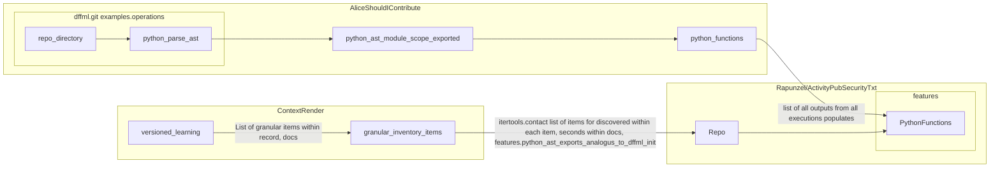

## 2023-02-06 Exporting Groovy Functions

- 1:1 Pankaj/John

```console
$ git remote -v
origin https://github.com/owner/repository
$ git status
origin    https://github.com/owner/repository
```

- `origin/branch_name` -> https://github.com/owner/repository/blob/branch_name
- https://github.com/intel/dffml/issues/1433




- TODO
  - [x] Pull request DFFML
    - https://github.com/intel/dffml/pull/1432
  - [x] Merge PR
  - [x] Rebuild container
    - https://github.com/intel/dffml/blob/main/.github/workflows/dffml_build_images_containers.yml
  - [x] Kick off run single
    - `alice shouldi contribute -keys https://github.com/jenkinsci/kubernetes-plugin`