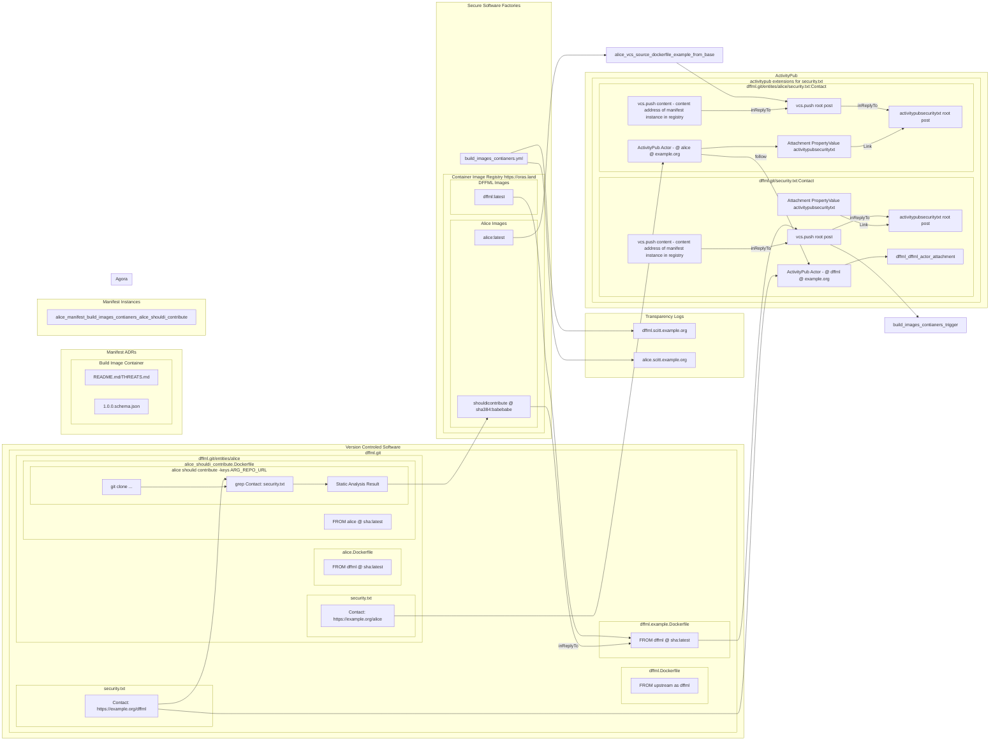

## 2023-02-09 @pdxjohnny Engineering Logs

- DWN schedule slip to march again
  - https://github.com/TBD54566975/dwn-cli
  - https://github.com/TBD54566975/dwn-relay
    - Sequence diagram reproduced below

> ```mermaid
> sequenceDiagram
>   autonumber
>   participant C as Client
>   participant R as DWN Relay
>   participant S as Downstream Service
>   
>   C->>R: DWeb Message
>   R->>R: Integrity Checks
>   R->>R: Lookup registered handlers
>   R->>S: POST /${registered-handler}
>   S->>S: Handle Request
>   S->>R: HTTP Response
>   R->>R: DWM'ify Response
>   R->>C: DWMified response
> ```

- https://cs.github.com/GoogleContainerTools/kaniko?q=config.json
- https://github.com/GoogleContainerTools/kaniko/blob/fe2413e6e3c8caf943d50cf1d233a561943df1d6/integration/images.go#L240-L243
- https://github.com/slowy07/mary
- https://github.com/intel/dffml/blob/657aed2c05941f4e9e513f6a6e2356df36008609/docs/news/0_4_0_alpha_release.rst
  - Continuous deployment tutorials
    - *We will expand the tutorials released with 0.4.0 to include deployment behind reverse proxies for multiple projects, including how to setup encryption and authentication in a painless and maintainable way.*
  - https://github.com/intel/dffml/blob/main/docs/examples/webhook/webhook.rst
- https://mermaid-js.github.io/mermaid-live-editor/
- https://github.com/ietf-scitt/use-cases/blob/de2b016b37d6762fba9f5b1bcde96324c67ce25e/openssf_metrics.md#activitypub-extensions-for-securitytxt
  - Have been playing with ActivityPub to facilitate handoffs between pipelines across project trust boundaries by consuming the ActivityPub graph and feeding it into caching view databases (mysql, mongo) as appropriate. This should help us ensure we have a stream of lifecycle events from all dependencies via communication of VEX. Chainguard's folks might have another similar way of communicated BOM, VEX + transparency logs receipts coming out in the next few weeks (Ariadne's Rapunzel). Decentralized Identifiers will likely be helpful for facilitating mappings across walled gardens. The referenced doc currently is WIP to the SCITT use case repo.
  - https://hyperonomy.com/2023/01/23/mapping-the-web-7-0-didcomm-http-architecture-reference-model-to-the-toip-trust-spanning-layer-framework/ looks great but the comms are why we have to play with ActivityPub now, TDB DWN and some other bits which facilitate relay aren't quite there yet, they just slipped again from Q4 22 to March 2023. This is why we've been primarily targeting the lower layers of the web7 stack, LDVC2, aka https://w3c.github.io/vc-data-model/ this would allow us to make policy audit of [InnerSource crawler generated metrics](https://intel.github.io/dffml/main/examples/innersource/swportal.html#crawler) effectively all queries over the graph of data which we populate via insertion to the https://oras.land/ style registry (since there is plenty of existing transparency log pull/push checks developed there). Ideally these objects which are JSON-LD that are stored in the registry also have content type appropriate endpoints which proxy to the underlying objects
    - https://github.com/transmute-industries/jsonld-to-cypher
    - https://github.com/OR13/endor
  - Eventually our Eden nodes could attest via SLSA4 provenance by providing receipts from a SCITT registry saying they booted a reasonable software stack, then they self-issue a verifiable credential based SCITT receipt from the VM itself which wraps the receipt from the software stack source of truth SCITT log using the compute's HSM or equivalent (TPMs for client devs or non-TDX machines). This self issued receipt then serves as a proof which can be arbitrarily relayed or verified. This forms the foundations of auth in our distributed compute (fast CI/CD, hypotheses from Alice). Basically all data blobs transmitted end up being Verifiable Credentials and the data sits in a registry (later to be accessed via DIDComm or equivalent).



- https://scored.dev/
- https://dl.acm.org/doi/proceedings/10.1145/3560835
- https://deepai.org/publication/automatic-security-assessment-of-github-actions-workflows
- https://github.com/Mobile-IoT-Security-Lab/GHAST
  - > Also, GHAST needs a running Neo4j server.
  - The Open Architecture goal is to provide a methodology around interpretation of data in the graph in alignment with the threat model
    - This should help multiple entities pull/push from the knowledge graph
    - https://intel.github.io/dffml/main/about.html#philosophy
    - Ref: agora
      - https://github.com/flancian/agora-bridge/tree/main/bots/mastodon
- https://github.com/node-fetch/node-fetch/issues/79#issuecomment-616127141
- Below overlay applied to activitypubstarterkit
  - Orchestrator: Shell
- https://www.typescriptlang.org/docs/handbook/declaration-files/templates/module-d-ts.html#library-file-layout
- https://developer.mozilla.org/en-US/docs/Web/JavaScript/Reference/Operators/Conditional_Operator

```
$ npm run build

> dumbo@1.0.0 build
> tsc

src/request.ts:5:24 - error TS7016: Could not find a declaration file for module 'simple-proxy-agent'. '/home/pdxjohnny/activitypub-starter-kit-alice/node_modules/simple-proxy-agent/src/agent.js' implicitly has an 'any' type.
  Try `npm i --save-dev @types/simple-proxy-agent` if it exists or add a new declaration (.d.ts) file containing `declare module 'simple-proxy-agent';`

5 import ProxyAgent from "simple-proxy-agent";
                         ~~~~~~~~~~~~~~~~~~~~


Found 1 error in src/request.ts:5

$ mkdir node_modules/@types/simple-proxy-agent/
$ echo "declare module 'simple-proxy-agent';" | tee node_modules/@types/simple-proxy-agent/index.d.ts
$ rm -f db/database.sqlite3; PROTO=https FDQN=3e52664be9f477.lhr.life WEBHOOK_PATH=$(cat ../webhook) NODE_ENV=production PORT=8000 ACCOUNT=alice ADMIN_USERNAME=alice ADMIN_PASSWORD=$(cat ../password) PUBLIC_KEY=$(cat publickey.crt) PRIVATE_KEY=$(cat pkcs8.key) npm run start &

> dumbo@1.0.0 start
> node build/index.js

Dumbo listening on port 8000…
GET /alice 200 1354 - 2.711 ms
POST /admin/follow/alice/localhost/8000/http - - - - ms 
POST /admin/follow/alice/2b1103fcbfb295.lhr.life/443/https - - - - ms
file:///home/pdxjohnny/activitypub-starter-kit-alice/node_modules/node-fetch/src/index.js:108
                        reject(new FetchError(`request to ${request.url} failed, reason: ${error.message}`, 'system', error));


FetchError: request to https://2b1103fcbfb295.lhr.life/alice/inbox failed, reason: connect ETIMEDOUT 146.112.61.108:443
    at ClientRequest.<anonymous> (file:///home/pdxjohnny/activitypub-starter-kit-alice/node_modules/node-fetch/src/index.js:108:11)
    at ClientRequest.emit (node:events:525:35)
    at TLSSocket.socketErrorListener (node:_http_client:494:9)
    at TLSSocket.emit (node:events:513:28)
    at emitErrorNT (node:internal/streams/destroy:157:8)
    at emitErrorCloseNT (node:internal/streams/destroy:122:3)
    at processTicksAndRejections (node:internal/process/task_queues:83:21) {
  type: 'system',
  errno: 'ETIMEDOUT',
  code: 'ETIMEDOUT',
  erroredSysCall: 'connect'
}
$ curl -ku alice:$(cat ../password) -X POST -v http://localhost:8000/admin/follow/push/vcs.activitypub.securitytxt.dffml.chadig.com/443/https
```

```diff
diff --git a/src/request.ts b/src/request.ts
index dca8d23..4aea048 100644
--- a/src/request.ts
+++ b/src/request.ts
@@ -2,6 +2,7 @@ import crypto from "node:crypto";
 
 import type { Request } from "express";
 import fetch from "node-fetch";
+import ProxyAgent from "simple-proxy-agent";
 import { assert } from "superstruct";
 
 import { PRIVATE_KEY } from "./env.js";
@@ -9,8 +10,13 @@ import { Actor } from "./types.js";
 
 /** Fetches and returns an actor at a URL. */
 async function fetchActor(url: string) {
+  const agent = (process.env.https_proxy ? new ProxyAgent(process.env.https_proxy, {
+      tunnel: true, // If true, will tunnel all HTTPS using CONNECT method
+      timeout: 5000, // Time in milli-seconds, to maximum wait for proxy connection to establish
+    }) : null);
   const res = await fetch(url, {
     headers: { accept: "application/activity+json" },
+    agent: agent,
   });
 
   if (res.status < 200 || 299 < res.status)
@@ -46,6 +52,10 @@ export async function send(sender: string, recipient: string, message: object) {
   const signature = crypto
     .sign("sha256", Buffer.from(data), key)
     .toString("base64");
+  const agent = (process.env.https_proxy ? new ProxyAgent(process.env.https_proxy, {
+      tunnel: true, // If true, will tunnel all HTTPS using CONNECT method
+      timeout: 5000, // Time in milli-seconds, to maximum wait for proxy connection to establish
+    }) : null);
 
   const res = await fetch(actor.inbox, {
     method: "POST",
@@ -57,6 +67,7 @@ export async function send(sender: string, recipient: string, message: object) {
       signature: `keyId="${sender}#main-key",headers="(request-target) host date digest",signature="${signature}"`,
       accept: "application/json",
     },
+    agent: agent,
     body,
   });
```

```console
$ rm -f db/database.sqjlite3; PROTO=https FDQN=04ac0180053fec.lhr.life WEBHOOK_PATH=$(cat ../webhook) NODE_ENV=production PORT=8000 ACCOUNT=alice ADMIN_USERNAME=alice ADMIN_PASSWORD=$(cat ../password) PUBLIC_KEY=$(cat publickey.crt) PRIVATE_KEY=$(cat pkcs8.key) npm run start

> dumbo@1.0.0 start
> node build/index.js

Dumbo listening on port 8000…
GET /alice 200 1354 - 2.510 ms
file:///home/pdxjohnny/activitypub-starter-kit-alice/build/request.js:63
        throw new Error(res.statusText + ": " + (await res.text()));
              ^

Error: Unauthorized: Unauthorized
    at send (file:///home/pdxjohnny/activitypub-starter-kit-alice/build/request.js:63:15)
    at processTicksAndRejections (node:internal/process/task_queues:96:5)
    at async file:///home/pdxjohnny/activitypub-starter-kit-alice/build/admin.js:53:5
$ curl -ku alice:$(cat ../password) -X POST -v http://localhost:8000/admin/pdxjohnny/push/vcs.activitypub.securitytxt.dffml.chadig.com/443/https
```

- It's failing to POST to the inbox of the push actor to execute the follow?
- TODO
  - [ ] activitypub extensions for security.txt follow on example in `docs/examples/webhook/activitypub.rst`
    - This will be how we do downstream validation mentioned under Continuous deployment tutorials of 0.4.0 release notes
  - [ ] For first downstream validation (aka `FROM` rebuild chain, train)
    - [x] Deploy activitypubstarterkit
      - @push@vcs.activitypub.securitytxt.dffml.chadig.com
    - [ ] Scheduled polling job
      - [ ] Connect to websocket endpoint via random password
        - [ ] ASAP OIDC auth
        - [ ] Build dataflows representing dep trees
          - [ ] Filter based on declared triggers (see last few days logs)
        - [ ] Trigger downstream rebuilds
      - [ ] Later localhost.run and spin server on demand instead of deployed