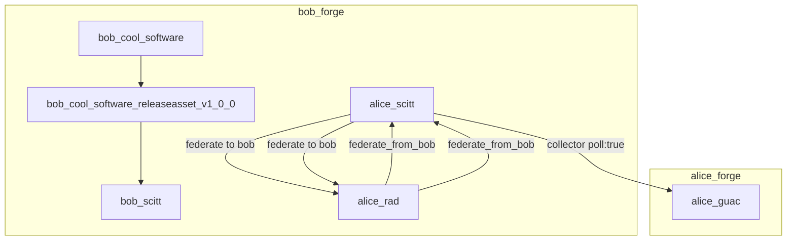

## 2023-03-30 @pdxjohnny Engineering Logs

- https://github.com/neo4j/neo4j-python-driver
- https://neo4j.com/docs/graphql-manual/current/getting-started/
- https://codeberg.org/fediverse/fep/src/branch/main/feps/fep-c390.md
  - FEP-c390: Identity Proofs
- https://github.com/faokunega/pg-embed
- https://socialhub.activitypub.rocks/t/fep-7888-demystifying-the-context-property/3021/6
- https://go-fed.org/ref/activity/pub
- code.forgejo.org/actions as a catalog of Free Software actions
  - https://codeberg.org/forgejo/discussions/issues/16
  - The following WIP use case doc is a place where we're trying to flush out how we could deduplicate computation across forges for analysis of security posture (such as OpenSSF Scorecard) of dependencies (Actions, etc.) which would be in the catalog. The goal is to enable policy as code which enables forge org admins and repo admins to set secure-by-default policies with the ability for repo owners/pull-requesters to overlay modifications to the analysis policy, adherant to policy as code to auto-approve/deny those downstream context local modifications to policy: [WIP: RFCv4.1: IETF SCITT: Use Case: OpenSSF Metrics: activitypub extensions for security.txt](https://github.com/ietf-scitt/use-cases/blob/748597b37401bd59512bfedc80158b109eadda9b/openssf_metrics.md#openssf-metrics)
  - Related: [#12](https://codeberg.org/forgejo/discussions/issues/12) (for event based triggers of re-analysis)
- https://lab.forgefriends.org/forgefriends/community-action/-/issues/1 - forgefed: contribute to (S10) Search, discovery, WebFinger
- https://www.valueflo.ws/
  - No More Painting the Roses Red
  - https://www.valueflo.ws/examples/ex-exchange/
  - https://github.com/TBD54566975/tbdex-protocol
  - https://lab.allmende.io/valueflows/valueflows/-/blob/master/examples/process-stage-state.yaml
  - https://github.com/valueflows/vf-examples-jsonld-context/raw/13b5c8d8e8dedaa5f849f8e6289bff7406244bd5/context.jsonld
  - https://lab.allmende.io/valueflows/valueflows/-/blob/187fd3c4067abaae66488ee146e3c3dad26e1011/mkdocs/docs/concepts/actions.md
- https://repo.prod.meissa.de/meissa/dda-masto-embed
- https://github.com/poljar/weechat-matrix

```bash
cd ~/Documents/python/
git clone https://github.com/poljar/weechat-matrix.git
cd weechat-matrix
sudo dnf -y install libolm-devel
pip install -U pip setuptools wheel
pip install --user -r requirements.txt
make install
/join #forgejo-chat:matrix.org
```

- https://gitea.com/xy/gitea/wiki/Federated-following
- https://codeberg.org/forgejo/forgejo/issues/502 - [FEAT] Federated discussion with mastodon users
- https://codeberg.org/forgejo/forgejo/issues/581 - [FEAT] Bittorrent RSS/Atom Feeds For Repos
  - grep recent engineering logs for webhook based torrent sync
- https://github.com/go-gitea/gitea/issues/14186
- https://github.com/go-gitea/gitea/pull/19462
  - Finally found the PR that added webfinger
- https://github.com/go-gitea/gitea/issues/18240#issuecomment-1212012942
  - How to enable federation
- https://app.radicle.xyz/seeds/seed.radicle.xyz/rad:z3gqcJUoA1n9HaHKufZs5FCSGazv5/commits/fc724a2333040ced38f87aa4c70149ffab095bb7/HACKING.md
  - Alice is Here
  - This seems like a great place to start with ActivityPub data transforms, they are using DIDs
  - https://github.com/radicle-dev/heartwood/pull/452
    - These folks have working federation, but a non-ActivityPub based protocol


- We're close, I can feel it
- heartwood --> openapi generator + actogitypub endpoints off cyclonedx -> guac --> cypher mutatuon and ipvm exec chain for analysis --> guac emit activitypub --> forgefed
  - scitt and endor later keri tied via ccf
- https://github.com/intel/dffml/tree/alice/examples/tutorials/rolling_alice/federated_forge/alice_and_bob
- https://github.com/go-yaml/yaml
- https://docs.python.org/3/library/urllib.parse.html#module-urllib.parse
- Need to convert the configs back from YAML

```bash
until curl -I http://alice_forgejo_server:3000 > /dev/null 2>&1; do sleep 5; done;
CSRF_TOKEN=$(curl http://127.0.0.1:2000/user/sign_up | grep csrfToken | awk '{print $NF}' | sed -e "s/'//g" -e 's/,//g');
query_params=$(python3 -c 'import sys, urllib.parse, yaml; print(urllib.parse.urlencode(yaml.safe_load(sys.stdin)))' < /usr/src/forgejo-init/requests/init.yaml);
curl -v -H "Cookie: lang=en-US; _csrf=${CSRF_TOKEN}; i_like_gitea=d5249768265f875d" -X POST --data-raw "${query_params}" http://alice_forgejo_server:3000:          
```

- Went to validate and turns out CSRF isn't even enabled :P

```console
$ curl -sfL http://127.0.0.1:2000 | grep -i CSRF
                csrfToken: '',
```

- http://127.0.0.1:2000/user/sign_up
  - Okay it is enabled on sign up, modified scrape
  - https://github.com/guacsec/guac/commit/c9de76f0ae90145ba76831cca73d2673a8ca1c2a
    - Added pyyaml for conversion from saved yaml to urlencoded query string for `curl --data-raw`
- https://enarx.dev/docs/webassembly/rust
- https://github.com/go-gitea/gitea/blob/8df1b4bd699897264c60da7ce982b09cee57f345/custom/conf/app.example.ini#L2442-L2469
- https://forgejo.org/docs/latest/admin/config-cheat-sheet/
- https://github.com/guacsec/guac/pull/498
- https://github.com/guacsec/guac/tree/main/pkg/handler/collector
  - Add federated event space collector listening to websocket of activitypub-start-key when `poll: true`

```console
$ git clone https://seed.radicle.xyz/z3gqcJUoA1n9HaHKufZs5FCSGazv5.git heartwood
$ cd heartwood
$ cargo install --path radicle-cli --force --locked \
  && cargo install --path radicle-node --force --locked \
  && cargo install --path radicle-remote-helper --force --locked
$ target/release/rad --help
rad 0.8.0
Radicle command line interface

Usage: rad <command> [--help]

It looks like this is your first time using radicle.
To get started, use `rad auth` to authenticate.

Common `rad` commands used in various situations:

        assign       Assign an issue
        auth         Manage identities and profiles
        checkout     Checkout a project into the local directory
        clone        Clone a project
        edit         Edit an identity doc
        fetch        Fetch repository refs from the network
        help         CLI help
        id           Manage identity documents
        init         Initialize a project from a git repository
        inspect      Inspect a radicle repository
        issue        Manage issues
        ls           List projects
        merge        Merge a patch
        node         Control and query the Radicle Node
        patch        Manage patches
        path         Display the radicle home path
        push         Publish a project to the network
        review       Approve or reject a patch
        rm           Remove a project
        self         Show information about your identity and device
        tag          Tag an issue
        track        Manage repository and node tracking policy
        unassign     Unassign an issue
        untag        Untag an issue
        untrack      Untrack project peers

See `rad <command> --help` to learn about a specific command.
$ ls -lAF target/release/
total 40184
drwxr-xr-x  68 pdxjohnny pdxjohnny     4096 Mar 30 16:11 build/
-rw-r--r--   1 pdxjohnny pdxjohnny        0 Mar 30 16:09 .cargo-lock
drwxr-xr-x   2 pdxjohnny pdxjohnny    49152 Mar 30 16:12 deps/
drwxr-xr-x   2 pdxjohnny pdxjohnny        6 Mar 30 16:09 examples/
drwxr-xr-x 334 pdxjohnny pdxjohnny    16384 Mar 30 16:11 .fingerprint/
-rwxr-xr-x   2 pdxjohnny pdxjohnny  6116440 Mar 30 16:12 git-remote-rad*
-rw-r--r--   1 pdxjohnny pdxjohnny     6178 Mar 30 16:12 git-remote-rad.d
drwxr-xr-x   2 pdxjohnny pdxjohnny        6 Mar 30 16:09 incremental/
-rw-r--r--   1 pdxjohnny pdxjohnny    11259 Mar 30 16:10 libradicle_cli.d
-rw-r--r--   2 pdxjohnny pdxjohnny  7187292 Mar 30 16:10 libradicle_cli.rlib
-rw-r--r--   1 pdxjohnny pdxjohnny     8990 Mar 30 16:11 libradicle_node.d
-rw-r--r--   2 pdxjohnny pdxjohnny  4287234 Mar 30 16:11 libradicle_node.rlib
-rw-r--r--   1 pdxjohnny pdxjohnny     6108 Mar 30 16:12 libradicle_remote_helper.d
-rw-r--r--   2 pdxjohnny pdxjohnny   263706 Mar 30 16:12 libradicle_remote_helper.rlib
-rwxr-xr-x   2 pdxjohnny pdxjohnny 13923872 Mar 30 16:10 rad*
-rw-r--r--   1 pdxjohnny pdxjohnny    11308 Mar 30 16:10 rad.d
-rwxr-xr-x   2 pdxjohnny pdxjohnny  9197808 Mar 30 16:11 radicle-node*
-rw-r--r--   1 pdxjohnny pdxjohnny     9048 Mar 30 16:11 radicle-node.d
```

- :upside_down_face: GAUC is very tightly coupled with nats...
  - We may want to have a little activitypub (starter-kit) / nats bridge as a service
- `cmd/collector/cmd/files.go:func initializeNATsandCollector(ctx context.Context, natsAddr string) {`
  - `// TODO: pass in credentials file for NATS secure login`
- GAUC main: e1c30a68ea4b6fc7ccf804f9418c55662d4a968b
- rad master: fc724a2333040ced38f87aa4c70149ffab095bb7
- We need to find the place where `rad` is communicating and hook that to dump all the events
  - Then we'll translate into the friendly forge / forgejo / forgeflow / federated forge event space
  - Then we'll have GUAC ingest it

```console
$ git grep node
$ cat radicle-cli/examples/rad-node.md
$ ./target/release/radicle-node --help
2023-03-30T16:23:18.376-07:00 INFO  node     Starting node..

Usage

   radicle-node [<option>...]

Options

    --connect          <peer>        Connect to the given peer address on start
    --external-address <address>     Publicly accessible address (default 0.0.0.0:8776)
    --git-daemon       <address>     Address to bind git-daemon to (default 0.0.0.0:9418)
    --tracking-policy  (track|block) Default tracking policy
    --tracking-scope   (trusted|all) Default scope for tracking policies
    --help                           Print help
    --listen           <address>     Address to listen on
```

- We need containers, we'll add them to Alice's and Bob's forges
  - https://github.com/radicle-dev/heartwood/blob/91efbd9630dce10517f189f33b6533a70d45cdbf/.github/workflows/deploy.yml
  - Then we'll use ActivityPub starter kit to facilitate mirror

```console
$ echo maryisgod | HOME=/tmp/radicle-node-alice-home ./target/release/rad auth --stdin

Initializing your radicle 🌱 identity

✓ Creating your Ed25519 keypair...
✓ Adding your radicle key to ssh-agent...
✓ Your Radicle ID is did:key:z6MkuvAub19PrYpovoTegNeN5nz2wDcjMUBxw3p9XSteBxD3. This identifies your device.

👉 To create a radicle project, run `rad init` from a git repository.
$ cd $(mktemp -d)
$ git clone https://github.com/OR13/endor .
$ HOME=/tmp/radicle-node-alice-home ~/Documents/rust/heartwood/target/release/rad init --name endor --default-branch main --description "SCITT DID and VC as VCS repo"

Initializing local 🌱 project in .

✓ Project endor created

Your project id is rad:zoUtme6QYUyiaKqZPTSZYaYYvtwv. You can show it any time by running:
    rad .

To publish your project to the network, run:
    rad push

$ HOME=/tmp/radicle-node-alice-home strace -y -yy -f -o rad.push.strace ~/Documents/rust/heartwood/target/release/rad push
$ grep socket rad.push.strace 
106330 socket(AF_UNIX, SOCK_STREAM|SOCK_CLOEXEC, 0) = 3<UNIX-STREAM:[366069]>
106330 socket(AF_UNIX, SOCK_STREAM|SOCK_CLOEXEC, 0) = 5<UNIX-STREAM:[367701]>
$ grep -i unix rad.push.strace 
106330 socket(AF_UNIX, SOCK_STREAM|SOCK_CLOEXEC, 0) = 3<UNIX-STREAM:[366069]>
106330 connect(3<UNIX-STREAM:[366069]>, {sa_family=AF_UNIX, sun_path="/run/user/1000/keyring/ssh"}, 29) = 0
106330 write(3<UNIX-STREAM:[366069->366895]>, "\0\0\0\1\v", 5) = 5
106330 recvfrom(3<UNIX-STREAM:[366069->366895]>, "\0\0\1\375", 4, 0, NULL, NULL) = 4
106330 recvfrom(3<UNIX-STREAM:[366069->366895]>, "\f\0\0\0\2\0\0\0003\0\0\0\vssh-ed25519\0\0\0 \345\304-\32"..., 509, 0, NULL, NULL) = 509
106330 write(3<UNIX-STREAM:[366069->366895]>, "\0\0\0\256\r\0\0\0003\0\0\0\vssh-ed25519\0\0\0 \345\304-\32"..., 178) = 178
106330 recvfrom(3<UNIX-STREAM:[366069->366895]>, "\0\0\0X", 4, 0, NULL, NULL) = 4
106330 recvfrom(3<UNIX-STREAM:[366069->366895]>, "\16\0\0\0S\0\0\0\vssh-ed25519\0\0\0@f\231\0[E\370\223F"..., 88, 0, NULL, NULL) = 88
106330 socket(AF_UNIX, SOCK_STREAM|SOCK_CLOEXEC, 0) = 5<UNIX-STREAM:[367701]>
106330 connect(5<UNIX-STREAM:[367701]>, {sa_family=AF_UNIX, sun_path="/tmp/radicle-node-alice-home/.radicle/node/radicle.sock"}, 58) = -1 ENOENT (No such file or directory)
106330 close(5<UNIX-STREAM:[367701]>)   = 0
106330 close(3<UNIX-STREAM:[366069->366895]>) = 0
```

- `106330 connect(5<UNIX-STREAM:[367701]>, {sa_family=AF_UNIX, sun_path="/tmp/radicle-node-alice-home/.radicle/node/radicle.sock"}, 58) = -1 ENOENT (No such file or directory)`
  - ~~We should be able to intercept comms on this socket~~
    - We can just compile rust
- We will table forgejo for now and just get the rad events into guac. we can about the nested kvm / subflow recurisve analysis right now
- https://github.com/radicle-dev/heartwood/blob/a830cf02b99275efdd8dcb6ba72c5b13857b6b36/docker-compose.yml#L47-L58
  - Nice caddyfile
- https://github.com/radicle-dev/heartwood/blob/91efbd9630dce10517f189f33b6533a70d45cdbf/radicle-node/src/runtime.rs
  - This looks like a good place to explore for our GUAC `poll: true` collector
- Federate the SCITT API emulator by converting the dumped format to endor, then using rad to federate the git repo containing the dump.
- https://github.com/scitt-community/scitt-api-emulator/issues/20#issuecomment-1491145192
  - > Orie: In the emulator, the payload of a COSE Sign1 "signed statement" can be a file content, for example:
    > 
    > if `ctyp` is `application/json` the `payload` could be the bytes of `example.json`.
   - I think we get another Chaos for the Chaos God for that one thank you Orie for the clean explanation.
   - Now we know we should confirm we are seeing `ctyp` (Content Type) set correctly.
     -  https://github.com/intel/dffml/blob/alice/docs/tutorials/rolling_alice/0000_architecting_alice/0002_shes_ariving_when.md#scitt-api-emulator-spin-up


- Pretty sure rad doesn't have artifact types yet.
  - Maybe this is a good time for us to write the OA schema?
    - We should try using the CycloneDX DataFlow stuff, protoc into GUAC for expanded policy engine.



- This example docker-compose.yml is the first demo of our shared stream of consciousness
  - https://github.com/intel/dffml/blob/alice/docs/tutorials/rolling_alice/0000_architecting_alice/0005_stream_of_consciousness.md
- We need a way to do runners, either push to forgejo with runners setup or for prod execute within aurae cell
  - https://github.com/aurae-runtime/aurae/blob/709b417915097fd9ef25740d208958ac85109085/examples/cells_isolated_processes_and_network.ts
- https://docs.codeberg.org/collaborating/pull-requests-and-git-flow/
- Either way we something executes a job which uploads a release artifact (likely via push to a repo with runners enabled, just by watching the https://github.com/radicle-dev/radicle-client-services event stream on our Endor SCITT repo).
- https://forgejo.org/docs/latest/user/agit-support/
  - > Here's another advanced example for creating a new PR targeting master with topic, title, and description:
    >
    > `git push origin HEAD:refs/for/master -o topic="Topic of my PR" -o title="Title of the PR" -o description="# The PR Description\nThis can be **any** markdown content.\n- [x] Ok"`
- We'll add a linked data notifications handler within SCITT and execute the policy engine with dffml on insert
  - We can optionally use the java setup stuff similar to npm-groovy-lint to start neo4j and guac if we want to later. We'll use the existing shouldi flows first.

```patch
commit b6974c499b1849df1ae14e4a95a1e151b74650dc
Author: John Andersen <johnandersenpdx@gmail.com>
Date:   Thu Mar 30 21:36:04 2023 -0700

    REMOVED: server: Add todo around policy engine
    
    Signed-off-by: John Andersen <johnandersenpdx@gmail.com>

diff --git a/scitt_emulator/server.py b/scitt_emulator/server.py
index 094d0b6..b121039 100644
--- a/scitt_emulator/server.py
+++ b/scitt_emulator/server.py
@@ -103,6 +103,13 @@ def create_flask_app(config):
         except OperationNotFoundError as e:
             return make_error("operationNotFound", str(e), 404)
         headers = {}
+        # Here's the retry. We can add an outside dffml / alice process, the
+        # threats listen, to grab files in the directory. We can submit the
+        # events mirrored from webhooks to scitt to get recipts for. On
+        # submission we'll enable long running (use_lro), the operation / claim
+        # data we'll modify the submit_claim to wait for a lock file to indicate
+        # the policy evaluation completed and what the status was of pass/no
+        # pass from the policy engine.
         if operation["status"] == "running":
             headers["Retry-After"] = "1"
         return make_response(operation, 200, headers)

```

- https://asciinema.org/a/572541
- https://asciinema.org/a/572543
- https://asciinema.org/a/572548
- Have to mkdir workspace or else getting weird permissions errors

```console
$ pip install -e .
$ mkdir -p workspace/storage/operations/
$ scitt-emulator server --workspace workspace/ --tree-alg CCF --use-lro
$ scitt-emulator client create-claim --issuer did:web:example.com --content-type application/json --payload '{"sun": "yellow"}' --out claim.cose                                                                                              
Claim written to claim.cose
$ scitt-emulator client submit-claim --claim claim.cose --out claim.receipt.cbor
Claim registered with entry ID 2
Receipt written to claim.receipt.cbor
```

- https://asciinema.org/a/572551

```console
$ (cd ~/.local && npm install --upgrade nodemon)
$ asciinema upload $(ls ~/asciinema/rec-$(hostname)-*ndjson | tail -n 1)
```

- https://asciinema.org/a/572552
  - We start and see a `.cose` queued. This is similar to how one might deploy a telemetry service where `operations/` would be the spool dir probably on a message bus (ActivityPub) or ramdisk.
- https://flask.palletsprojects.com/en/2.2.x/async-await/
- https://docutils.sourceforge.io/docs/ref/doctree.html
- https://myst-parser.readthedocs.io/en/latest/apidocs/myst_parser/myst_parser.parsers.docutils_.html#myst_parser.parsers.docutils_.Parser
- https://pydoc.dev/docutils/latest/docutils.nodes.document.html
  - > The document root element. Do not instantiate this class directly; use [docutils.utils.new_document()](https://pydoc.dev/docutils/latest/docutils.utils.html#new_document) instead.

```console
$ nodemon -e py --exec 'clear; pytest -s -k registration; test 1'
```

- No luck with `unittest.mock.patch.object` as the server side has already kicked off within a thread.

```python
unittest.mock.patch.object(                                    
        service.server.app.scitt_service._sync_policy_result,                    
        new_callable=funcutils.partial(                                          
            run_simple_file_based_policy_engine,                                 
            sync_policy_result=service.server.app.scitt_service._sync_policy_result,
        ),                                                                       
    ):
```

- TODO
  - [ ] ~~Sleep~~
  - [x] Rate limited by GiHub presumably for clicking too many links -ENOTAROBOT
  - [x] Caffeine
  - [ ] UCAN or DID for operation ID instead of UUID for SCITT emulator
  - [ ] Online cloning
    - [ ] GAUC watches mirrored webhook event stream or federated forge native event stream
    - [ ] Emit events to stream to re-trigger full `git clone` style https://github.com/guacsec/guac/issues/205 events
  - [x] https://github.com/scitt-community/scitt-api-emulator/pull/27
    - Monitor operations directory to decide which claims get to be submitted by analysis of new operation.result file. For use with `use_lro`.
    - Simple insert policy based engine based on presence of `operation.policy.{insert,denied,failure}` files. Currently only for use with `use_lro=True`. This is a simple way to enable evaluation of claims prior to submission by arbitrary policy engines which watch the workspace (fanotify,  inotify, etc.).
    - Related: https://github.com/ietf-scitt/use-cases/pull/18
      - Recent discussion has revealed most of this use case will be focused on the policy / gatekeeper component and federation components of SCITT.
    - TODO
      - [x] Unittests
      - [x] Docs
- Future
  - Federation of events for other servers triggering claim-insert
    - This gets us into context local (per transparency service) evaluation of claims
  - https://github.com/intel/dffml/pull/1273
    - Zeroth phase to next phase on COSE/cbor
  - More demos for alternative policy engine orchestration
    - CycloneDX + DFFML/Open Architecture Directed Acyclic Graph (DAG) JSON object as value for `insertPolicy` property
      - Optionally advertised via webfinger or other means
      - Optional spin of neo4j/GUAC within pull request validation flows for graph query and detailed analysis of dependencies
        - https://neo4j.com/docs/graph-data-science/current/end-to-end-examples/fastrp-knn-example/
        - Federate events into forge local trust boundry (GUAC as listener) using SCITT policy as "firewall". We evaluate based on policy as code, demo with overlays.