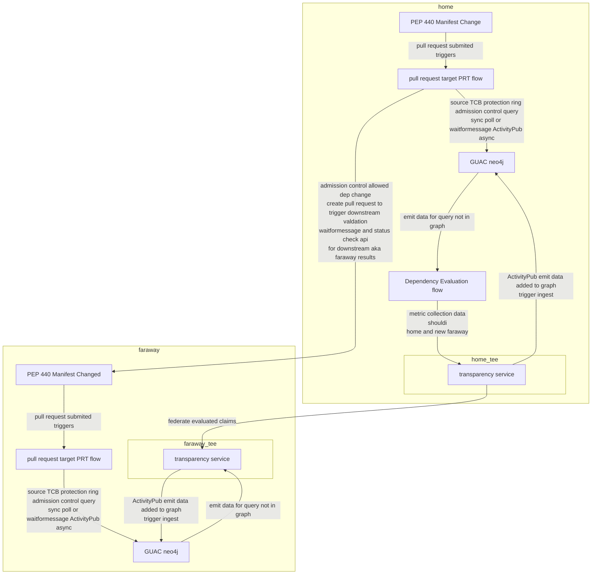

```mermaid
graph TD
subgraph home
h_prt[pull request target PRT flow]
subgraph home_tee
h_ts[transparency service]
end
h_guac[GUAC neo4j]
h_manifest[PEP 440 Manifest Change]
h_eval[Dependency Evaluation flow]

h_manifest -->|pull request submited triggers| h_prt
h_prt -->|source TCB protection ring admission control query<br>sync poll or waitformessage ActivityPub async| h_guac
h_guac -->|emit data for query not in graph| h_eval
h_eval -->|metric collection data<br>shouldi<br>home and new faraway| h_ts
h_ts -->|ActivityPub emit data added to graph<br>trigger ingest| h_guac

end

subgraph faraway
f_prt[pull request target PRT flow]
subgraph faraway_tee
f_ts[transparency service]
end
f_guac[GUAC neo4j]
f_manifest[PEP 440 Manifest Changed]

f_manifest -->|pull request submited triggers| f_prt
f_prt -->|source TCB protection ring admission control query<br>sync poll or waitformessage ActivityPub async| f_guac
f_ts -->|ActivityPub emit data added to graph<br>trigger ingest| f_guac

end

h_prt -->|admission control allowed dep change<br>create pull request to trigger downstream valdation<br>waitformessage and status check api<br>for downstream aka faraway results| f_manifest
f_guac -->|emit data for query not in graph| f_ts
h_ts -->|federate evaluated claims| f_ts
```