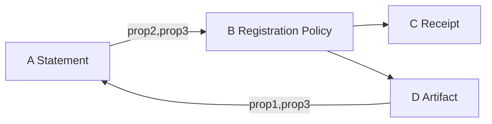
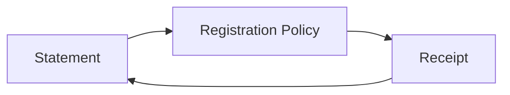

## 2023-11-04 IETF 118 Hackathon Day 1

- https://datatracker.ietf.org/meeting/118/agenda
- SCITT table
  - Steve
  - Orie
  - Yogesh
  - Jon
  - Tristan
  - Cedrick
  - A.J. Stein
    - https://github.com/aj-stein-nist/oscal-content
  - John
  - Henk Birkholz
  - Kaliya Young
- Snacks
- OIDC issuer as issuer of notary
- DID resolution discussion
  - `serviceAddress` WASM API floated
    - Prep for dataflow style
- Kick off
  - https://github.com/IETF-Hackathon/ietf118-project-presentations
    - https://github.com/IETF-Hackathon/ietf118-project-presentations/blob/main/.github/workflows/main.yml
  - Hackdemo Happy Hour on Monday 18:30 - 19:30 Registry by 13:00 Monday. Share hackathon projects
- Working on PR
  - https://github.com/scitt-community/scitt-api-emulator/pull/37
  - https://github.com/ietf-wg-scitt/draft-ietf-scitt-architecture/issues/79
- Discussion with Steve around OIDC issuer
  - https://github.com/ietf-wg-scitt/draft-ietf-scitt-architecture/issues/87#issuecomment-1716042275
  - Do we need more info than `did:web:token.....`
  - Moved arch to CWT, which makes it more obvious client side
    - Emulator needs to be updated
  - There's been discussion around re-writing the emulator in another language because the original Python maintainer left. However, no one has done it yet and both JA's like Python and have been contributing.
- https://datatracker.ietf.org/doc/draft-lemmons-composite-claims/
  - Pealing the layers of the onion of bearer token with policy, never comping back to transparency service
  - Exposes claim keys, know it contains subject
  - length analysis on enveloped?
    - Add padding?
    - Zero knowledge fixed length, selective disclosure BBS CNRG, proof of knowledge
  - https://datatracker.ietf.org/doc/bofreq-richer-wimse/
    - Workload Identity in Multi System Environments (WIMSE)
- No one respects DNS TTL at ISP level
- Entry ID within claim discussion
  - Options
    - Hash of A, order or A
      - Chair says says he will not implement
    - Unique ID such as UUID
  - One option was said to be adding the entry_id to the receipt
    - Orie advises a consensus call to resolve on what we should do here and put in the architecture
    - https://github.com/ietf-wg-scitt/draft-ietf-scitt-architecture/issues/79#issuecomment-1767445443
  - Process steps, write proposal, send to list, send PR, chair may be required to run consensus call if someone requests
  - One option would be to include in receipt the entry ID and if it's ordered or not
- Detached Payloads
  - From a logical sense, they are detached. From a COSE point of view everything is attached (the COSE header we use is attached), the attached payload contains the information to discover and verify (URI, hash)
- A.J. mentions backdooring compiled deps as nation state attacker path of choice
  - John mentioned SLSA L5 in progress with TEEs or L4 hermetic with federation would help detect backdoors
  - A.J. likes https://github.com/ietf-scitt/use-cases/pull/18
    - Trusted bot tells me how much I need to care, based on threat model
- Orie explains RDF
  - 
  - Expresses knowledge
  - Can use OWL for traversing first order logic, forward chaining
  - Prolog reasoning engine operates on information which is an expression of first order logic
  - RDF is an expression of first order logic that doesn't have one serialization
  - Triples is a concept which has many different ways of serialization which all have some disadvantage which results in us inventing new formats and replacing the old one
  - Turtle, NQuads, JSON-LD
  - Example
    - Subject, Predicate, Object
    - Brent, understands, CBOR (it may not be true but it's writable in RDF)
    - CBOR is-understood, by-cool-people
    - Brent, is-cool, true
  - The issue is, if you interpret the graph, you think that Brent
    - Your knowledge about the world expands about you add triples
    - You learn more every time you add a new triple, at the risk of inconsistency
  - Triples create a named graph (W3C name)
  - How do you ensure you know which Brent if there were multiple
    - Add scopes to get unique identifiers
      - http://website.example/Brent
        - With fragment or without fragment issue
  - What if we say definition of term under authority of URL?, use `url(...)`
    - url(Brent), url(understands), url(CBOR)
    - Now this issue is that you can resolve the url to a different thing every time, this is a bug says Orie, feature says rest of W3C WG, TODO find this at context issue/pr thread from a while back
  - John: What if we combined with receipts?
    - [2023-04-19 @pdxjohnny Engineering Logs](https://github.com/intel/dffml/blob/alice/docs/discussions/alice_engineering_comms/0243/reply_0000.md)
  - Henk Birkholz gives example of VEX and different parties saying something is a vuln or not within different contexts, USGov says no, GreenPeace says yes.
    - RDFStart is equivilant to labeled property graph, let's you put nodes on the edges
  - RATs versifiers use this.
  - Imagine we have an OSCAL component displayed by the React class, they both have the concept of a component
    - `https://oscal.org/Component(Component)`
    - `https://react.org/Component(Component)`
  - We could describe registration policies using labeled property graphs (Henk Birkholz says this is v2)
    - We want to find the intersections of what we agree
    - Machine can find that when we put it in URI/URL format
  - We can express any information in this format
    - Our question is, it it valuable to express it this way and share it
  - Are our policy graphs equivalent?
    - Isomorphic
    - You you build aggregates and do graph computations on aggregates

- What registration policy was evaluated when the claim became a receipt
  - We agree this is a requirement
  - Jon and John agree we should put this an ID of the relevant policy in the receipt
  - In v1 we don't have to agree what the policy ID points to
  - In v2 we might want to agree on a recommended format for the policy pointed to
- https://internetidentityworkshop.com/past-workshops/
  - Kaliya started IIW
  - Topics include Supply Chain Security!
  - https://github.com/trustoverip/tswg-trust-registry-tf/tree/main/v2#high-level
    - > 
- https://github.com/usnistgov/vulntology
  - Talked to Dave who works on this with A.J. at NIST about how this would be good for ad-hoc CVE creation, Dave said this was the original idea
    - https://github.com/ossf/wg-vulnerability-disclosures/issues/94#issuecomment-1483184591
  - https://bit.ly/aliceoa
    - Talked about Alice, threat modeling, iteration (Entity Analysis Trinity)
- TODO
  - [ ] Update emulator to CWT (CBOR Web Token)
    - https://www.iana.org/assignments/cwt/cwt.xhtml
    - https://datatracker.ietf.org/doc/draft-ietf-cose-cwt-claims-in-headers/
    - > CWT_Claims (label: 13 pending [CWT_CLAIM_COSE]): A CWT representing the Issuer (iss) making the statement, and the Subject (sub) to correlate a collection of statements about an Artifact. Additional [CWT_CLAIMS] MAY be used, while iss and sub MUST be provided
      > - iss (CWT_Claim Key 1): The Identifier of the signer, as a string
      >   - Example: did:web:example.com
      > - sub (CWT_Claim Key 2): The Subject to which the Statement refers, chosen by the Issuer
      >   - Example: github.com/opensbom-generator/spdx-sbom-generator/releases/tag/v0.0.13
    - Could you implement this off of GitHub Pages?
      - Potentially rotate jwks / cwks or store in secrets
  - [ ] Bring A.J. and Dave some Alice cards
  - [x] Post notes to IETF channel
    - https://zulip.ietf.org/#narrow/stream/300-scitt/topic/ietf-interim/near/93128