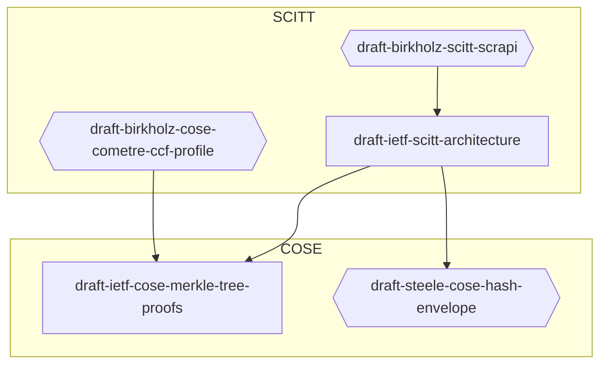

## 2024-01-08 SCITT

- Triaging issues on arch doc
- Dep diagram from Orie
  - https://github.com/ietf-wg-scitt/draft-ietf-scitt-architecture/issues/148

- https://github.com/ietf-wg-scitt/draft-ietf-scitt-architecture/issues/79
- https://github.com/ietf-wg-scitt/draft-ietf-scitt-architecture/issues/120
  - Verifier checks crypto
  - Relying party needs crypto checked, and as vested intrest in payload
- https://github.com/ietf-wg-scitt/draft-ietf-scitt-architecture/issues/151
  - Same stuff Cedric introduced at 118
- https://github.com/ietf-wg-scitt/draft-ietf-scitt-architecture/pulls/142
  - Connections to Key Transparency need to be included