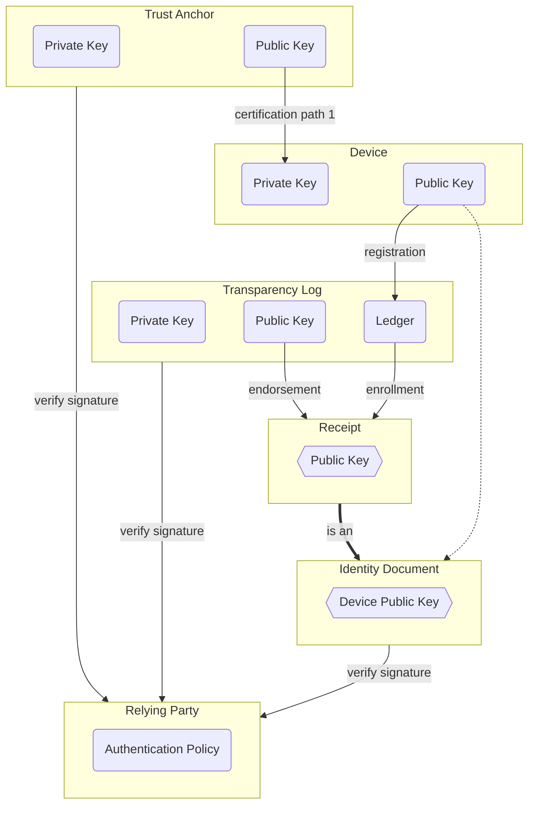

## 2024-03-26 @pdxjohnny Engineering Logs

- GUAC Call Thursday
  - > - https://zoom-lfx.platform.linuxfoundation.org/meeting/96427374177?password=cfa87e4b-f9fa-4bdf-a52f-fe9c3b4a7202
    > - OPA Gatekeeper / GUAC Demo (from Kubecon)
    > - [if time permits] How to use SBOMs and SLSA to make a Supply Chain Graph talk at Kubecon (from Kubecon)
- https://github.com/scitt-community/scitt-examples/tree/main/identity-documents
  - This is the perfect place for our OIDC phase 1 relying party to go
  - See Orie's diagram below
    - It's the same as the litellm interaction with the relying party we finished yesterday (this AM technically)
      - https://github.com/BerriAI/litellm/commit/3b6b7427b15c0cadd23a8b5da639e22a2fba5043#diff-95a105c80600ebb2de10fddc4f64a9754c12815ad7f00e3265400a789ed18786R87-R299
      - https://gist.github.com/pdxjohnny/b8d4728a002ca0e5ffe5f78c4a8ec68b
        - https://github.com/scitt-community/scitt-api-emulator/commit/1e4ec8844aa1ead539ddfd1ac9b71623e25f4c0d

- https://github.com/sigstore/fulcio/issues/754
- We call OpenAPI spec operations (tools) passing the litellm thread context JWT as bearer token
  - We pass the ClearForTakeOff token which is the token for the function to use
    - This token may or may not have permission to make a recursive call into itself
      - #1400
  - We should have a workflow.yml / request.yml inputs to FastAPI (OpenAPI) endpoint generator
  - **TODO** We need to add thread support to litellm to get thread context IDs
- https://langchain-doc.readthedocs.io/en/latest/modules/indexes/chain_examples/question_answering.html?highlight=refine#the-refine-chain
- https://langchain-doc.readthedocs.io/en/latest/modules/indexes/chain_examples/vector_db_text_generation.html
  - Read Alice docs, look for concepts, write outline based off concepts, generate sections via this
- TODO
  - [x] https://github.com/scitt-community/scitt-api-emulator/pull/39
    - 🛤️🛤️🛤️🛤️🛤️🛤️🛤️
    - https://scitt-community.github.io/scitt-api-emulator/registration_policies.html