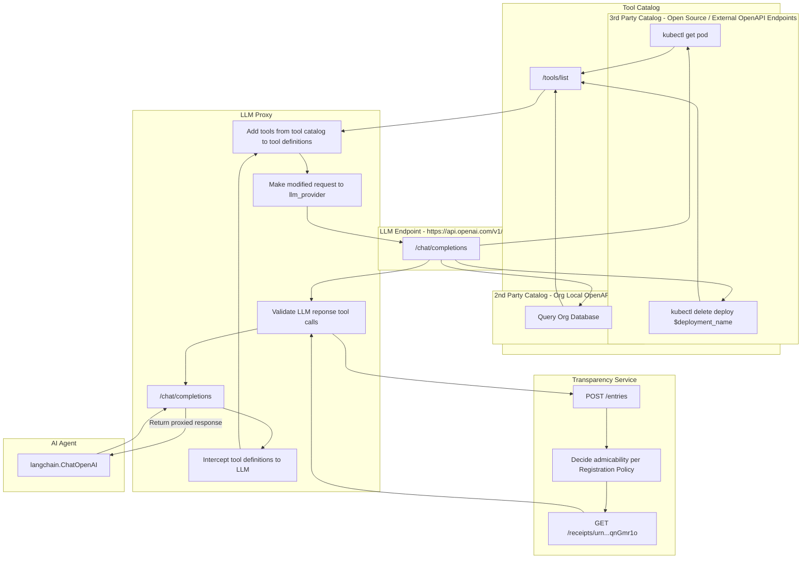

## 2024-04-12 @pdxjohnny Engineering Logs

- https://github.com/chkimes/image-attestation/blob/6f670412415746b70706fe851d5acc89f702089b/figures/attestation-chain.png
  - As images get built we run them once to find TPM/TDX values and produce the known measurements and logs those to TS with the BOM of the container / VM/ WASM. The relying party needs to be attested as well in the federation case.
  - > Producer issues VSA which says this TCB works for the Threat Model of your workload
    - https://github.com/intel/dffml/blob/9b9353b3a4b87efdb8955f529405828308adafbd/docs/discussions/alice_engineering_comms/0572/reply_0000.md
    - https://github.com/intel/dffml/blob/main/docs/discussions/alice_engineering_comms/0575/reply_0000.md
  - > Between each these is the relying party attestation check.
    >
    > 
- https://github.com/in-toto/attestation/pull/341
  - Conflates policy with policy decision
  - Really should be more of a admission control attestation then a deployment attestation
- CycloneDX 1.6 has signed SBOM support (COSE?)
- https://github.com/github-early-access/generate-build-provenance
- https://www.intel.com/content/www/us/en/software/trust-and-security-solutions.html
- https://enarx.dev/docs/Credentials
  - For `secrets.*`
- https://github.com/thesofproject/sof/issues/9034
  - > 
- https://github.com/paul-gauthier/aider/blob/9b2e6975843d253430c68ad011bcab27fb3e23cf/docs/repomap.md
  - Uses tree-sitter to give LLM context of repo
  - > Aider sends a repo map to GPT along with each request from the user to make a code change. The map contains a list of the files in the repo, along with the key symbols which are defined in each file. It shows how each of these symbols are defined in the source code, by including the critical lines of code for each definition.



- https://github.com/WebAssembly/wabt

```bash
cd python-wasi

```

```patch
diff --git a/docker/Dockerfile b/docker/Dockerfile
index 5667e50..447ab57 100644
--- a/docker/Dockerfile
+++ b/docker/Dockerfile
@@ -35,13 +35,13 @@ RUN cd /tmp && \
     wget http://ftp.gnu.org/gnu/autoconf/autoconf-2.71.tar.gz && \
     tar zxvf autoconf-*.tar.gz && \
     cd autoconf-* && \
-    ./configure && make && make install
+    ./configure && make -j $(($(nproc)*4)) && make install

 RUN cd /tmp && \
     wget http://ftp.gnu.org/gnu/automake/automake-1.16.tar.gz && \
     tar zxvf automake-*.tar.gz && \
     cd automake-* && \
-    ./configure && make && make install
+    ./configure && make -j $(($(nproc)*4)) && make install

 # WASM tools
 RUN curl https://wasmtime.dev/install.sh -sSf | bash
@@ -50,7 +50,7 @@ RUN cd /opt && \
     git clone --recursive https://github.com/WebAssembly/wabt && \
     cd wabt && \
     git submodule update --init
-RUN cd /opt/wabt && mkdir build && cd build && cmake .. && cmake --build .
+RUN cd /opt/wabt && mkdir build && cd build && cmake .. && cmake --build . -j $(($(nproc)*4))

 RUN mkdir /opt/lib
 RUN mkdir /opt/include
@@ -81,5 +81,5 @@ RUN cd /tmp && \
     unzip wasix.zip && \
     cd wasix-0.2.0 && \
     make clean && \
-    make && \
+    make -j $(($(nproc)*4)) && \
     make install
diff --git a/run.sh b/run.sh
index ac7749f..160870e 100755
--- a/run.sh
+++ b/run.sh
@@ -65,7 +65,7 @@ if [[ ! -d "${BUILD_PYTHON_DIR}" ]]; then
                --prefix="${BUILD_PYTHON_DIR}" \
                --exec-prefix="${BUILD_PYTHON_DIR}" && \
         make clean && \
-        make && \
+        make -j $(($(nproc)*4)) && \
            make install
     cd "${PROJECT_DIR}"
 fi
```


```console
$ docker run -it -u $(id -u):$(id -g) --rm -v $(pwd):$(pwd):z -w $(pwd) wasi-build:latest bash -xec 'bash -xe ./run.sh && wasmtime run --mapdir=$(pwd)/opt::opt -- opt/wasi-python/bin/python3.wasm -c "$(cat $(pwd)/fib.py)"'
│ + cd /home/johnsa1/python-wasi                                                                                                                                                                                                                                                                                                                                                               │
│ + cd /home/johnsa1/python-wasi/cpython                                                                                                                                                                                                                                                                                                                                                       │
│ + export CONFIG_SITE=/home/johnsa1/python-wasi/config.site                                                                                                                                                                                                                                                                                                                                   │
│ + CONFIG_SITE=/home/johnsa1/python-wasi/config.site                                                                                                                                                                                                                                                                                                                                          │
│ + [[ 3 -ge 3 ]]                                                                                                                                                                                                                                                                                                                                                                              │
│ + [[ 13 -ge 11 ]]                                                                                                                                                                                                                                                                                                                                                                            │
│ + rm -f /home/johnsa1/python-wasi/cpython/Modules/Setup.local                                                                                                                                                                                                                                                                                                                                │
│ + patch -p1 -N -r-                                                                                                                                                                                                                                                                                                                                                                           │
│ patching file Modules/getpath.py                                                                                                                                                                                                                                                                                                                                                             │
│ Hunk #1 succeeded at 282 (offset 1 line).                                                                                                                                                                                                                                                                                                                                                    │
│ Hunk #2 FAILED at 340.                                                                                                                                                                                                                                                                                                                                                                       │
│ Hunk #3 FAILED at 463.                                                                                                                                                                                                                                                                                                                                                                       │
│ 2 out of 3 hunks FAILED 
```

- https://github.com/singlestore-labs/python-wasi/issues/8
  - https://discuss.python.org/c/webassembly/28
    - https://discuss.python.org/t/bundling-python-apps-for-the-web-top-level-imports/15663
      - https://github.com/pyodide/pyodide-pack
- python-wasi may not be the ideal route
  - https://github.com/python/cpython/blob/eca53620e3ff1f2e7d621360a513ac34a1b35aa3/Tools/wasm/README.md
    - cpython wasm target doesn't support asyncio
- https://github.com/pygame-web/pygbag
  - Supports python WASM with asyncio
- Federation via stream of COSE byte arrays https://github.com/globocom/m3u8
- https://pygame-web.github.io/showroom/pygbag.html?cpython311
- https://github.com/intel/dffml/blob/9b9353b3a4b87efdb8955f529405828308adafbd/dffml/util/testing/manifest/shim.py#L3
  - Annnnnnnnd we're back folks
- https://github.com/ccc-certifier-framework/certifier-framework-for-confidential-computing/pull/228
- https://www.redhat.com/en/blog/all-you-need-know-about-kvm-userspace
  - Random solid summary
- https://blog.cloudflare.com/mitigating-spectre-and-other-security-threats-the-cloudflare-workers-security-model/#isolation
  - > At the whole-process level, we apply another layer of sandboxing for defense in depth. The "layer 2" sandbox uses Linux namespaces and seccomp to prohibit all access to the filesystem and network. Namespaces and seccomp are commonly used to implement containers. However, our use of these technologies is much stricter than what is usually possible in container engines, because we configure namespaces and seccomp after the process has started (but before any isolates have been loaded). This means, for example, we can (and do) use a totally empty filesystem (mount namespace) and use seccomp to block absolutely all filesystem-related system calls. Container engines can't normally prohibit all filesystem access because doing so would make it impossible to use exec() to start the guest program from disk; in our case, our guest programs are not native binaries, and the Workers runtime itself has already finished loading before we block filesystem access.
    >
    > The layer 2 sandbox also totally prohibits network access. Instead, the process is limited to communicating only over local Unix domain sockets, to talk to other processes on the same system. Any communication to the outside world must be mediated by some other local process outside the sandbox.
    >
    > One such process in particular, which we call the "supervisor", is responsible for fetching worker code and configuration from disk or from other internal services. The supervisor ensures that the sandbox process cannot read any configuration except that which is relevant to the workers that it should be running.
    >
    > For example, when the sandbox process receives a request for a worker it hasn't seen before, that request includes the encryption key for that worker's code (including attached secrets). The sandbox can then pass that key to the supervisor in order to request the code. The sandbox cannot request any worker for which it has not received the appropriate key. It cannot enumerate known workers. It also cannot request configuration it doesn't need; for example, it cannot request the TLS key used for HTTPS traffic to the worker.