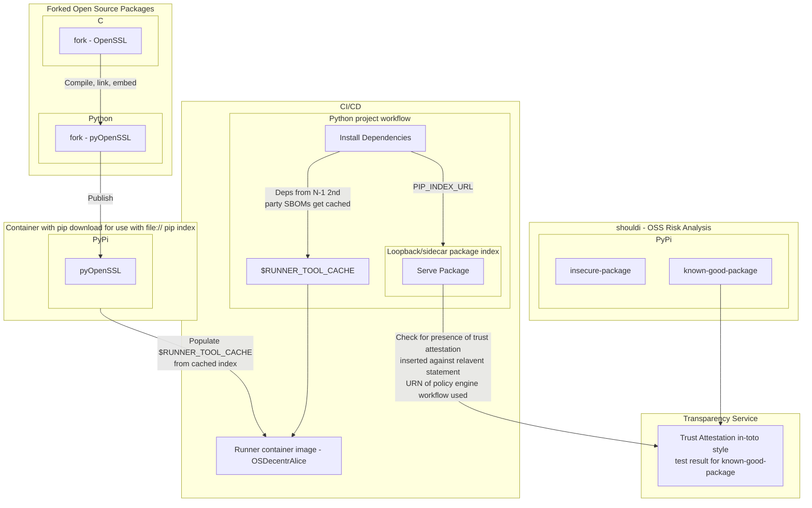

- https://github.com/intel/dffml/pull/1061/files#r1095079133

```mermaid
graph TD
    subgraph transparency_service[Transparency Service]
        transparency_service_pypi_known_good_package[Trust Attestation in-toto style<br>test result for known-good-package]
    end
    subgraph shouldi[shouldi - OSS Risk Analysis]
        subgraph shouldi_pypi[PyPi]
            shouldi_pypi_insecure_package[insecure-package]
            shouldi_pypi_known_good_package[known-good-package]
        end
    end
    subgraph shouldi[shouldi - OSS Risk Analysis]
        subgraph shouldi_pypi[PyPi]
            shouldi_pypi_insecure_package[insecure-package]
            shouldi_pypi_known_good_package[known-good-package]
        end
    end
    subgraph cache_index[Container with pip download for use with file:// pip index]
        subgraph cache_index_pypi[PyPi]
            cache_index_pyOpenSSL[pyOpenSSL]
        end
    end
    subgraph fork[Forked Open Source Packages]
        subgraph fork_c[C]
            fork_OpenSSL[fork - OpenSSL]
        end
        subgraph fork_python[Python]
            fork_pyOpenSSL[fork - pyOpenSSL]
        end

        fork_OpenSSL -->|Compile, link, embed| fork_pyOpenSSL
    end
    subgraph cicd[CI/CD]
        runner_tool_cache[$RUNNER_TOOL_CACHE]
        runner_image[Runner container image - OSDecentrAlice]
        subgraph loopback_index_service[Loopback/sidecar package index]
            serve_package[Serve Package]
        end

        subgraph workflow[Python project workflow]
            install_dependencies[Install Dependencies]
            install_dependencies -->|Deps from N-1 2nd<br>party SBOMs get cached| runner_tool_cache
            install_dependencies -->|PIP_INDEX_URL| loopback_index_service
        end

        runner_tool_cache --> runner_image
    end

    shouldi_pypi_known_good_package --> transparency_service_pypi_known_good_package

    serve_package -->|Check for presence of trust attestation<br>inserted against relavent statement<br>URN of policy engine workflow used| transparency_service_pypi_known_good_package

    cache_index_pypi -->|Populate $RUNNER_TOOL_CACHE<br>from cached index| runner_image

    fork_pyOpenSSL -->|Publish| cache_index_pyOpenSSL
```