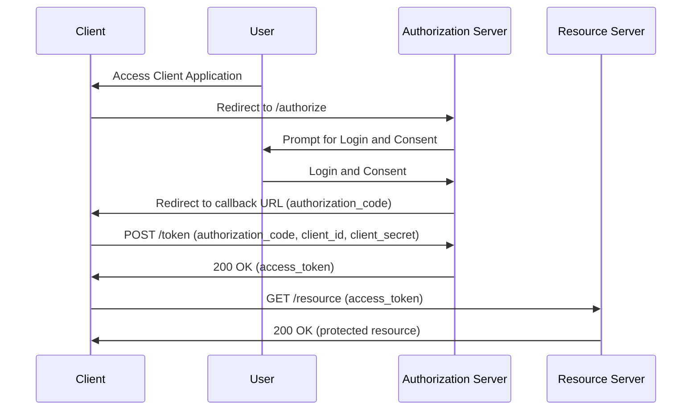

## 2024-06-08 @pdxjohnny Engineering Logs

- https://directus.pdxjohnny.chadig.com/auth/login/forgejo?redirect=https%3A%2F%2Fdirectus.pdxjohnny.chadig.com%2Fadmin%2Flogin%3Fcontinue%3D

```bash
export FORGEJO_FQDN="git.pdxjohnny.chadig.com" \
&& export DIRECTUS_FQDN="directus.pdxjohnny.chadig.com" \
&& rm -fv \
  "${HOME}/.local/directus.sqlite3" \
  "${HOME}/.local/directus_admin_role_id.txt" \
&& ( 
  set -x; \
  referesh_role_id() { 
    export DIRECTUS_ADMIN_ROLE_ID=$(echo 'SELECT id from directus_roles;' \
                                    | sqlite3 ${HOME}/.local/directus.sqlite3 \
                                    | tee ${HOME}/.local/directus_admin_role_id.txt); \
  }; \
  referesh_role_id; \
  while [ "x" = "x${DIRECTUS_ADMIN_ROLE_ID}" ]; do \
    sleep 5; \
    referesh_role_id; \
  done; \
  set +x; \
  ) & \
docker run \
  -ti \
  --rm \
  -p 8055:8055 \
  -e PUBLIC_URL="https://${DIRECTUS_FQDN}" \
  -e AUTH_DISABLE_DEFAULT=true \
  -e AUTH_PROVIDERS="forgejo" \
  -e AUTH_FORGEJO_DRIVER="openid" \
  -e AUTH_FORGEJO_CLIENT_ID="$(python -m keyring get directus auth.forgejo.client_id)" \
  -e AUTH_FORGEJO_CLIENT_SECRET="$(python -m keyring get directus auth.forgejo.client_secret)" \
  -e AUTH_FORGEJO_ISSUER_URL="https://${FORGEJO_FQDN}/.well-known/openid-configuration" \
  -e AUTH_FORGEJO_IDENTIFIER_KEY="email" \
  -e AUTH_FORGEJO_REDIRECT_ALLOW_LIST="https://${DIRECTUS_FQDN}/auth/login/forgejo/callback" \
  -e AUTH_FORGEJO_ALLOW_PUBLIC_REGISTRATION=true \
  -e SECRET="$(head -n 99999 /dev/urandom | sha384sum - | awk '{print $1}')" \
  --entrypoint sh \
  -v "${HOME}/.local/directus_admin_role_id.txt:/directus/admin_role_id.txt:z" \
  -v "${HOME}/.local/directus.sqlite3:/directus/database/database.sqlite:z" \
  directus/directus \
  -c \
  'set -x && node cli.js bootstrap && while [ "x$(cat admin_role_id.txt)" = "x" ]; do sleep 10; done && export AUTH_FORGEJO_DEFAULT_ROLE_ID=$(cat admin_role_id.txt) && pm2-runtime start ecosystem.config.cjs'
```

- https://github.com/go-gitea/gitea/issues/22779
  - There's not API for adding applications which use forgejo for OIDC based auth
    - Was unable to use cookie jar and curl to avoid the lack of API
      - Will have to implement in API, basing off org create APIs since that form in similar
- What is federation with forgejo? Peer to peer pull requests. CI/CD on host and in shared pools. Works on my machine should also be works in CI because we have a runner on our machine.


- OIDC confidential client flow



- https://github.com/go-gitea/gitea/blob/0188d82e4908eb173f7203d577f801f3168ffcb8/models/auth/oauth2.go#L257
- https://github.com/go-gitea/gitea/blob/0188d82e4908eb173f7203d577f801f3168ffcb8/modules/structs/user_app.go#L36
- TODO
  - [x] Deploy Directus where auth is from ForgeJo via OIDC
  - [ ] Federate events to the always online server from laptop
  - [ ] Systemd unit file to start forgejo and directus and scitt (or rekor) on user login and ssh tunnels
    - [x] Configure server side caddy to fallback reverse proxy to the loopback federated always online "mirror" forgejo (this is how we take federated closer to peer to peer)
      - https://github.com/pdxjohnny/dotfiles/blob/64b97e177256397900c34118a79590d08a727090/forge-install.sh
    - [ ] SCITT