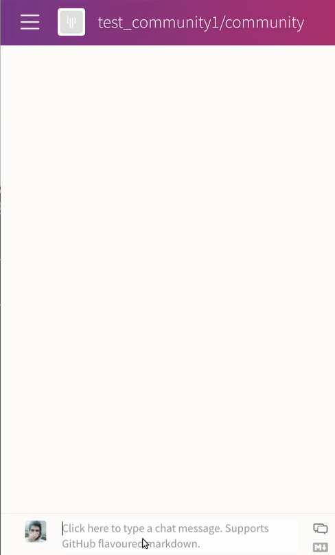

Gitter ML Inference Chatbot
===========================

This tutorial shows how to use configs in DFFML operations. We'll be implementing
a Gitter chatbot. Let's take a look at the final result before moving forward.

Okay, Let's start!!
We'll be using the Gitter's Streamping API to collect chats, for this we need an
authorization token from Gitter. Go to https://developer.gitter.im/apps
and get the personal access token for your chatbot (If you are redirected to the Gitter docs
from this URL, sign in and try again).

Our dataflow will take a Gitter room URI as input (For https://gitter.im/dffml/community
``dffml/community`` is the URI), listens to chats in the room and replies to
messages which are directed to our bot.

.. note::

    All the code for this example is located under the
    `examples/dataflow/chatbot <https://github.com/intel/dffml/blob/master/examples/examples/dataflow/chatbot>`_
    directory of the DFFML source code.

We'll write the operations for this dataflow in operations.py

.. literalinclude:: /../examples/dataflow/chatbot/operations.py
    :lines: 24-51,53-86,88-120,122-217

our operations are ``get_room_id, stream_chat, send_message and interpret_message``.
All of them use at least one config. The common config being INISecretConfig which
loads out secret token and bot name from out ini configs file.

.. literalinclude:: /../examples/dataflow/chatbot/configs.ini

Detour: What are imp_enter and ctx_enter?
---------------------------------------------

.. code-block::python

    config_cls=GitterChannelConfig,
    imp_enter={"config": lambda self: self.config.config},
    ctx_enter={"cfg": lambda self: self.parent.config()},

This piece of code in the op decorator tells that the operation will be using
``GitterChannelConfig``. ``imp_enter`` and ``ctx_enter`` are basically shortcuts for
the double context entry followed in dffml.

``"config": lambda self: self.config.config``: sets the ``config`` attribute of parent to
what is returned by the function; in this case it returns BaseSecret(because ``self.config``
is ``GitterChannelConfig`` and it has a ``BaseSecret`` as its config attribute)

``"cfg": lambda self: self.parent.config()``: calls the function and assigns the return value
to ``cfg`` attribute.

So in the operation instead of

.. code-block:: python

    with self.config.config() as config:
        with cfg as config():
            cfg.call_a_method()

we can do

.. code-block:: python

    self.cfg.call_a_method()

Running the dataflow
--------------------

.. literalinclude:: /../examples/dataflow/chatbot/run.py

set the room name, config file name and run the dataflow

.. code-block:: console

    python run.py

Or using the command line to, create the dataflow

.. code-block:: console

    dffml dataflow create \
        operations:get_room_id \
        operations:stream_chat \
        operations:send_message \
        operations:interpret_message \
        -config \
            ini=operations:get_room_id.secret.plugin \
            "configs.ini"=operations:get_room_id.secret.config.filename \
            ini=operations:stream_chat.secret.plugin \
            "configs.ini"=operations:stream_chat.secret.config.filename \
            ini=operations:send_message.secret.plugin \
            "configs.ini"=operations:send_message.secret.config.filename \
            ini=operations:interpret_message.secret.plugin \
            "configs.ini"=operations:interpret_message.secret.config.filename \
    > chatbot_df.json

And run it by providing the ``room_name`` as the input

.. code-block:: console

    dffml dataflow run records all \
        -dataflow ./chatbot_df.json \
        -inputs test_community1/community=room_name \
        -sources m=memory \
        -source-records temp
