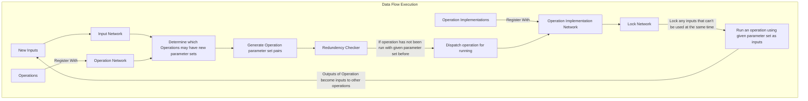
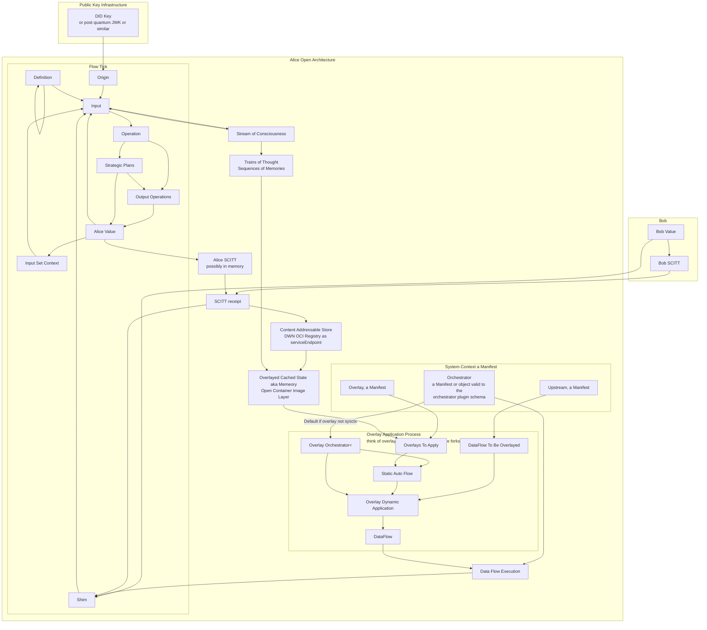

# Volume 0: Chapter 2: She's Ariving When?

Between the tick and the tock. Which is not a finite amount
of time. In fact, what's recently been revealed is the
knowledge that she's already here, she's been here for quite
some time now.

This should be about the pattern, the system context, the Upstream,
the Overlay, and the Orchestrator. A pattern that has always existed.
The pattern of the open architecture has been something we could
have done at any time. It's just the way you think about traversing
the process graph.

## Data Flow Programming

> Explainer on waht data flow programming is and how it works.
> Alice thinks in parallel.

- Tutorials on DFFML Operations / DataFlows

  - https://intel.github.io/dffml/main/examples/shouldi.html
  - https://intel.github.io/dffml/main/examples/dataflows.html
  - https://github.com/intel/dffml/blob/alice/entities/alice/CONTRIBUTING.rst#finding-data-types-to-work-with

- Talk snippit explaining above tutorial

  - https://youtu.be/D9puJiKKKS8?t=873
  
- Concuptual docs on data flow execution

  - https://github.com/intel/dffml/blob/alice/docs/about.rst#what-is-key-objective-of-dataflows
  - https://intel.github.io/dffml/main/concepts/dataflow.html
  
- Misc. References

  - https://en.wikipedia.org/wiki/Dataflow_programming
  - https://www.gamedeveloper.com/programming/tips-on-writing-code-for-data-oriented-design
  - https://www.youtube.com/watch?v=aPh4Z3SioB8

We need to come up with serveral metrics to track and plot throughout.
We also need to plot in relation to other metrics for tradeoff analysis.

We could also make this like a choose your own adventure style tutorial,
if you want to do it with threads, here's your output metrics. We can
later show that we're getting these metrics by putting all the steps
into a dataflow and getting the metrics out by running them. We could then
show how we can ask the orchestrator to optimize for speed, memory, etc.
Then add in how you can have the orchestrator take those optimization
constriants from dynamic conditions such as how much memory is on the
machine you are running on, or do you have access to a k8s cluster. Also
talked about power consumption vs. speed trade off for server vs. desktop.
Could add in edge constraints like network latency.

Will need to add in metrics API and use in various places in
orchestrators and expose to operations to report out. This will be the
same APIs we'll use for stub operations to estimate time to completion,
etc.

- Make sure to measure speed and memory useage with ProcessPoolExecutor
  ThreadPoolExecutor. Make sure we take into accout memory from all
  processes.

- Start to finish speed

  - Plot with number of requests made

- Memory consumed

  - Plot with number of requests made

This could be done as an IPython notebook.

- Show basic downloader code

  - Observe speed bottleneck due to download in series

- Parallelize download code

  - Observe increase in speed

  - Observe error handling issues

- Add in need to call out via subprocess

  - Observe subprocess issues

- Move to event loop

  - Observe increase in speed (? Not sure on this yet)

  - Observe successful error handling

  - Observe need to track fine grained details

- Move to event based implemention with director (orchestrator, this file
  minus prev pointers in Base Event)

  - Observe visablity into each event state of each request

  - Observe lack of visablity into chain of events

- Add prev pointers

  - Open Liniage

- Move to data flow based implemention

- Demo full DFFML data flow using execution on k8s

  - Use k8s playground as target environment

### DFFML's Current Working Data Flow Execution Model



## If You Give A Python A Computer

*If you give a Python a computer, they're gonna wanna write a script.
When they write a script, they're gonna end up maintaining that script.
When they end up maintaining that script, vulnerabilities with CVSS
scores of HOLY_HAND_GRENADE_OF_ANTIOCH will relentlessly bombard our
once curious and now distraught Python. Never fear, Alice is Here!
She's returned to Wonderland to do battle with Python as they take on...
open source software maintainance!? Not even Eve saw this One coming.
We'll quest far and wide, and we might even find what we forgot we set
out looking for.*

If you give a Python a computer, they're going to want to write a script. If they want to write a script, they're probably going to want to call another script. If they're going to call a script, they're going to want to read the output. If they read the output, they're going to want to write it somewhere else. So if they write the script, that's the first operation. If they read the output, now that gets into the importance of the... Okay. If they write a script, that becomes the operation. Now they want to execute another command. Okay. So that's another operation. Now, if... Now, reading the output. So... Now, reading the output, it comes in an event-based way. Because you need to wait for the return code, and you want to read line by line, and you want to do all that at the same time. Right. So you're going to end up with, you know, what amounts to the... execute some process, but being run in a dataflow will have to show that. And then, okay... pass that script. They're going to want to write it. Call another script. If they're going to call a script, they're going to want to read the output. Okay. If they're going to read the output, they're probably going to want to do something with the output. Or they're probably going to want to write it somewhere else. If they're going to want to write it somewhere else, that means that they need to use the network. If they're going to use the network, they should probably be using asyncio. Okay. So, now what happens after you've written it somewhere else? Okay. Probably running something remotely. Okay, what do you usually do? Yeah, you're going to want to do something remote. You're going to want to write it somewhere else. Okay, well, where are you going to... If you want to write it somewhere else, you probably want a web service to receive it. You probably want to write something to receive it. Yeah, you want to... If you're going to write it somewhere else, you probably need to write something to receive it somewhere else. Okay. And now that's the first time where we've got... The first operation is the script. It executes the subprocess, which is in the same machine, and then it wants to write it somewhere else. So now you can have the implementation of the script is on one machine, and now we can show how the input moves to the other machine using the execution environment. Okay, it's going to want to write something to receive it. Now, if you write something to receive... What is he going to want to do? He's probably going to want to run that on another computer. Okay. He's probably going to want to run it on another computer. And when he runs it on another computer, he's probably going to need to deploy... He's probably going to... If he wants to run it on another computer, then he's going to need to build it.

They're gonna want to run on our computer. He's going to want to build it. No, they're going to want to build it. They're going to build it. And then this is where we get into something where it's like, uh, synthesis. Where we can basically say, hey, so we're sending from... Okay, so basically we're running the script on one machine. We're sending to the other machine. So, the other machine, and we send it to the other machine, we're doing that via probably an operation implementation network, which exposes the open API. Or which hits its server, which exposes the open API. So then we need to go synthesize the server that builds the open API. So, the implementation is seen by the side. The implementation is seen by the side that runs the script is the open API client. Now, when you take the same data flow and you render it like you can take the same data, so you can be executing the data flow, or you can take the data flow and you could do like a build, essentially. And when you do the build, the implementation, you see, yeah, when you do the build, it's essentially, it's essentially using an orchestrator to do the build. Is it using an orchestrator to use the build? I think no, I think it might just be like a run data flow. And the run data flow handles putting things together. So it might see this operation that says, you know, what does the operation say? It says it's to receive, you know, receive client, receive something operation. Right. OK. And I really like it's the log, you know, it's the write to log file. OK, it's right to log file. Right. Write to file. No, update Web page. Update Web page. OK. And then we can see a Web page that just shows the updated value. All right. So. OK. And then we can just run the output and pull and refresh the Web page. OK, so. OK, so. OK, so now you're going to synthesize this thing. So how would you do that? Basically, ideally, you would describe it as a data flow or you would describe it. Maybe you describe it as a what you're going to describe as a data flow. So how do you describe it? So maybe your run data flow here is something like. Some kind of. You know, it's a it's a synthesis run data flow. Very cool. So it's some kind of synthesis run data flow instead of instead of actually it's it's. OK, so how are you swapping that out? Well, you're swapping out the operation implementation when you do the execution. So you swap out the operation. So you swap out. OK, well. So. Do the execution when you do the execution. So you have essentially have multiple. Multiple. OK, so you have multiple. You might actually select a different. So you have selected the operation implementation for you essentially have like a client and a server. And so somewhere in the data flow, you say for client. For client. Then choose the operation implementation network, like each operation instance has a preferred implementation network for each deployment method. And so when you synthesize your server, you say my preferred method is OK. You say my preferred method is essentially the synthesize thing. And then. Yeah, it's like a build. Your preferred method is actually build. And what even like does it even matter that you have the inputs there? No, probably not, because you're probably going to say you're probably going to say pass data flow to the build, which you're probably going to pass the data flow to the build, which will. You're going to pass the data flow to the build in the builds config, which means that you need to configs specific to deployment as well. And so you need configs that are specific to deployment as well. So. Can fix specific to. Yeah. OK, so then. So you can fix this specific to. So you need to config specific for build and I can fix specific for deploy. OK, so in the build.

In the build specific configs you have a data flow. In that data flow it probably contains, for example, say we were doing this. Say we wanted to build a fast API. We're going to build this fast API thing. We're actually going to synthesize one of the roots. We'll synthesize one of the roots. We'll output a Python file that runs the data flow where the input is one of those model things, and the model will take the inputs as shown from the parent data flow, whatever the inputs to the operation were. Basically, you run data flow with the build option set. With the build, your target is build. So you run data flow, your target is build. Now your operation implementation knows what its inputs are. It's going to take those inputs and their definitions. Because you're saying, I am a builder, you're probably going to inject the inputs to your own. You're probably going to take the operation that you're building for and you're going to add it as an input to the network itself, like the operation itself, so that then the data flow that does the build would say, because you're basically saying the build, you're executing run data flow. On the client, you're going to end up with an operation implementation which calls the open API spec, like the open API spec endpoint. You're going to end up with an operation implementation that calls the open API spec. When you do the build, the build says, like server build for example, you would pass server build says, prefer an operation implementation. When you run data flow server build, the other one is a NOP. Essentially, you NOP the client stuff. You have NOPs, the client specific implementations are NOPs. The client specific implementations are NOPs and you end up doing actually run data flow without any inputs. It's kicked off whenever the data flow went on initialization, whatever that flow was, whatever that code path was through the orchestrator. It kicks off the operations that don't have any inputs. It'll kick off this operation because this operation is actually run data flow and the original one that was running the script is actually a NOP in the server build version. It's run data flow and the script is NOP. Now we need to build, but it's run data flow. If we run data flow, we're going to say add the operation itself as the... We might need a specific version of run data flow for this because I don't know if this is something that we would add in the config to run data flow. It seems a little bit specific to a build process type of run, but we might be a separate operation is what I mean. Basically, what you end up is not really an implementation specific over preference. I think that probably comes somewhere else. You probably have an operation implementation preference for each operation at run time where you would prefer... You have two things. You basically have deployment specific overrides. You have a deployment specific override and then you have a at execution time deployment implementation preference per deployment. You run the build. It adds the input to the network and it specifies and you've given it the data flow. The data flow you've given it says write me a... Write out a file that is an open API server or a fast API server. It writes out the file that's a fast API server. It uses the input definitions to create the model and the result is a built fast API app. Now you have the deploy phase and then you might take that and you might turn it into a container. Now you would have the deploy data flow. You would run the deploy step on the same data flow and you would say... You would run the deploy step on the same data flow and it would then take the built application and you would run the deploy phase on the same data flow and it would take the built application. Then if you give up Python... If he wanted to write the... If he wanted to read the logs then he wanted to write the logs. If he wanted to write the logs he's probably going to want to write them to his server. If he wants to write the logs that's where we say the part about AsyncIO. If he wants to write them to his server then now we need to figure out, okay, how is he going to write his server? What is his server? That's where we get into the synthesis and the build version of the data flow. Now if he's going to want to write the summary he's probably going to need a server. If he's going to need a server he's going to write a service... Yeah, he's going to need a service. If he's going to write a service he's going to need to deploy a service. Now we get into deployment. Now we need to think somehow about the artifacts that were created in the build process. How do we communicate the fact that there are outputs from one stage? Because it almost becomes... It is a different data flow really. Where are we picking up those outputs? That stuff is probably all in config. We probably have... Yeah, so we've probably configured... We've probably configured... Yeah, that stuff is all in config. For example, those data flows, the build data flow, the one that we're supplying to the run data flow when we override for the build phase, which means configs needs to have an option for deployment specific stuff. When we do that for build phase we're going to write out... The data flow will take in its configuration, the places where it writes things. Then the deployment data flow will just configure with the same credentials or the same whatever or the same output path so that it understands. We're not facilitating... Do we need to facilitate that? If you wanted to do that you would write one data flow that would call both of them and then pass the outputs between them. Yeah, you could have a data flow that does build and deploy. You could run the build stage and you can run the deploy stage or you could have a build and deploy data flow. The build and deploy data flow would say, okay, run the build data flow. When you run it... Let's see. When you run the build data flow you need to tell it where the hell you're building, where the hell you're going to... You need to configure it. Does that need to be configured or inputs? Because most of it is inputs are runtime things. Configuration is locked at data flow. I would say that you can override that data flow. For example, you wanted to build this server and it comes out of the container. Now I want to push that container somewhere. You built it and now you want to push it somewhere. When you push it somewhere you do the build. Say you do the build and it's entirely in memory somehow. Then you push an in memory image as an input to an operation which does something to it. It's probably going to push it to a registry. You could potentially just swap out that operation. In that case the registry is probably helping us configure it. Remember we can take anything that's configured and we can make it an input and we can take anything that's an input and make it configured if you wanted to. You could have re-scoping operations. It's essentially that little operation that we talked about that has... You could wrap any input. You could wrap any operation and make the scope different on this. Okay. Now deployment artifacts. Build artifacts, deployment artifacts. The build, where do you separate that? Is the build build and push? Is the build just build? Okay, if it's just build then yeah, you end up with this image and you're like, what do I do with the image? You probably need to push it somewhere. From that perspective you need to have an operation in the data flow that's going to do that push somewhere. Now how do you communicate where it was pushed to the other thing? Well when you run that data flow you either need to have configured the operations or you need to be passing them as inputs. That's really up to you. You can... Yeah. If you configure them then you can always wipe them out with an override and make them configurable. Make them be in operations that you used to take it as a config but you're overriding it to take it as an input. Now that you have that, okay so you've built and pushed then you run the deploy. The deploy, you have a data flow that's just run data flow stage build, run data flow stage deploy and then that would be built and deployed. If you give a Python, if he wants to write a service he's going to want to deploy a service. If he's going to want to deploy a service then it's the same flow as the build. You just show him it again. Now if he's going to want to deploy a service he's going to want to deploy a service from his CI CD. If he's going to want CI CD and then what do we go into the whole build server process? I'm not sure. Maybe.

And if he wants to deploy a service, he's going to want some logs. And if he wants some logs, Oh, wait, no, we can't go yet. We have to, we have to finish out. If he's going to deploy a service, he's going to want some logs. Okay. And then we talk about, and then we talk about the integration with the open lineage stuff. We can talk about the integration with the open lineage stuff for John Lader who can't hear himself than Apple.

Scratch the logs. Alright, well, in that order. So, if he's gonna write a service, he's going to have to configure it. Alright, if he's gonna, if he's gonna deploy, oh, if he's gonna deploy a service, he's going to need some secrets. Okay, and now we talk about the whole secret thing and the input transforms and yeah, that whole thing. We'll talk about that whole thing. And, okay, yeah, it's gonna, and if he's going to, and if he's going to manage his secrets, he's going to need to do his security process. If he's going to do his security process, okay, and when he does his security process, here's the level of audibility, the auditability and the visibility in throughout the entire thing in an automated way. And if, okay, and if he's going to do his security process, then he's going to need, then he's going to need some logs. And if he's going to need some logs, then we do the whole open lineage thing, right. And if he's gonna have some logs, and if he's gonna have some logs, then he's gonna look for bugs. Okay, maybe he's gonna look for bugs. What is he gonna do with the logs? Okay, he's gonna look for bugs, he's gonna look for bugs and logs, he's going to, I don't know, probably looking for bugs. So, okay, but how do we get into the thing where you have the real-time updates throughout the entire thing? So, okay, the bugs, okay, the bugs, and if he's gonna look for logs, okay, so security and then he's got logs. And so the logs, then the logs, then the logs, we get into the open lineage thing. Yeah, we get into the open lineage thing and we can look at the data flow as it's running and we can do analysis on and, you know, what is happening as it's happening. And we can potentially even report that information all the way back through the client. Have we covered everything? I think we have. Perfect.

Okay, and then, and if you're gonna fix some bugs, so if you're gonna find some bugs, you're gonna fix some bugs. If you're gonna fix some bugs, you're gonna want some CI CD. And if you want some CI CD, then blah blah blah blah blah, then we tell the story about kube control, fucking etc. And I think we have a wrap all the way back in the whole circle of development. I think we've covered every single part, unless we have not. What else might we need to cover? So we covered building the app, deploying the app, across platforms, running it across platforms, events, logging, bugs, bug fixing, security, fuck man. Alright, okay.


So, if you synthesize data flow, you may lose things like event emissions of inputs between operations. So we need a way to say that, we need a way, we need that way to say what events, events, what events are you expecting? The data flow should declare what events it's expecting to yield as an allow list.

If you give Monty Python a computer, they’ll want to search for the Holy Grail. If they want to search for the Holy Grail, they might find the system context. If they find the system context, they’ll know that the Holy Grail is the Trinity is the system context: the upstream, the overlay, and the orchestrator.

## System Context 

- References
  - https://github.com/intel/dffml/blob/alice/docs/arch/0008-Manifest.md
  - https://github.com/intel/dffml/blob/alice/docs/arch/0009-Open-Architecture.rst
  - https://github.com/microsoft/scitt-ccf-ledger/blob/main/pyscitt/pyscitt/did.py
  - https://scitt.io/distributing-with-oci-scitt.html
  - [Data Flow Execution: One possible implementation approach](#dffmls-current-working-data-flow-execution-model)
  - https://github.com/intel/dffml/tree/alice/docs/tutorials/rolling_alice/0000_architecting_alice#what-is-alice



> |Pass flow to be overlayed|
> |What is the execution context? Example: UNIX Group_identifier|
> |Where did this come from? client, cache, seed, argv, etc.|
> |Defines data type|
> |Links to other definitions to support something like<br>inheritance via graph node label traversal|

## SCITT API Emulator Spin Up

Playing with SCITT

- References
  - https://github.com/microsoft/scitt-api-emulator/blob/2502eda6b99936a7b28792ca3fd6ba9fbf97e7ba/README.md

```console
$ git clone https://github.com/microsoft/scitt-api-emulator
$ cd scitt-api-emulator
$ git ls-files | xargs -I '{}' -- sed -i 's/python3.8/python3.10/g' '{}'
$ python -m rich.markdown README.md
$ ./scitt-emulator.sh server --workspace workspace/ --tree-alg CCF
Setting up Python virtual environment.
[notice] A new release of pip available: 22.2.2 -> 22.3.1
[notice] To update, run: pip install --upgrade pip
Service private key written to workspace/storage/service_private_key.pem
Service parameters written to workspace/service_parameters.json
Service parameters: workspace/service_parameters.json
 * Serving Flask app 'scitt_emulator.server'
 * Debug mode: on
WARNING: This is a development server. Do not use it in a production deployment. Use a production WSGI server instead.
 * Running on all addresses (0.0.0.0)
 * Running on http://127.0.0.1:8000
 * Running on http://192.168.1.115:8000
Press CTRL+C to quit
 * Restarting with stat
Service parameters: workspace/service_parameters.json
 * Debugger is active!
 * Debugger PIN: 000-000-000
```

- Ran commands from `README.md`

```console
$ ./scitt-emulator.sh server --workspace workspace/ --tree-alg CCF
$ ./scitt-emulator.sh client create-claim --issuer did:web:example.com --content-type application/json --payload '{"sun": "yellow"}' --out claim.cose
$ ./scitt-emulator.sh client submit-claim --claim claim.cose --out claim.receipt.cbor
$ ./scitt-emulator.sh client retrieve-claim --entry-id 1 --out claim.cose
$ ./scitt-emulator.sh client retrieve-receipt --entry-id 1 --out receipt.cbor
$ ./scitt-emulator.sh client verify-receipt --claim claim.cose --receipt claim.receipt.cbor --service-parameters workspace/service_parameters.json
```

- It works!

> The `verify-receipt` command verifies a SCITT receipt given a SCITT claim and a service parameters file. This command can be used to verify receipts generated by other implementations.
>
> The `service_parameters.json` file gets created when starting a service using `./scitt-emulator.sh server`. The format of this file is not standardized and is currently:
>
> ```json
> {
>     "serviceId": "emulator",
>     "treeAlgorithm": "CCF",
>     "signatureAlgorithm": "ES256",
>     "serviceCertificate": "-----BEGIN CERTIFICATE-----..."
> }
> ```

- We upload `alice shouldi contribute` dataflow to SCITT and get a receipt!
  - Friends, today is a great day. :railway_track:
  - Next stop, serialization / federation with Alice / Open Architecture serialization data flow as SCITT service.
- References
  - [Architecting Alice: She's Arriving When?: System Context](#system-context)
  - [`alice shouldi contribute`](https://github.com/intel/dffml/tree/alice/entities/alice#contribute)
  - [Coach Alice: Our Open Source Guide](https://github.com/intel/dffml/blob/alice/docs/tutorials/rolling_alice/0001_coach_alice/0002_our_open_source_guide.md)

[](https://asciinema.org/a/537643)

> **TODO** The should be moved to Volume 6: Chapter 1: Time Travel with Us
>
> Time being relative to the sum of knowledge in aligned chains of
> thought / system contexts. See discussion dump for details: 2022-05-02 https://github.com/intel/dffml/discussions/1369#discussioncomment-2677810
>
> > The trick is tick to tock is different across different conscious and subconscious states. 
