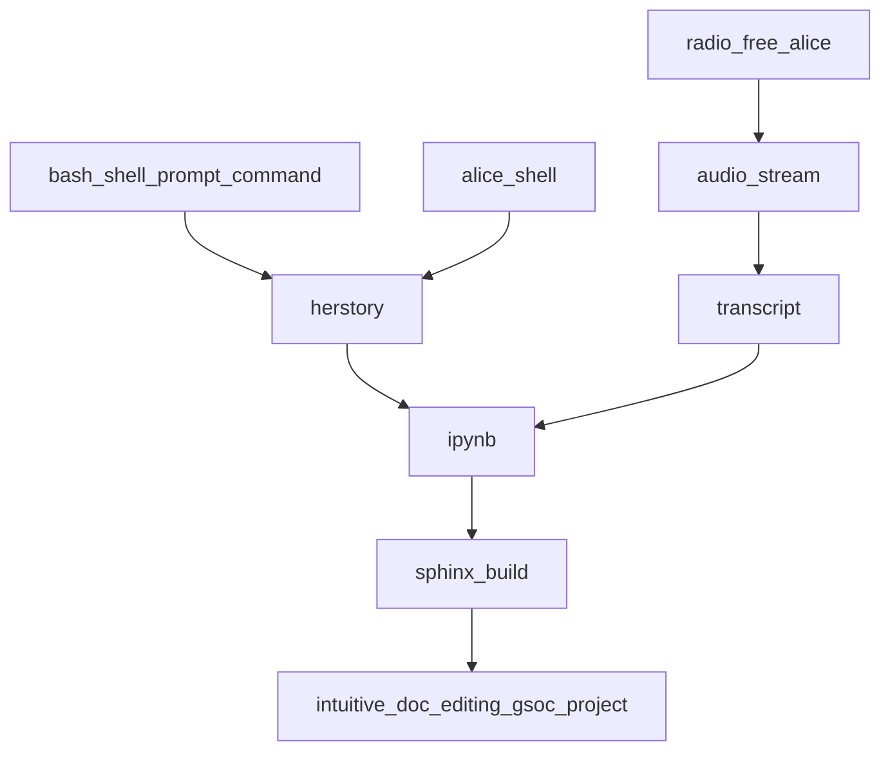

# Volume 0: Chapter 4: Writing the Wave

We want Alice to be as easy to communicate with as possible so
that she can be the most helpful possible.

We'll be using text to a speech to text model from OpenAI known
as Whisper provide Alice with additional context / input data.
In future tutorials we'll leverage what we teach Alice here.

- Context
  - This tutorial is how we enabled Alice to hear us and
    transcribe our verbal communication to text for further
    analysis and control.
  - We are doing this so we can talk to Alice while we develop
    to provide her with more context about our process and
    enable her to communicate that to future devs or eventually
    devs working in parallel.
- Goals
  - Teach Alice to transcribe speech to text.
- Actions
  - We're going to write an operation that streams output of
    transcription to other operations.
- Future work
  - We'll later implement operations which combine our shell
    recordings with our audio transcriptions to help us creat
    tutorials just by hacking in the shell and explaining our
    process!
- References
  - This tutorial is covered in `Writing the Wave: Teaching Alice to Listen` **TODO** Update with link to recording once made.
  - The resulting commit from completion of this tutorial was: **TODO** Update with link to operations added.
- Feedback
  - Please provide feedback / thoughts for extension / improvement about this tutorial in the following discussion thread: https://github.com/intel/dffml/discussions/1413

## The Time is Come for Thee to Reap

A good friend to us all, John Van Sickle, whose ffmpeg static
builds have saved many of us from an ungodly amount of time
spent in dependency hell.

We'll be calling on John today, or well, his HTTP server, to
provide us with what we all want, ffmpeg that "just works".
Whisper requires that we have ffmpeg installed and asking John
for a binary is usually the easiest way to make that happen.

```console
$ curl -sfLOC - https://johnvansickle.com/ffmpeg/releases/ffmpeg-release-amd64-static.tar.xz
$ tar xvf ffmpeg-release-amd64-static.tar.xz
```

Move the downloaded files into a user local binary directory,
we're sure to have permissions to write here.

```console
$ mkdir -p ~/.local/bin/
$ mv $(ls | grep ffmpeg- | grep -v tar.xz)/{ffmpeg,ffprobe,qt-faststart} ~/.local/bin/
```

Add the directory to your `PATH` to ensure you can run the binaries
we put in there.

```console
$ export PATH="${PATH}:${HOME}/.local/bin"
```

Add the PATH modification to the shell's startup scripts to ensure
*new* shells also know where to get those binaries so as to run them.

```console
$ echo -e 'export PATH="${PATH}:${HOME}/.local/bin"' | tee -a ~/.bashrc ~/.bash_profile
```

Try running `ffmpeg`, you should see output similar to the following.

```console
$ ffmpeg
ffmpeg version 5.1.1-static https://johnvansickle.com/ffmpeg/  Copyright (c) 2000-2022 the FFmpeg developers
  built with gcc 8 (Debian 8.3.0-6)
  configuration: --enable-gpl --enable-version3 --enable-static --disable-debug --disable-ffplay --disable-indev=sndio --disable-outdev=sndio --cc=gcc --enable-fontconfig --enable-frei0r --enable-gnutls --enable-gmp --enable-libgme --enable-gray --enable-libaom --enable-libfribidi --enable-libass --enable-libvmaf --enable-libfreetype --enable-libmp3lame --enable-libopencore-amrnb --enable-libopencore-amrwb --enable-libopenjpeg --enable-librubberband --enable-libsoxr --enable-libspeex --enable-libsrt --enable-libvorbis --enable-libopus --enable-libtheora --enable-libvidstab --enable-libvo-amrwbenc --enable-libvpx --enable-libwebp --enable-libx264 --enable-libx265 --enable-libxml2 --enable-libdav1d --enable-libxvid --enable-libzvbi --enable-libzimg
  libavutil      57. 28.100 / 57. 28.100
  libavcodec     59. 37.100 / 59. 37.100
  libavformat    59. 27.100 / 59. 27.100
  libavdevice    59.  7.100 / 59.  7.100
  libavfilter     8. 44.100 /  8. 44.100
  libswscale      6.  7.100 /  6.  7.100
  libswresample   4.  7.100 /  4.  7.100
  libpostproc    56.  6.100 / 56.  6.100
Hyper fast Audio and Video encoder
usage: ffmpeg [options] [[infile options] -i infile]... {[outfile options] outfile}...

Use -h to get full help or, even better, run 'man ffmpeg'
```

Thanks again John!

## Not With a Bang, but With a Whisper

OpenAI does some cool stuff! They released a model we'll be wrapping
as an operation, first we'll do some basic setup and usage of their
text to speech code / model called Whisper.

- References
  - https://github.com/openai/whisper
  - https://github.com/openai/whisper/blob/e90b8fa7e845ae184ed9aa0babcf3cde6f16719e/README.md
- Troubleshooting
  - If pytorch/troch fails to download try downloading and installing separately it to see if that helps.
    - https://github.com/intel/dffml/discussions/1406#discussioncomment-3710985

Check their page for the most up to date information on how to install it.

```console
$ pip install git+https://github.com/openai/whisper.git
Defaulting to user installation because normal site-packages is not writeable
Collecting git+https://github.com/openai/whisper.git
  Cloning https://github.com/openai/whisper.git to /tmp/pip-req-build-1x3f7bij
  Running command git clone --filter=blob:none --quiet https://github.com/openai/whisper.git /tmp/pip-req-build-1x3f7bij
o  Resolved https://github.com/openai/whisper.git to commit e90b8fa7e845ae184ed9aa0babcf3cde6f16719e
  Preparing metadata (setup.py) ... done
Collecting numpy
  Using cached numpy-1.23.3-cp39-cp39-manylinux_2_17_x86_64.manylinux2014_x86_64.whl (17.1 MB)
Requirement already satisfied: torch in ./.local/lib/python3.9/site-packages (from whisper==1.0) (1.12.1)
Collecting tqdm
  Downloading tqdm-4.64.1-py2.py3-none-any.whl (78 kB)
     ━━━━━━━━━━━━━━━━━━━━━━━━━━━━━━━━━━━━━━━━ 78.5/78.5 kB 11.1 MB/s eta 0:00:00
Collecting more_itertools
  Downloading more_itertools-8.14.0-py3-none-any.whl (52 kB)
     ━━━━━━━━━━━━━━━━━━━━━━━━━━━━━━━━━━━━━━━━ 52.2/52.2 kB 18.7 MB/s eta 0:00:00
Collecting transformers>=4.19.0
  Downloading transformers-4.22.1-py3-none-any.whl (4.9 MB)
     ━━━━━━━━━━━━━━━━━━━━━━━━━━━━━━━━━━━━━━━━ 4.9/4.9 MB 22.8 MB/s eta 0:00:00
Collecting ffmpeg-python==0.2.0
  Downloading ffmpeg_python-0.2.0-py3-none-any.whl (25 kB)
Collecting future
  Downloading future-0.18.2.tar.gz (829 kB)
     ━━━━━━━━━━━━━━━━━━━━━━━━━━━━━━━━━━━━━━━━ 829.2/829.2 kB 51.4 MB/s eta 0:00:00
  Preparing metadata (setup.py) ... done
Requirement already satisfied: packaging>=20.0 in ./.local/lib/python3.9/site-packages (from transformers>=4.19.0->whisper==1.0) (21.3)
Requirement already satisfied: pyyaml>=5.1 in ./.local/lib/python3.9/site-packages (from transformers>=4.19.0->whisper==1.0) (6.0)
Collecting tokenizers!=0.11.3,<0.13,>=0.11.1
  Downloading tokenizers-0.12.1-cp39-cp39-manylinux_2_12_x86_64.manylinux2010_x86_64.whl (6.6 MB)
     ━━━━━━━━━━━━━━━━━━━━━━━━━━━━━━━━━━━━━━━━ 6.6/6.6 MB 23.8 MB/s eta 0:00:00
Requirement already satisfied: regex!=2019.12.17 in ./.local/lib/python3.9/site-packages (from transformers>=4.19.0->whisper==1.0) (2022.7.25)
Collecting filelock
  Downloading filelock-3.8.0-py3-none-any.whl (10 kB)
Requirement already satisfied: requests in ./.local/lib/python3.9/site-packages (from transformers>=4.19.0->whisper==1.0) (2.28.1)
Collecting huggingface-hub<1.0,>=0.9.0
  Downloading huggingface_hub-0.9.1-py3-none-any.whl (120 kB)
     ━━━━━━━━━━━━━━━━━━━━━━━━━━━━━━━━━━━━━━━━ 120.7/120.7 kB 15.8 MB/s eta 0:00:00
Requirement already satisfied: typing-extensions in ./.local/lib/python3.9/site-packages (from torch->whisper==1.0) (4.3.0)
Requirement already satisfied: pyparsing!=3.0.5,>=2.0.2 in ./.local/lib/python3.9/site-packages (from packaging>=20.0->transformers>=4.19.0->whisper==1.0) (3.0.9)
Requirement already satisfied: charset-normalizer<3,>=2 in ./.local/lib/python3.9/site-packages (from requests->transformers>=4.19.0->whisper==1.0) (2.1.0)
Requirement already satisfied: idna<4,>=2.5 in ./.local/lib/python3.9/site-packages (from requests->transformers>=4.19.0->whisper==1.0) (3.3)
Requirement already satisfied: certifi>=2017.4.17 in ./.local/lib/python3.9/site-packages (from requests->transformers>=4.19.0->whisper==1.0) (2022.6.15)
Requirement already satisfied: urllib3<1.27,>=1.21.1 in ./.local/lib/python3.9/site-packages (from requests->transformers>=4.19.0->whisper==1.0) (1.26.11)
Building wheels for collected packages: whisper, future
  Building wheel for whisper (setup.py) ... done
  Created wheel for whisper: filename=whisper-1.0-py3-none-any.whl size=1173962 sha256=2972ec82594a159a312f32a82c755a0aa9d896d2fbcfe4e517d2df89d0ac9dc4
  Stored in directory: /tmp/pip-ephem-wheel-cache-42cy9_3c/wheels/fe/03/29/e7919208d11b4ab32972cb448bb84a9a675d92cd52c9a48341
  Building wheel for future (setup.py) ... done
  Created wheel for future: filename=future-0.18.2-py3-none-any.whl size=491058 sha256=8cd76024b97611296081328e7fbcfe960b3b533abba60af5bf5e1ecdd959070d
  Stored in directory: /home/coder/.cache/pip/wheels/2f/a0/d3/4030d9f80e6b3be787f19fc911b8e7aa462986a40ab1e4bb94
Successfully built whisper future
Installing collected packages: tokenizers, tqdm, numpy, more_itertools, future, filelock, huggingface-hub, ffmpeg-python, transformers, whisper
Successfully installed ffmpeg-python-0.2.0 filelock-3.8.0 future-0.18.2 huggingface-hub-0.9.1 more_itertools-8.14.0 numpy-1.23.3 tokenizers-0.12.1 tqdm-4.64.1 transformers-4.22.1 whisper-1.0
```

The model downloads on first load, so we need a one off python
command to trigger the download. This block of code will be
used on operation implementation context entry.

- References
  - https://intel.github.io/dffml/main/examples/shouldi.html#pypi-operations

```console
$ python -uc 'import whisper; whisper.load_model("base")'
The cache for model files in Transformers v4.22.0 has been updated. Migrating your old cache. This is a one-time only operation. You can interrupt this and resume the migration later on by calling `transformers.utils.move_cache()`.
Moving 0 files to the new cache system
0it [00:00, ?it/s]
100%|███████████████████████████████████████| 139M/139M [00:02<00:00, 61.9MiB/s]
```

Great! The model downloaded using our one off command.

Let's try running an audio file through for transcription.

While falling down the rabbit hole we came across an interesting
recording from our good friend, Alan Watts. We'd love to save
knowledge contained in it for easy reference and use later.

- Gnosticism & The Supreme Reality - Alan Watts
  - https://anchor.fm/sabrina-borja/episodes/Gnosticism--The-Supreme-Reality---Alan-Watts-eehqgr

### RSS feed us the Audio file please and thank you

[](https://github.com/intel/dffml/blob/alice/docs/tutorials/rolling_alice/0000_easter_eggs.md#hack-the-planet-)

From the webpage we found a RSS URL for the podcast.

- We download the RSS feed
  - `curl -sfL https://example.com/rss`
- Filter for `.mp4` or `.mp3` references
  - `grep -C 4 '\.m'`
- Filter once more for a word from the title we are looking for
  - `grep -A 5 -i Gnosticism`

```console
$ curl -sfL https://anchor.fm/s/1351bf54/podcast/rss | grep -C 4 '\.m' | grep -C 5 -i Gnosticism
                        <itunes:summary>&lt;p&gt;Alan Watts questions if we are still thinking&lt;/p&gt;

---

--
                        <link>https://anchor.fm/sabrina-borja/episodes/Gnosticism--The-Supreme-Reality---Alan-Watts-eehqgr</link>
                        <guid isPermaLink="false">6f19c9d0-5d94-4858-8387-1cec43c39569</guid>
                        <dc:creator><![CDATA[Sabrina Borja]]></dc:creator>
                        <pubDate>Mon, 25 May 2020 14:42:18 GMT</pubDate>
                        <enclosure url="https://anchor.fm/s/1351bf54/podcast/play/14264283/https%3A%2F%2Fd3ctxlq1ktw2nl.cloudfront.net%2Fstaging%2F2020-05-25%2F24a16eaddc18ff58c96e24bee0faf6b8.m4a" length="50094380" type="audio/x-m4a"/>
                        <itunes:summary>&lt;p&gt;Alan Watts talks about the gnosticism and the supreme reality&lt;/p&gt;

---

--
                        <link>https://anchor.fm/sabrina-borja/episodes/What-Do-You-Desire----Alan-Watts-eehn6o</link>
```

Let's download recording using the URL to the `.m4a` we found.

```console
$ curl -sfLC - -o alan-watts-gnosticism.m4a https://anchor.fm/s/1351bf54/podcast/play/14264283/https%3A%2F%2Fd3ctxlq1ktw2nl.cloudfront.net%2Fstaging%2F2020-05-25%2F24a16eaddc18ff58c96e24bee0faf6b8.m4a
```

We'll double check 

```console
$ file alan-watts-gnosticism.m4a
alan-watts-gnosticism.m4a: ISO Media, MP4 Base Media v1 [IS0 14496-12:2003]
```

[](https://github.com/intel/dffml/blob/alice/docs/tutorials/rolling_alice/0000_easter_eggs.md#write-the-docs-)

Calculate the SHA, when we wrote the docs for this we ran the following
command to calculate a cryptographic hash of the contents of the file.
In the next command, we use the hash captured at time of writing the tutorial
and ask the `sha384sum` command to verify that the contents of the file
match the expected hash.

If you're writing more tutorials for Alice, you'll want to calculate the hash
of a files you use so that others can verify that they downloaded the same file
you did! We don't want anyone to get confused at why something doesn't work,
simply because the file they downloaded didn't have the expected contents!

```console
$ sha384sum alan-watts-gnosticism.m4a
db9504a15b19bac100093fffe69ce2ab6dd7ed017978c7afcf6ff70db0f288c56b470224e4bcc8b23b927029de13d60a  alan-watts-gnosticism.m4a
```

[](https://github.com/intel/dffml/blob/alice/docs/tutorials/rolling_alice/0000_easter_eggs.md#mindset-security-)

Verify the contents are as expected, you can check the output of the
previous command to make sure the hash you see matches these docs. You
can also run the next command which will fail if the contents are do not
match the hash provided here via `<<<`.

```console
$ sha384sum -c - <<< 'db9504a15b19bac100093fffe69ce2ab6dd7ed017978c7afcf6ff70db0f288c56b470224e4bcc8b23b927029de13d60a  alan-watts-gnosticism.m4a'
alan-watts-gnosticism.m4a: OK
```

Now that we have our audio file, let's try transcription.
First we reduce the length of the recording to be transcribed
so that this goes faster.

```console
$ ffmpeg -t 60 -i alan-watts-gnosticism.m4a -acodec copy alan-watts-gnosticism-first-60-seconds.m4a
```

Now we'll ask whisper to transcribe those first 60 seconds for us.
This took about an hour on first run.

- Troubleshooting
  - Troubleshooting Failed Whisper Transcriptions
    - https://github.com/intel/dffml/discussions/1406#discussioncomment-3711966

```console
$ python -uc 'import sys, whisper; print(whisper.load_model("base").transcribe(sys.argv[-1])["text"])' alan-watts-gnosticism-first-60-seconds.m4a
/home/coder/.local/lib/python3.9/site-packages/whisper/transcribe.py:70: UserWarning: FP16 is not supported on CPU; using FP32 instead
  warnings.warn("FP16 is not supported on CPU; using FP32 instead")
Detected language: english


 Of course, what we've been talking about is not so much a set of ideas as an experience, or shall we say, experiencing. And this kind of seminar in comparison with encounter groups or workshops of various kinds or experiments in sensory awareness is now being called a conceptual seminar. Although I'm not talking about concepts, but the crucial question arises that an understanding, a real feeling understanding of the polar relationship between the
```

Let's try with the tiny english only model and see if that speeds
things up.

```console
$ python -uc 'import whisper; whisper.load_model("tiny.en")'
The cache for model files in Transformers v4.22.0 has been updated. Migrating your old cache. This is a one-time only operation. You can interrupt this and resume the migration later on by calling `transformers.utils.move_cache()`.
Moving 0 files to the new cache system
0it [00:00, ?it/s]
100%|███████████████████████████████████████| 139M/139M [00:02<00:00, 61.9MiB/s]
```

We'll add the `language="en"` decode option to our call to
`model.transcribe()`.

- References
  - https://github.com/openai/whisper/blob/e90b8fa7e845ae184ed9aa0babcf3cde6f16719e/whisper/__main__.py#L1-L4
  - https://github.com/openai/whisper/blob/e90b8fa7e845ae184ed9aa0babcf3cde6f16719e/whisper/transcribe.py#L78

```console
$ time python -uc 'import sys, whisper; print(whisper.load_model("tiny.en").transcribe(sys.argv[-1], language="en")["text"])' alan-watts-gnosticism-first-60-seconds.m4a
/home/coder/.local/lib/python3.9/site-packages/whisper/transcribe.py:70: UserWarning: FP16 is not supported on CPU; using FP32 instead
  warnings.warn("FP16 is not supported on CPU; using FP32 instead")
 Of course, what we've been talking about is not so much a set of ideas as an experience, or shall we say experiencing. And this kind of seminar in comparison with encounter groups or workshops of various kinds or experiments in sensory awareness is now being called a conceptual seminar. Although I'm not talking about concepts, but the crucial question arises that an understanding, a real feeling understanding of the polar relationship between the…

real    15m33.964s
user    4m41.394s
sys     0m14.513s
```

Here is the full text of the transcription: https://gist.github.com/pdxjohnny/b11aac04d10e7c5546bd1e34781b2445

## Into the Ether

Just like us, Alice thinks in parallel. We can't very well
have all Alice's time being spent transcribing audio files.
We need her help with too many things for that. We are about to
teach her how to transcribe for us in the background, using
a different CPU thread.

At the time of writing this tutorial Alice's orchestration is
able to run concurrent operations but does not transparently
run non-concurrent (no `async`, just a `def`) operations within
threads so as to make them concurrent.

- References
  - https://docs.python.org/3/library/threading.html

> Eventually the orchestrator will be updated so that it takes op kwargs and decides if it should run it in a thread or not. **TODO** We need an issue to track this.
> - References
>   - https://github.com/intel/dffml/issues/245

[](https://github.com/intel/dffml/blob/alice/docs/tutorials/rolling_alice/0000_easter_eggs.md#use-the-source-)

There is an example within the DFFML source code which we can pull
from, if only we could find it first...

Let's head over to a copy of DFFML and look for what we want, any
mention of "thread".

```console
$ cd /src/dffml
$ git grep -i thread
```

In the output we see:

```console
feature/auth/dffml_feature_auth/feature/operations.py:            illustrate threading. 100000 is probably not enough iterations!!!
feature/auth/dffml_feature_auth/feature/operations.py:        # we submit to the thread pool. Weird behavior can happen if we raise in
feature/auth/dffml_feature_auth/feature/operations.py:        self.pool = concurrent.futures.ThreadPoolExecutor()
```

As mentioned by the [Python documentation on threading](https://docs.python.org/3/library/threading.html),
we see the use of [`concurrent.futures.ThreadPoolExecutor`](https://docs.python.org/3/library/concurrent.futures.html#concurrent.futures.ThreadPoolExecutor).

Our example code is as follows, we'll copy directly from it but replace
the call to `self.hash_password`, a non-concurrent function, with our
transcription function.

https://github.com/intel/dffml/blob/9f06bae59e954e5fe0845d416500d8418b5907bf/feature/auth/dffml_feature_auth/feature/operations.py#L101-L134

- TODO
  - [ ] Stream input
  - [ ] Stream output
    - [ ] Fix
    - [ ] Configurable yield break points (via overlay based replacement of op? or config at a minimum similar to `\n` on `StreamReader.readline()`)

## Vision

This tutorial was written by echoing examples to the shell, then code
blocking the relevant console commands. We're going to use what we build
here to allow tutorial writers to either speak the echo commands and we'll 
later insert them into the asciinema recordings we scrape the commands and 
outputs from. We could also use the date on the filename we record too plus
the offsets to calculate point in time for a given recording. asciicast
recordings have new content with a time delta stamp from the last read/write,
we probably need to ensure recording are not made with `--idle-time-limit`
for this. If we can get streaming working for the lines of asciinema output,
critical piece here is ensuring writes are flushed on each line asciinema
side, pretty sure this is the case but we need to check. Then we could
potentially run these updates markdown comments realtime, Alice doing it
sitting alongside of course.


