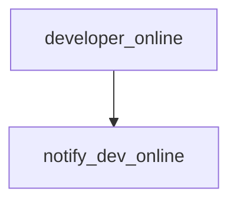

# [Volume 0: Chapter 5: Stream of Consciousness](https://github.com/intel/dffml/blob/alice/docs/tutorials/rolling_alice/0000_architecting_alice/0005_stream_of_consciousness.md)

In this tutorial we use dataflow as class to build Input, Redundancy,
Lock, Operation, and Operation Implementation Networks which interact
with ActiveMQ and Redis. These will enable us to overlay them on
Alice's process local memory resident implementations to facilitate
a shared stream of consciousness.

We then show how two different instances of Alice can communicate where
some operation implementations are instantiated in one process space,
and some in another, we'll then watch them run a simple flow which
print the message "Alice Online" and "Bob Online" to each side.

- Context
  - This tutorial is how we enabled Alice to communicate with
    other instances of herself.
  - Since we each have our own instances of Alice, this is also
    how we can communicate between ourselves.
- Goals
  - Establish dynamic channels for arbitrary data exchange.
- Actions
  - Leverage `dffml-service-http` within an operation to deploy a webhook
    sending and receiving dataflow.
- Future work
  - Notifications to other systems
  - Webrtc overlays
  - SSI DWN if running in OS DecentAlice
  - Extend for further use in pull model dev methodology
- References
  - This tutorial is covered in `Stream of Consciousness: Collective Thought` **TODO** Update with link to recording once made.
  - The resulting commit from completion of this tutorial was: **TODO** Update with link to operations added.
- Feedback
  - Please provide feedback / thoughts for extension / improvement about this tutorial in the following discussion thread: https://github.com/intel/dffml/discussions/1415



```python
def developer_online() -> DeveloperOnlineName:
    return getpass.getuser()

def notify_dev_online(developer: DeveloperOnlineName):
    print(f"{developer.title() Online")
```

Later in Architecting Alice, we'll add in rekor to get data
provenance and put the whole bit behind an HTTP API. We validate data
using SCITT. We could optionally require passes from filter operations.
Could add in more mixins to rekor to check on addition.

In Coach Alice, we'll see these techniques used to support caching of
complex inputs such as directory trees (creating new inputs on load
by inspecting cached state overlayed). Our work with the OpenSSF
means that we'll want to be scanning lots of VCS (git, svn, etc.) repos.
We'll use this to cache those repos and restore repos from cached state,
then run an update for the delta, then save back to cache. This way
we can avoid running the full download for larger repos. Small repos
we can examine past runs to estimate size and just clone every time
to avoid resource usage of caching. This will building on our Architecting Alice
Webhook Based Distributed Compute leveraging Jenkins and the Manifest concept,
as well as the shim.

In Coach Alice we'll also see how we can use this distributed stream
of consciousness to assist with developer communication. We can enable
developers to give Alice dataflows which she runs in the background.
She can then say oh the dev API server restarted (maybe it's your or
your friends laptop running the API, or a real server). This gives
the same impact for both users, a little `notify-send` popup.

We should also make sure to support overlay plugin abilities to revalidate
against any of their dependencies, whenever one of their dependencies changes.
Possibly some kind of service people can set as a webhook which is a sort of
pubsub. The SCM sever such as GitHub publishes webhook events to the service
(`dffml-service-sw-src-change-notify`). The service then relays to any
listeners. Listeners are downstream projects. Downstream projects can register
themselves with the listener to receive change events for any of their
dependencies. Registration involves plugin based configurable callbacks.

- References
  - [intel/dffml#1315: service: sw: src: change: notify: Service to facilitate poly repo pull model dev tooling](https://github.com/intel/dffml/issues/1315#issuecomment-1066814280)
    - Completion of this tutorial is a great first step towards closing this issue
  - [intel/dffml#1016: docs: arch: 2nd and 3rd party plugins](https://github.com/intel/dffml/pull/1061#discussion_r819930461)
    - https://github.com/intel/dffml/pull/1061/files/a7b2b0585862bda883be5f475a50945f91043b2f#diff-c7d7828822f15922ed830bb6f3148edc97c291c809836b1a1808165d36bd8c9dR227-R229
  - [intel/dffml#1207: docs: arch: Inventory](https://github.com/intel/dffml/pull/1207)
  - https://activemq.apache.org/python
    - For Python support we recommend the [Python Stomp Client](http://stomp.github.io/implementations.html)
    - https://stomp.github.io/implementations.html
- TODO
  - [ ] `dffml-service-http` modify request handler code to pass request and app
        to dataflow. Improve passing of flows on start and improve teardown if
        needed or potentially leverage testing code.
- Future
  - Notify on diff to discussion thread or git repo with upleveling
  - Image (container, entity, etc.) downstream build / test / deploy flow
