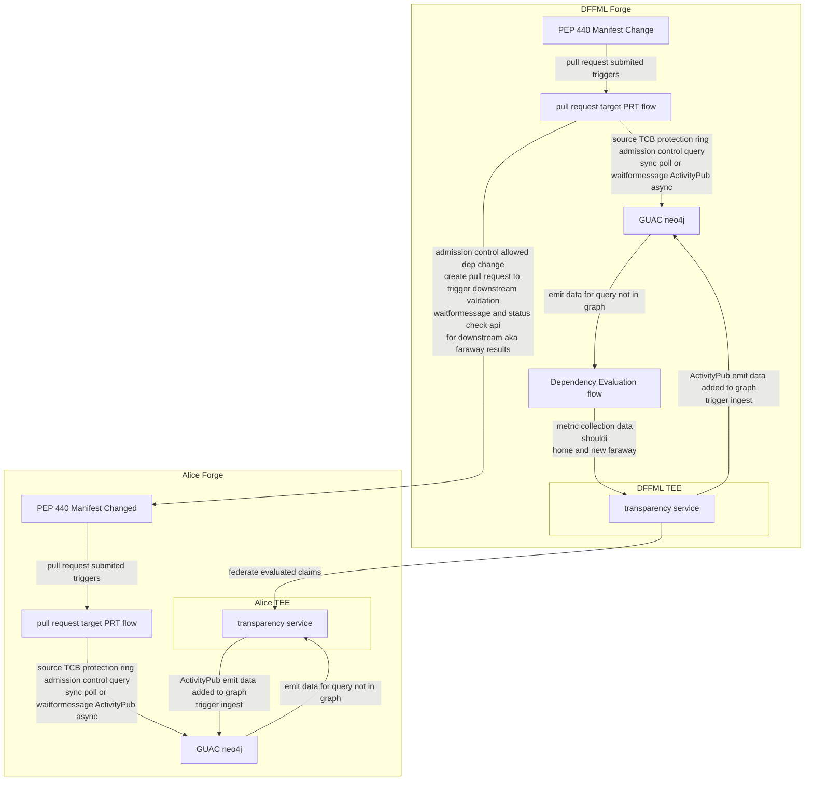

# [Volume 0: Chapter 5: Stream of Consciousness](https://github.com/intel/dffml/blob/alice/docs/tutorials/rolling_alice/0000_architecting_alice/0005_stream_of_consciousness.md)

In this tutorial we use dataflow as class to build Input, Redundancy,
Lock, Operation, and Operation Implementation Networks which interact
with webhook endpoints. These will enable us to overlay them on
Alice's process local memory resident implementations to facilitate
a shared stream of consciousness.

We then show how two different instances of Alice can communicate where
some operation implementations are instantiated in one process space,
and some in another. Bob will hypothesize a new system context. He chooses to
share this hypothesized system context with Alice.

Alice decides if she likes the thought, and what she wants to do about it, if
anything. She may think more on it, resulting in a chain of sub context
executions representing high orders of concepts (clusters of similar strategic
plans analyzed across Entity Analysis Trinity).

- Context
  - This tutorial is how we enabled Alice to communicate with
    other instances of herself.
  - Since we each have our own instances of Alice, this is also
    how we can communicate between ourselves.
- Goals
  - Establish dynamic channels for arbitrary data exchange.
- Actions
  - Leverage `dffml-service-http` within an operation to deploy a webhook
    sending and receiving dataflow.
- Future work
  - Notifications to other systems
  - Webrtc overlays
  - SSI DWN if running in OS DecentAlice
  - Extend for further use in pull model dev methodology
- References
  - This tutorial is covered in `Stream of Consciousness: Collective Thought` **TODO** Update with link to recording once made.
  - The resulting commit from completion of this tutorial was: **TODO** Update with link to operations added.
- Feedback
  - Please provide feedback / thoughts for extension / improvement about this tutorial in the following discussion thread: https://github.com/intel/dffml/discussions/1415

## Game Plan

- Allowlists as dynamic context aware policy as code over provenance of message
  content.
  - Federate over Heartwood the SCITT API emulator by converting the dumped
    format to Endor style Decentralized Identifier and Verifiable Credentials
    stored in a Git version control repository.
  - GUAC collector for SCITT API emulator
    - We leverage GUAC to emit the event into the next phase tcb (2nd party
      promotion). This way we only accept the federated events into our forge
      after policy required trust attestations exist in the graph.
    - GAUC/SCITT and the eventing across the policy engines there effectively act
      as the firewall / audit mechanism.

## Architecture

- Everything you want to federate you just create a receipt for. Since we listen
  for federated transparency log events we tie our running system context to a
  context local instance, this will be all in one address space eventually for a
  given system context execution, aka packaged down to WASM and or freestanding.

> In the following diagram we see Alice's policy engine for dependency analysis.



## Setup

**WARNING: THIS IS A WORK IN PROGRESS AND PROVIDES NO SECURITY GUARANTEES**

- References
  - [`docker-compose.yml`](https://github.com/intel/dffml/tree/alice/examples/tutorials/rolling_alice/federated_forge/alice_and_bob)

```console
$ git clone https://github.com/intel/dffml -b alice
$ cd examples/tutorials/rolling_alice/federated_forge/alice_and_bob/
$ docker-compose up
```

- Alice's Git WebUI: http://127.0.0.0:2000
- Bob's Git WebUI: http://127.0.0.0:3000

Cleanup

```console
$ docker-compose rm -f
$ sudo git clean -xdf .
```

## Sketch Notes

- ActivityPub protos for grpc service / openapi definition
  - Policy Engine (Prioritizer's Gatekeeper/Umbrella) - Defined via [CycloneDX DataFlows](https://github.com/CycloneDX/specification/pull/194)
    - Upstream
      - GUAC + Cypher queries
    - Overlay
      - https://github.com/intel/cve-bin-tool/issues/2639
      - https://github.com/seedwing-io/seedwing-policy/
    - Orchestrator
      - pr-validation
        - https://code.forgejo.org/forgejo/runner/src/branch/main/cmd/exec.go
      - prod / service batch jobs L0
        - https://github.com/ipvm-wg/spec/pull/8
- KERI backed keys for duplicity detection to reboot web of trust off less robust revocation detection mechanisms
  - Publish `releaseartifact.json` to DirectoryBased/Heartwood/ActivityPub security.txt/md stream
    - Others who are committing or online cloning a repo watch those streams (schema in content)
- Setup auto prs
  - Rebuild chains based off SBOM as inventory for building cross linkage to determine downstream validation pattern / hypothesized flows and prs-to-prs required to enable execution, the dependency tree of artifacts.
    - https://github.com/intel/cve-bin-tool/blob/main/.github/workflows/sbom.yml
    - https://github.com/renovatebot/renovate
- Mirror webhook event streams into federated forge environment
  - Upstream changes directly to git
    - Publish federated event corresponding to `git ...` action
      - Federate with more servers/services/nodes for availability.
    - Comms over SSI Service/DWN with KERI backed keys ideally rooted to [TEE enclave keys](https://www.intel.com/content/www/us/en/developer/articles/technical/intel-trust-domain-extensions.html)
    - Watch SCITT stream of peers with ephemeral resync when online KERI watcher
      - Require sync before queries to streams, raft?
- Data transforms
  - ActivityPub --> openapi generator + actogitypub endpoints off cyclonedx -> guac --> cypher mutatuon and ipvm exec chain for analysis --> guac emit activitypub --> forgefed
- Use the SBOM of the cypher query to build the re-trigger flows
  - On query we build and publish SBOM of query, if downstream listeners to they query stream see new system context stream (schema `inReplyTo` or `replies` is query, cache busting inputs if applicable) come in, and similar to a `FROM` rebuild chain that SBOM has not been built, we transform into the manifest which triggers the build, recursively fulfill any dependencies (creating repos with workflows with issue ops or dispatch flows based on upstream and overlays: distro-esq patch-a-package)
    - On complete, federate re-trigger event for original SBOM, publish the same SBOM again
- Hook the write to a given node field to publish schema (can be done in via policy local neo in GraalVM)
  - `SET output.streams.by_schema_shortname.vcs_push = output.streams.by_schema_shortname.vcs_push + {key: n.value}`
- `alice threats listen activitypub -stdin`
  - For now execute with grep and xargs unbuffered for each note from websocket/websocat
  - Alias for dataflow which has ActivityPub based listener (later encapsulate that in dataflow, for now follow self with startkit and others, follow as code)
  - Output via operation which just does `print()` to stdout
    - Publish workflow run federated forge events for each operation / dataflow executed in response
      - Check out their webfinger and inspect the event stream to publish the same way
      - If we still need to use `content` POST to admin endpoint to create new `Note`s

## References

- [CI/CD Event Federation codeberg.org/forgejo/discussions#12](https://codeberg.org/forgejo/discussions/issues/12)
- [RFCv4.1: IETF SCITT: Use Case: OpenSSF Metrics: activitypub extensions for security.txt](https://github.com/ietf-scitt/use-cases/blob/748597b37401bd59512bfedc80158b109eadda9b/openssf_metrics.md#openssf-metrics)

## TODO

- [x] Forges intialized for Alice and Bob
- [ ] ActivityPub events (then using `did:keri:`, then Federated Forge translation).
- [ ] Policy engine leveraging CycloneDX dataflow format and IPVM execution
- [ ] GAUC emmiter for ActivityPub federated event space
- [ ] Feed build server (melange) on SBOM / Dockerfile `FROM` retrigger events

## Next Steps

In Coach Alice, we'll see these techniques used to support caching of
complex inputs such as directory trees (creating new inputs on load
by inspecting cached state overlayed). Our work with the OpenSSF
means that we'll want to be scanning lots of VCS (git, svn, etc.) repos.
We'll use this to cache those repos and restore repos from cached state,
then run an update for the delta, then save back to cache. This way
we can avoid running the full download for larger repos. Small repos
we can examine past runs to estimate size and just clone every time
to avoid resource usage of caching. This will building on our Architecting Alice
Webhook Based Distributed Compute leveraging the Manifest concept.

In Coach Alice we'll also see how we can use this distributed stream
of consciousness to assist with developer communication. We can enable
developers to give Alice dataflows which she runs in the background.
She can then say oh the dev API server restarted (maybe it's your or
your friends laptop running the API, or a real server). This gives
the same impact for both users, a little `notify-send` popup.

We should also make sure to support overlay plugin abilities to revalidate
against any of their dependencies, whenever one of their dependencies changes.
Possibly some kind of service people can set as a webhook which is a sort of
pubsub. The SCM sever such as GitHub publishes webhook events to the service
(`dffml-service-sw-src-change-notify`). The service then relays to any
listeners. Listeners are downstream projects. Downstream projects can register
themselves with the listener to receive change events for any of their
dependencies. Registration involves plugin based configurable callbacks.

- References
  - [intel/dffml#1315: service: sw: src: change: notify: Service to facilitate poly repo pull model dev tooling](https://github.com/intel/dffml/issues/1315#issuecomment-1066814280)
    - Completion of this tutorial is a great first step towards closing this issue
  - [intel/dffml#1016: docs: arch: 2nd and 3rd party plugins](https://github.com/intel/dffml/pull/1061#discussion_r819930461)
    - https://github.com/intel/dffml/pull/1061/files/a7b2b0585862bda883be5f475a50945f91043b2f#diff-c7d7828822f15922ed830bb6f3148edc97c291c809836b1a1808165d36bd8c9dR227-R229
  - [intel/dffml#1207: docs: arch: Inventory](https://github.com/intel/dffml/pull/1207)
  - [IETF SCITT OpenSSF Metrics Use Case](https://github.com/pdxjohnny/use-cases/blob/openssf_metrics/openssf_metrics.md)
    - We'll be feeding in CVE details via metrics and retriggering
      downstream validation (rebuild and redistributed) via stream of
      consciousness. See inventory and 2nd and 3rd party Architecture
      Design Record pull requests for more details.
- TODO
  - [ ] `dffml-service-http` modify request handler code to pass request and app
        to dataflow. Improve passing of flows on start and improve teardown if
        needed or potentially leverage testing code.
- Future
  - Notify on diff to discussion thread or git repo with upleveling
  - Image (container, entity, etc.) downstream build / test / deploy flow
   - Possible aligned tutorial sketch follows: `Rolling Alice: Architecting Alice: Thought Communication Protocol Case Study: DFFML`
     - Examples
       - At 07:34 -7 UTC @pdxjohnny started drafting the tutorial: `Rolling Alice: Coach Alice: You are what you EAT!`
         - Others with the GitHub discussions thread loaded in their browser (at least on desktop) will see updates soon after he edits comments and replies in the thread.
         - https://github.com/intel/dffml/discussions/1406?sort=new#discussioncomment-3883683
      - We will combine GitHub Actions on discussion edit trigger with [`scripts/dump_discussion.py`](https://github.com/intel/dffml/blob/ed4d806cf2988793745905578a0adc1b02e7eeb6/scripts/dump_discussion.py)
      - We will replicate this data to DIDs and run DWN `serviceEndpoint` s as needed.
        - system context as service endpoint or executed locally if sandboxing / orchestrator policy permits.
          - See early architecting Alice Engineering Log lossy cached streams of consciousness for more detail
            - https://www.youtube.com/playlist?list=PLtzAOVTpO2jaHsS4o-sDzDyHEug-1KRbK
       - We will attest data using reusable workflows, OIDC, and sigstore
       - We will run more rekor / fulcio instances
       - We will network via webrtc and DERP
       - We will write orchestration operations / data flows / overlays and use data flow as class to leverage them via double context entry pattern (or some other way to do that).
       - We will see the same effect, but in a more DID based way with abstract implementation / infra
         - This will be mentioned as being a follow on to the tutorial: `Rolling Alice: Architecting Alice: Stream of Consciousness`
           - https://github.com/intel/dffml/blob/alice/docs/tutorials/rolling_alice/0000_architecting_alice/0005_stream_of_consciousness.md
         - Alice will filter by updates relevant to the downstream receiver of events based on their current state, context, etc.
           - https://twitter.com/SergioRocks/status/1580545209678454784
             - > 
         - She will notify or etc. as appropriate based off prioritizer's thoughts on 
           -  **TODO** implement the prioritizer concept as another tutorial
         - Similar to "Bob Online" or "Alice Online" message from webhook based tutorial but ran through data flow / overlayed logic to determine relevance and what to do / say. Also it's now including Decentralized Web Nodes and DIDs. Possible next step / future in this (aligned clusters) train of thought would be:
           - KERI encapsulation over arbitrary channels
           - NLP to summarize git log changes
             - Hook up to git log
           - CI integration to serialize to sensible information format
         - Eventually Alice will be able to tell us whatever we want to know.
           - In the future (current date 2022-10-15), when you want to know something
             about Alice, she'll be able to tell you, because she knows about her
             own codebase, and she has solid foundations for security and trust and
             alignment with your strategic principles / values. She's a trustworthy
             messenger, the Ghost in the shell.
           - See discussion thread (or the thread dump in `docs/arch/alice/discussion`)
             - https://github.com/intel/dffml/tree/alice/docs/arch/alice/discussion
               - `$ git log -p --reverse -p -- docs/arch/alice/discussion`
             - https://github.com/intel/dffml/discussions/1369
