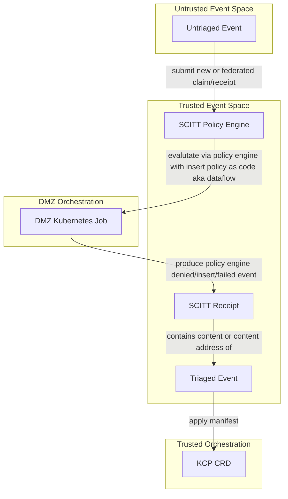
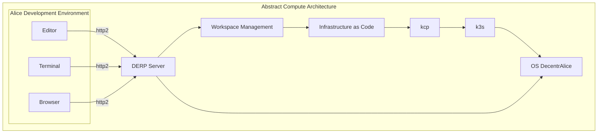

# Volume 0: Chapter 5: Stream of Consciousness

```bash
$ (while [ ! -f stop ]; do websocat --exit-on-eof --basic-auth admin:$(cat ../password) wss://vcs.activitypub.securitytxt.dffml.chadig.com/listen/websocket | tee -a untriagged_events; done) &
$ python -m venv .venv
$ . .venv/bin/activate
$ echo "Clone DFFML/Alice at pinned state of art" \
  && set -x \
  && export TARGET_DIR=dffml \
  && export TARGET_REPO_URL=https://github.com/intel/dffml \
  && export TARGET_COMMIT=$(curl -sfL https://github.com/intel/dffml/raw/alice/entities/alice/README.rst | grep 'ALICE_STATE_OF_ART=' | sed -e 's/.*=//') \
  && mkdir -p "${TARGET_DIR}" \
  && cd "${TARGET_DIR}" \
  && git init \
  && git remote add origin "${TARGET_REPO_URL}" \
  && git fetch origin "${TARGET_COMMIT}" --depth 1 \
  && git reset --hard "${TARGET_COMMIT}" \
  && python -m pip install \
    --no-cache \
    -e . \
    -e entities/alice[dev] \
    -e examples/shouldi/ \
    -e feature/git/ \
    -e operations/innersource/ \
    -e configloader/yaml/ \
  && cd -
$ echo "Clone SCITT API emulator at pinned to pdxjohnny policy_engine branch HEAD as of 2023-03-31 09:54-7:00" \
  && set -x \
  && export TARGET_DIR=scitt-api-emulator \
  && export TARGET_REPO_URL=https://github.com/scitt-community/scitt-api-emulator \
  && export TARGET_COMMIT=2787820abf3fa4701bc46a9629cd98d11254fbe6 \
  && mkdir -p "${TARGET_DIR}" \
  && cd "${TARGET_DIR}" \
  && git init \
  && git remote add origin "${TARGET_REPO_URL}" \
  && git fetch origin "${TARGET_COMMIT}" --depth 1 \
  && git reset --hard "${TARGET_COMMIT}" \
  && python -m pip install \
    --no-cache \
    -e . \
    -r dev-requirements.txt \
  && cd -
$ export SCITT_API_EMULATOR_WORKSPACE="$(mktemp -d)"
$ mkdir -p "${SCITT_API_EMULATOR_WORKSPACE}/storage/operations/"
$ scitt-emulator server --workspace "${SCITT_API_EMULATOR_WORKSPACE}/" --tree-alg CCF --use-lro
$ scitt-emulator client create-claim --issuer did:web:example.com --content-type application/json --payload '{"sun": "yellow"}' --out claim.cose
$ scitt-emulator client submit-claim --claim claim.cose --out claim.receipt.cbor
```

- The following is a simple two
  [ring](https://en.wikipedia.org/wiki/Protection_ring) abstract trusted
  computing base.



- It's all the signal
  - New data event (set of neurons fire)
  - Data transforms (downstream neurons fire)
  - Fail safe conclusion
    - Add to vetted set via insertion of correct `Content-Type` to transparency service
      - `application/credential+ld+json`
- [`kind-config.yml`](https://github.com/intel/dffml/tree/alice/examples/tutorials/rolling_alice/transparency_service/kubernetes_dataflow_policy_engine)

```console
$ kind create cluster --name=nodes-test --config=https://github.com/intel/dffml/raw/alice/examples/tutorials/rolling_alice/transparency_service/kubernetes_dataflow_policy_engine/kind-config.yml
```

- References
  - https://github.com/intel/dffml/pull/1207#discussion_r1036680987
    - Alice is you. What do you have access too?
      - webrtc media stream of desktop
        - extension in browser
        - search
      - vetting of information (gatekeeper/prioritizer)
        - tutorial: Stream of Consciousness
      - codegen synthesis
      - offline RL
        - copy on write dataflow / system contexts for strategic plan evaluation for RL training on those predicted outputs
      - start with max_ctxs=1



- DFFML
  - Write operations, use octx.ictx directly:
    - memory_input_network_input_context_to_dict
      - dict_to_json
      - dict_to_did_serialized
        - Takes Credential Manifest (and wallet ref?)
    - memory_ memory_ memory_input_network_input_context_merge_from_dict
      - dict_from_json
      - dict_to_did_serialized
        - Takes Credential Manifest? Or JSON-LD / graphql-ld or maybe just data flow to validate verifiable credentials needed are present (and wallet ref?)
        - https://w3c.github.io/did-rubric/
    - memory_input_network_serve_strawberry_graphql
    - graphql_query
    - watch_for_compute_contracts
      - Watch stream of consciousness for new compute contracts read / verify via container image on demand registry
  - Eventually overlay for input network and associated operations to keep more performant series snapshot data. `List[memory_input_network_input_context_to_dict.outputs.result]` for each change to the input network. Enables rollback to any point as cached state or modification throughout.
- DID
  - https://github.com/orgs/w3c/repositories?language=&q=did&sort=&type=all
  - https://w3c.github.io/did-imp-guide/
  - https://github.com/w3c/did-spec-registries/compare/main...pdxjohnny:did-spec-registries:open-architecture-and-alice
    - Need to understand if this is appropriate
      - Goal: Define how DID operations could be used to execute the content addressable contracts
        - See kontian.me references and notes towards bottom of today's engineering logs
          - `did:alice:sha256:01`
          - https://identity.foundation/keri/did_methods/
          - https://w3c.github.io/did-rubric/
- KCP
  - https://github.com/kcp-dev/kcp
    - > kcp is a Kubernetes-like control plane focusing on: A control plane for many independent, isolated "clusters" known as workspaces
    - Great, this could satisfy our workspace manager component requirement
      within the abstract compute architecture.
      - Add to OS DecentrAlice
        - Need to figure out how to DWN network on boot and establish webrtc channels
          (or other channels).
        - Need to figure out how to automate and make cluster config / discovery dynamic
          and transparent on each running user instance of OS DecentrAlice.
          - Enable two use cases
            - Automated deployment, autostart on boot systemd config UNIX socket for kcp
            - End user on system, autostart on boot user login systemd config UNIX socket for kcp
  - https://docs.kcp.io/kcp/main/investigations/self-service-policy/
  - https://docs.kcp.io/kcp/main/developers/using-kcp-as-a-library/
  - https://book.kubebuilder.io/cronjob-tutorial/controller-implementation.html
