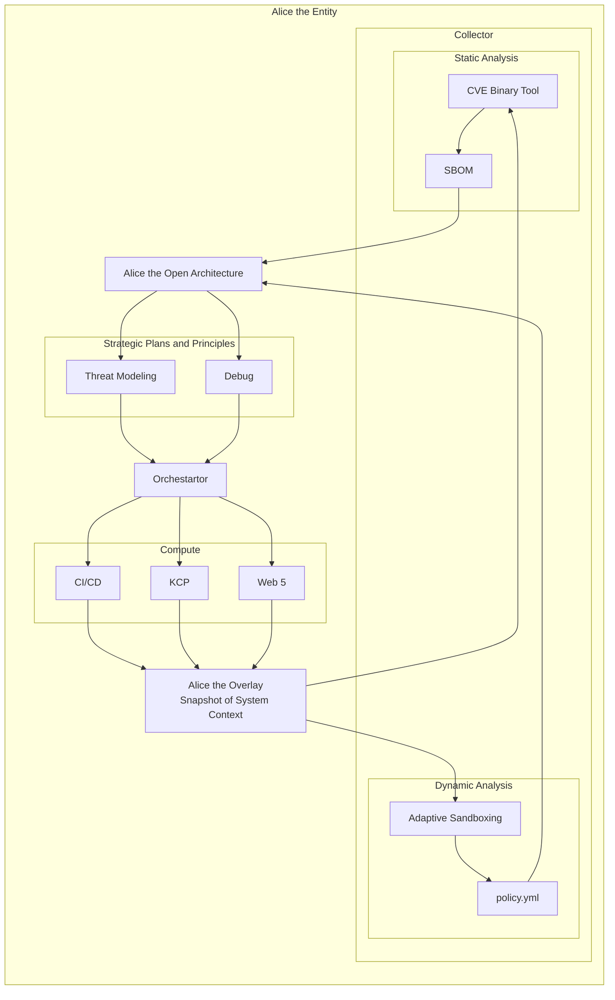

# [Rolling Alice: Volume 0: Introduction and Context](https://github.com/intel/dffml/blob/alice/docs/tutorials/rolling_alice/0000_architecting_alice)

> Introduction and Context to tutorial series - Started May 2022.
>
> Check here for overview and status updates: https://www.youtube.com/playlist?list=PLtzAOVTpO2jZltVwl3dSEeQllKWZ0YU39

Together we'll build Alice the AI software architect. We'll be successful when Alice successfully maintains a codebase as the only maintainer for a year. Debugging issues, writing fixes, reviewing code, accepting pull requests, refactoring the code base post PR merge, dealing with vulnerabilities, cutting releases, maintaining release branches, and completing development work in alignment with the plugin's universal blueprint (aka [Open Architecture](https://github.com/intel/dffml/blob/alice/docs/arch/0009-Open-Architecture.rst)). She will modify, submit pull requests to, and track upstreaming of patches to her dependencies to achieve the cleanest architecture possible. We'll interact with her as we would any other remote developer.

To build the foundations of Alice's thought processes we'll rely heavily on a mental model based on how humans think and problem solve. By the end of this series we'll have ensured Alice has all the primitive operations she requires to carry out the scientific process.

We'll visualize her thought processes and develop understanding of how we can best interact with her to extend her capabilities. By the end of Volume 4 Alice will have joined us as a developer on the DFFML project, maintaining one of it's plugins. Each quarter throughout the year we'll survey the user community of the repo she's been maintaining to get their feedback on her performance. Once we've determined Alice is ready, we'll allow her to interact with communities beyond our own. The conclusion of our series will not be an end, but a new beginning. By the time Alice is rolling we'll be through the looking glass. She'll author Volume 7, and we'll find out what happens next.

### Table Of Contents

- [Upstream](https://github.com/intel/dffml/tree/alice/entities/alice)
- [Rolling Alice](../)
- [Forward](../0000_forward.md)
- [Preface](../0000_preface.md)
- [Volume 0: Architecting Alice](../0000_architecting_alice)
- [Volume 1: Coach Alice](../0001_coach_alice)
- [Volume 2: Alice and the Art of Strategy](../0002_alice_and_the_art_of_strategy)
- [Volume 3: Alice and the Strategy of Art](../0003_alice_and_the_strategy_of_art)
- [Volume 4: Alice and the Health of the Ecosystem](../0004_alice_and_the_health_of_the_ecosystem)
- [Volume 5: Alice's Adventures in Wonderland](../0005_alices_adventures_in_wonderland)
- [Volume 6: Alice are you Rolling?](../0006_alice_are_you_rolling)
- [Volume 7: Through the Looking Glass](../0007_through_the_looking_glass)

### What is Alice?

Alice is an architecture for code that will write and maintain itself based off of a standard description of architecture, a universal blueprint, the open architecture. As such Alice is both an AI software architect and the AI software's architecture itself. The universal blueprint is universal because it's intuitive enough that anyone can begin using it quickly after the correct way of communicating to that individual is established via some communication method (spoken language, visual of some kind, text, etc.). This universal blueprint is an abstraction layer between descriptions of architecture within different domain specific representations for subcomponents as required to fully describe the system.

This universal blueprint (system context) is an integral part of creating a shared language for meaning and intent between humans and an Artificial General Intelligence. The goal is to provide an architecture and implementation for independent entities which act in accordance with guiding strategic plans/blueprints. This architecture must be safe and secure by default, scalable, and easily extensible.

We focus on Supply Chain Security because it will help us create a compute network suitable for various edge deployment scenarios. Edge deployment scenarios being the usage of all assets she has at her disposal. Supply Chain Security is also where she'll gain comprehension of security via intent, dynamic analysis, metrics collection, creation, and evaluation of provenance.

The end goal is to create a software architect, Alice. She will consult on existing projects to provide analysis of their architectures and properties such as maintainability, provide guidance for developer workstream prioritization to achieve strategic business goals, and write and maintain codebases herself, accepting contributions from external contributors.

### Entity Analysis Trinity

We leverage the Entity Analysis Trinity to help us bridge the gap between
our technical activities and processes and the conceptual model we are
following as we analyze the softare / system / entity over it's lifecycle.

### Terminology

- Open Architecture
  - Universal Blueprint
  - Standard architecture we use to describe anything. Provides the ability to use / reference domain specific architectures as needed to define architecture of whole.
  - https://github.com/intel/dffml/blob/alice/docs/arch/0009-Open-Architecture.rst
- Think
  - Come up with new data flows and system context input
- Thoughts
  - Data Flows and system context input pairs (these two plus orchestration config we get the whole system context)
- Downstream Validation
  - Running validation on all dependent packages to check for API breakages or regressions in the ecosystem

### Expectations

Alice is going to be held to very high standards. We should expect this list to grow for a long time (years). This list of expectations may at times contain fragments which need to be worked out more and are only fragment so the ideas don't get forgotten. 

- Alice should be able to work on any project as a remote developer
  - She should be able to make changes to projects following the branch by abstraction methodology
  - When she works on a github issue she'll comment what commands she tries and what files she modifies with diffs
- Alice will maintain a system which allows her to respond to asynchronous messages
  - Likely a datastore with the ability to listen for changes
  - Changes would be additions of messages from different sources (email, chat, etc.)
- Alice should be able to accept a meeting, join it, and talk to you
  - If Alice notices conversation getting off topic, she could interject to ask how it relates, and then update references in docs to that effect.
  - You should be able to have a conversation about a universal blueprint and she should be able to go act on it.
  - She should be able to analyze any codebase you have access to live and build and walk you through architecture diagrams
  - Alice build me a linux distro with these versions of these applications deploy it in a VM in QEMU, show me the screen while it's booting. Then give me control of it via this meeting. ... Okay now snapshot and deploy to XYZ CSP.
    - She should figure out how to validate that she has a working linux distro by overlaying discovered tests with intergration tests such as boot check via qemu serial.
  - Alice, spin up ABC helm charts and visualize the cluster (viewing in an AR headset)
  - Alice, let's talk about the automating classification web app included in the example.
    - Alice, give us an overview of the threats on our database, deploy the prod backup to a new environment. Attempt to exploit known threats and come up with new ones for the next 2 weeks. Submit a report and presentation with your findings. Begin work on issues found as you find them.
  - What are our biggest tome syncs between issue creation to delivery of fix to associated users?
- We should be able to see Alice think and understand her trains of thought
  - If Alice is presenting and she estimates thinking of the correct solution will take longer than a reasonable time her next word is expected by to keep regular conversational cadence, she should either offer to brainstorm, work through it and wait until it makes sense to respond, maybe there are situations where the output is related to saving someone's life, then maybe she interupts as soon as she's done thinking. Provided she didn't detect that the train of thought which was being spoken about by others was not of higher prioritiy than her own (with regards to lifesaving metrics).

### Alice's Understanding of Software Engineering

We'll teach Alice what she needs to know about software engineering though our InnerSource series. She'll follow the best practices outlined there. She'll understand a codebase's health in part using InnerSource metric collectors.

Alice will see problems and look for solutions. Problems are gaps between the present system capabilities and desired system capabilities or interpretations of outputs of strategic plans which are unfavorable by the strategic decision maker or the prioritizer.

### Naming

You can name it or call it whatever you like. This tutorial series will call it Alice. Alice will be used to refer to the entity carrying out this job of maintainer. The name Alice will also be used to refer to the AGI in general, the architecture through which one can instantiate arbitrary entities. In effect, the whole bit is arbitrary, and you can call it whatever you like.

Being that Alice is the nickname for both our an entity and the architecture in general. Alice when used in reference to the architecture is a stand in for the the technical term for the architecture. Not sure what the right technical term is right now. Maybe something like: data centric fail safe architecture for artificial general intelligence.

The original usage of DFFML was nicknamed George. George analyzed open source dependencies. This was his "job". 

Alice's Adventures in Wonderland is in the public domain, which is a great reason to leverage it for reuse. It's all over the place, just massive chaos, nothing makes sense. Alice navigates the chaos.

Also, in cryptography Alice and Bob are already commonly used names. So there's some shared understanding in the community that Alice is the name of a theoretical entity.

Also when George got a name people started liking him a lot more, talking positively about him, making quips about him. It's just more fun to give the inanimate object a name. Or a personality, oh George doesn't like that repo! I'm sure Alice would agree that things are a lot more interesting when inanimate objects have names and personalities.

References:

- https://www.alice.org/about/
  - > **Why is it called Alice?**
    > 
    > “This is one of my favorite questions. It always lets me know the question asker is thinking in the correct direction. After all, the ability to name something is a tremendous power, and in this case, there’s a terrific reason.
    >
    > Alice pays homage to Lewis Carroll, author of Alice’s Adventures in Wonderland and Through the Looking Glass. Carroll was a mathematician, novelist, and photographer. Most important, he could do intellectually difficult things but also realized the most powerful thing was to be able to communicate clearly and in an entertaining way. This inspires our efforts to make something as complex as computer programming easy and fun.
    >
    > The name is also a very practical choice. The artwork associated with the Alice books is now in the public domain, its copyright having lapsed. Also, the name “Alice” has several other advantages:
    >
    > – It is easy to spell.
    >
    > – It is easy to pronounce.
    >
    > – It shows up near the top of alphabetical lists.”
    >
    >  Randy Pausch
- https://github.com/w3c-ccg/did.actor/tree/3fe99eec616b71d7fc36c5603235eeac81c91652/alice
