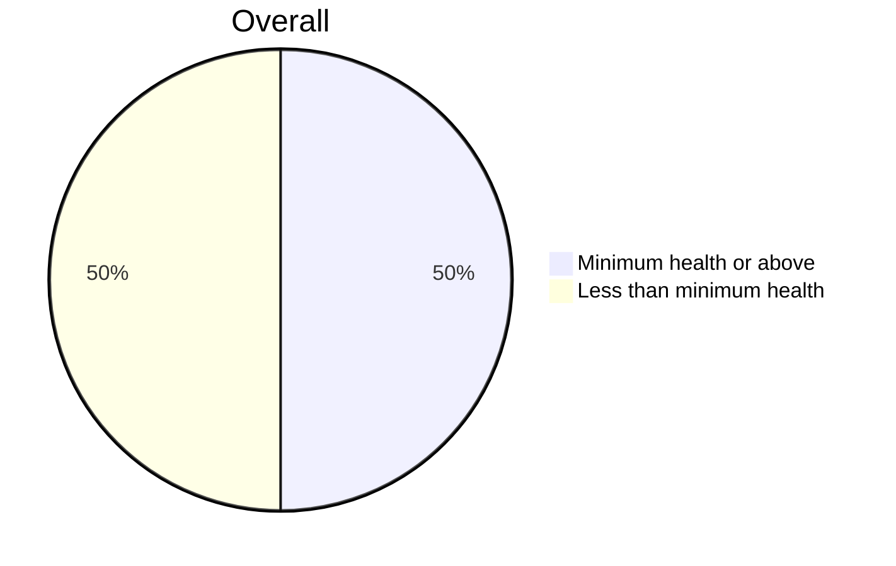
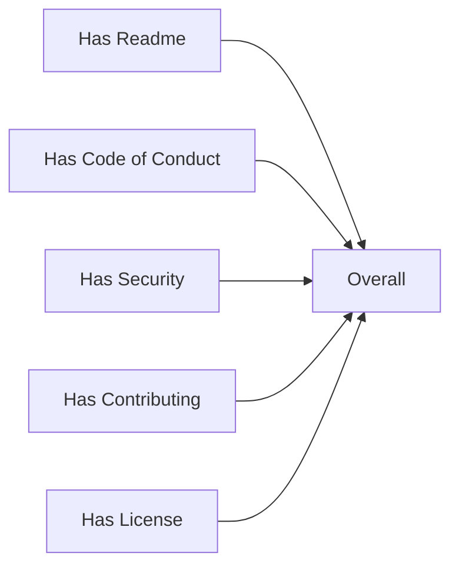

# Volume 1: Chapter 3: Strategic Principles as Game Plan

We'd like to be able to ask Alice for a rolled up view of how our org
health looks. When we run the following command, we want her to
produce a markdown file, `INNERSOURCE.md`, which describes the health
of the org at the scope desired. By default this is the repo scope,
this would mean the repo and it's dependencies.

At time of writing we do not yet have dependency tree creation flushed
out from ShouldI / CVE Bin Tool / SBOM traversal. We will instead add
an overlay which specifies we should pull repos to report on from the
source which we developed for the InnerSource collector example.

```console
$ alice please contribute report on innersource health
```

- References
  - [intel/dffml#1287: docs: examples: innersource: Org health and issue prioritization](https://github.com/intel/dffml/issues/1287)
  - [intel/dffml#1315: service: sw: src: change: notify: Service to facilitate poly repo pull model dev tooling #1315](https://github.com/intel/dffml/issues/1315#issuecomment-1066814280)
    - [Rolling Alice: Architecting Alice: Stream of Consciousness](../../0000_architecting_alice/0005_stream_of_consciousness.md)

The following is an example report

---

# InnerSource Org Health

Overall maps to our general Good/Bad for a train of thought.

`"Minimum health or above"` if `has_readme and has_contributing`



Show dataflow of only connections to the overall calculation.



<details>
<summary>Links to Repo Metric Visualizations</summary>

| Repo                           | Report URL                                         |
|--------------------------------|----------------------------------------------------|
| https://github.com/intel/dffml | https://chadig.com/did/repo/github.com/intel/dffml |
| https://github.com/intel/dffml | https://nahdig.com/did/repo/github.com/intel/dffml |

</details>
