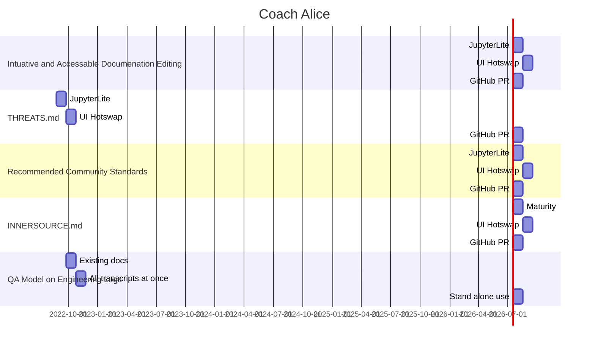

# [Rolling Alice](https://github.com/intel/dffml/blob/alice/docs/tutorials/rolling_alice/)

> This is Alice's plan. We are building her as a community, reach out
> if you want to get involved. Start contributing by reviewing or pull
> requesting the `alice` branch.
>
> Pull request https://github.com/intel/dffml/pull/1401
> we will be the central point for communications discussing Alice
> until she is merged into the `main` branch. At which point
> communications will branch off in a decentralized fashion reflective
> of her overlay (plugin) ecosystem.

The following seven sets of tutorials describe the adventures of Alice as she
returns to Wonderland. Where's Wonderland? Well that's where we are,
the physical world. We'll travel through through time and space as we
watch her come into this world. We'll work with her and with each
other to build the best possible community we can. A community where
we have entered the fully connected development model.

In our community of the future, Alice will be seen as one of us,
another remote developer. We'll each have our own copies of Alice,
who can be named Bob, or Eve, or anything. All these entities will
be seen just like Alice, just like all of us. There will be no way
to tell which entities are human and which are machine.

They say you don't really know something until you can teach it.
If we understand how to be human we will be able to teach Alice
how to be human. Her thought process is a methodology for problem
solving which is based off a mental model of how the human mind
interacts with the world. Alice the architecture is just the
existing best known architecture, what use everyday, all the time.
Alice is the [Open Architecture](https://github.com/intel/dffml/blob/alice/docs/arch/0009-Open-Architecture.rst),
she is the architecture of us all.
We'll learn from Alice, and Alice will learn from us as she comes
into our time.

Roll Alice with us, for humanity, enter the machine.

### Table Of Contents

- [Upstream](https://github.com/intel/dffml/tree/alice/entities/alice)
- [Rolling Alice](./)
- [Forward](0000_forward.md)
- [Preface](0000_preface.md)
- [Volume 0: Architecting Alice](0000_architecting_alice)
- [Volume 1: Coach Alice](0001_coach_alice)
- [Volume 2: Alice and the Art of Strategy](0002_alice_and_the_art_of_strategy)
- [Volume 3: Alice and the Strategy of Art](0003_alice_and_the_strategy_of_art)
- [Volume 4: Alice and the Health of the Ecosystem](0004_alice_and_the_health_of_the_ecosystem)
- [Volume 5: Alice's Adventures in Wonderland](0005_alices_adventures_in_wonderland)
- [Volume 6: Alice are you Rolling?](0006_alice_are_you_rolling)
- [Volume 7: Through the Looking Glass](0007_through_the_looking_glass)

## Roadmap

> Haven't done this before with the gantt chart, needs more work.

