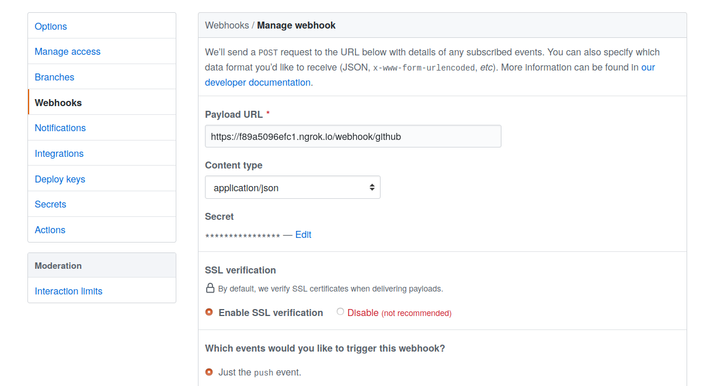

.. _usage_webhook:

Redeploying on receving GitHub webhook
======================================

We'll move ``ffmpeg`` to a GitHub repo, and set up a webhook DataFlow such that whenever
we push to the default branch, the new version is pulled and its docker container is built and run.

Webhook Dataflow
----------------

We'll be using operations from ``dffml-operations-deploy``, ``dffml-feature-git``, ``dffml-config-yaml``.

.. code-block:: console

    $ pip install dffml-operations-deploy dffml-feature-git dffml-config-yaml

Setup a http server in ``ffmpeg/deploy/webhook``, to receive webhook and redploy ffmpeg

.. code-block:: console

    $ mkdir -p deploy/webhook/df deploy/webhook/mc/http
    $ cat > /tmp/operations <<EOF
    get_url_from_payload
    clone_git_repo
    check_if_default_branch
    get_image_tag
    get_running_containers
    get_status_running_containers
    parse_docker_commands
    docker_build_image
    restart_running_containers
    cleanup_git_repo
    EOF
    $ dffml dataflow create -config yaml $(cat /tmp/operations) > deploy/webhook/df/webhook.yaml

Config

**deploy/webhook/mc/http/webhook.yaml**

.. code-block:: console

    $ cat > ./deploy/webhook/mc/http/webhook.yaml <<EOF
    path: /webhook/github
    output_mode: json
    input_mode: json:git_payload
    EOF

Note that the input_mode is ``json:git_payload``, this means that inputs from post request will
be parsed as JSON and then forwarded to dataflow as the ``git_payload`` definition..

Deploy it in port 8081 as 8080 is being used by ffmpeg http service

.. code-block:: console

    $ dffml service http server -insecure -mc-config deploy/webhook -port 8081

.. note::

    If you're not setting this up on a server directly accessible on the internet,
    here are two methods of exposing the webhook,

    Using `localhost.run <https://localhost.run>`_

    .. code-block:: console

        $ ssh -R 80:localhost:8081 $RANDOM@ssh.localhost.run

    .. image:: ./images/localhost_run.png

    Using ngrok

    .. code-block:: console

        $ ~/ngrok http 8081

    .. image:: ./images/ngrok_out.png

Copy paste the output url to ``Payload URL`` in webhook settings of ffmpeg repo.

Now whenever there's a push to the default branch of the repo, the ffmpeg container
which is running gets redeployed from the fresh pull. To check this we will modify the
end time of the conversion from 10 to 12 in ``ffmpeg/operations.py`` by changing

.. code-block:: python

    proc = await asyncio.create_subprocess_exec(
        "ffmpeg",
        "-ss",
        "0.3",
        "-t",
        "10",
        ..
        ..
    )

to

.. code-block:: python

    proc = await asyncio.create_subprocess_exec(
        "ffmpeg",
        "-ss",
        "0.3",
        "-t",
        "12",
        ..
        ..
    )

on pushing the changes to our repo, the container will be redeployed. To verify this run
``docker ps`` and check the up time of the container.
