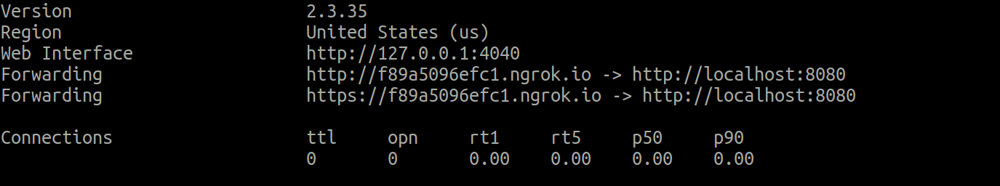

Redeploying on receving github webhook
======================================

We'll move  ``ffmpeg`` to a github repo,and set up the webhook dataflow such that whenever we push
to the default branch,the new version is pulled and a docker container is build and run with this
new version.

Deploying on docker container
-----------------------------

We'll first setup a docker container for running ffmpeg http service.A ``Dockerfile`` is
already generated in ffmpeg.We need to modify it to include ``ffmpeg``.

**Dockerfile**

.. literalinclude:: /../examples/ffmpeg/Dockerfile

.. note::
    The run command in the comment section of the Dockerfile will be used to execute
    the container after receving webhooks,so make sure you change it to your usecase.

For this tutorial we will change it to

.. code-block:: console

    docker run --rm -d -v ~/Videos:/usr/src/app/data -ti -p 8080:8080 aghinsa/ffmpeg \
        -mc-config deploy -insecure -log debug

you should replace ``aghinsa/ffmpeg`` with your ``USERNAME/REPONAME``,in both run and build commands,in cli
and in comment section of ``Dockerfile``.

The additional flags are:

    - -d : start the container in detached mode
    - -v : map the directory ``~/Videos`` in host to ``/usr/src/app/data`` in container

.. note::
    The image built after pulling the contaier will be taged ``USERNAME/REPONAME``,where USERNAME and REPONAME
    are gathered from the github html url,received in the webhook.

We can run the container and sent a post request like we did in :ref:`usage_ffmpeg_deploy_serve`
to verify that the container is working.

.. code-block:: console

    $ docker build -t USERNAME/REPONAME .
    $ docker run --rm -d -v ~/Videos:/usr/src/app/data -ti -p 8080:8080 USERNAME/REPONAME -mc-config deploy -insecure -log debug

.. code-block:: console

    $ curl -s \
    --header "Content-Type: application/json" \
    --request POST \
    --data '{"convert": [{"value":"./data/input.mp4","definition":"input_file"},
    {"value":"./data/output.gif","definition":"output_file"},
    {"value":1920,"definition":"resolution"}]}' \
    http://localhost:8080/ffmpeg

Dataflow for redploying
-----------------------

We'll be using operations from ``dffml_operations_deploy`` and ``dffml_feature_git``.

.. code-block:: console

    $ pip install dffml-operations-deploy dffml-feature-git

Setup a http server in ``ffmpeg/deploy/webhook``, to receive webhook and redploy ffmpeg

.. code-block:: console

    $ mkdir -p deploy/webhook/df deploy/webhook/mc/http
    $ cat > /tmp/operations <<EOF
    get_url_from_payload
    clone_git_repo
    check_if_default_branch
    get_image_tag
    get_running_containers
    get_status_running_containes
    parse_docker_commands
    docker_build_image
    restart_running_containers
    cleanup_git_repo
    EOF
    $ dffml dataflow create -config yaml $(cat /tmp/operations) > deploy/webhook/df/webhook.yaml

Config

**deploy/webhook/mc/http/webhook.yaml**

.. code-block:: console

    $ cat > ./deploy/webhook/mc/http/webhook.yaml <<EOF
    path: /webhook/github
    presentation: json
    asynchronous: false
    input_mode: json:git_payload
    EOF

Note that the input_mode is ``json:git_payload``,this means that inputs from post request will
be forwarded to dataflow as json with ``git_payload`` definition.

Deploy it in port 8081 as 8080 is being used by ffmpeg http service

.. code-block:: console

    $ dffml service http server -insecure -mc-config deploy/webhook -port 8081

.. note::
    If you're not setting this up on a server directly accessible on the internet,
    here are two methods of exposing the webhook, https://localhost.run and https://ngrok.com .

using ngrok

.. code-block:: console

    $ ~/ngrok http 8081

Copy paste the output url to ``Payload URL`` in webhook settings of ffmpeg repo.

.. image:: ./images/github_settings.png

Now whenever theres a push to the default branch of the repo the ffmpeg container which is running,
get redeployed from the fresh pull.To check this we can change the end time of the conversion from 10
to 12 in ``ffmpeg/operations.py`` by changing

.. code-block:: python

    proc = await asyncio.create_subprocess_exec(
        "ffmpeg",
        "-ss",
        "0.3",
        "-t",
        "10",
        ..
        ..
    )

to

.. code-block:: python

    proc = await asyncio.create_subprocess_exec(
        "ffmpeg",
        "-ss",
        "0.3",
        "-t",
        "12",
        ..
        ..
    )

on pushing the changes to our repo,the container will be redeployed.To verify this run
``docker ps`` and check the up time of the container.

