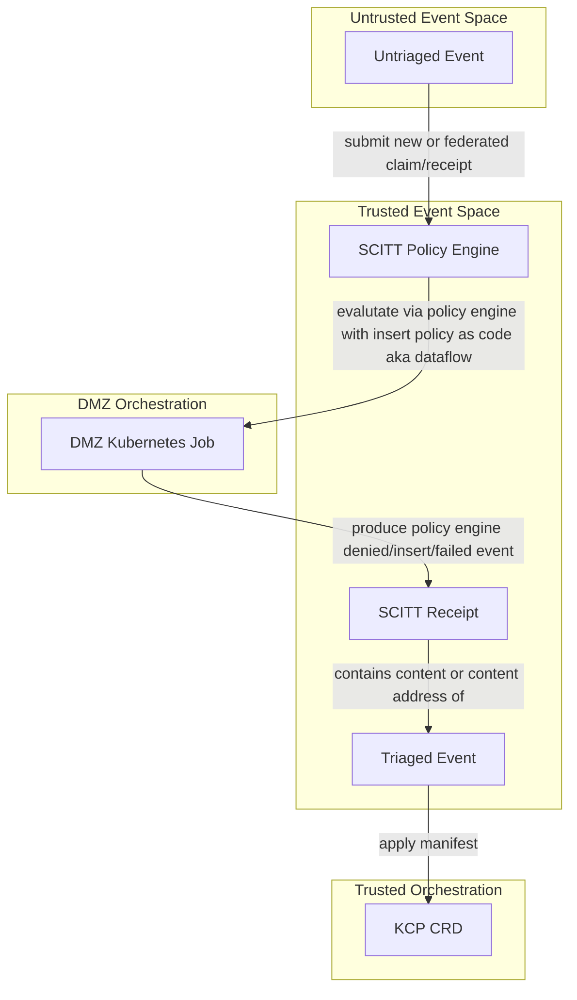

# Transparency Service: DataFlow Policy Engine in Kubernetes Orchestration

```bash
$ (while [ ! -f stop ]; do websocat --exit-on-eof --basic-auth admin:$(cat ../password) wss://vcs.activitypub.securitytxt.dffml.chadig.com/listen/websocket | tee -a untriagged_events; done) &
$ python -m venv .venv
$ . .venv/bin/activate
$ echo "Clone DFFML/Alice at pinned state of art" \
  && set -x \
  && export TARGET_DIR=dffml \
  && export TARGET_REPO_URL=https://github.com/intel/dffml \
  && export TARGET_COMMIT=$(curl -sfL https://github.com/intel/dffml/raw/alice/entities/alice/README.rst | grep 'ALICE_STATE_OF_ART_COMMIT=' | sed -e 's/.*=//') \
  && mkdir -p "${TARGET_DIR}" \
  && cd "${TARGET_DIR}" \
  && git init \
  && git remote add origin "${TARGET_REPO_URL}" \
  && git fetch origin "${TARGET_COMMIT}" --depth 1 \
  && git reset --hard "${TARGET_COMMIT}" \
  && cd "${TARGET_DIR}/entities/alice" \
  && python -m pip install \
    --no-cache \
    -e .[dev] \
    -e ../../ \
    -e ../../examples/shouldi/ \
    -e ../../feature/git/ \
    -e ../../operations/innersource/ \
    -e ../../configloader/yaml/ \
  && cd -
$ echo "Clone SCITT API emulator at pinned to pdxjohnny policy_engine branch HEAD as of 2023-03-31 09:54-7:00" \
  && set -x \
  && export TARGET_DIR=scitt-api-emulator \
  && export TARGET_REPO_URL=https://github.com/scitt-community/scitt-api-emulator \
  && export TARGET_COMMIT=2787820abf3fa4701bc46a9629cd98d11254fbe6 \
  && mkdir -p "${TARGET_DIR}" \
  && cd "${TARGET_DIR}" \
  && git init \
  && git remote add origin "${TARGET_REPO_URL}" \
  && git fetch origin "${TARGET_COMMIT}" --depth 1 \
  && git reset --hard "${TARGET_COMMIT}" \
  && cd "${TARGET_DIR}" \
  && python -m pip install \
    --no-cache \
    -e . \
    -r dev-requirements.txt \
  && cd -
$ export SCITT_API_EMULATOR_WORKSPACE="$(mktemp -d)"
$ mkdir -p "${SCITT_API_EMULATOR_WORKSPACE}/storage/operations/"
$ scitt-emulator server --workspace "${SCITT_API_EMULATOR_WORKSPACE}/" --tree-alg CCF --use-lro
$ scitt-emulator client create-claim --issuer did:web:example.com --content-type application/json --payload '{"sun": "yellow"}' --out claim.cose
$ scitt-emulator client submit-claim --claim claim.cose --out claim.receipt.cbor
```

- The following is a simple two
  [ring](https://en.wikipedia.org/wiki/Protection_ring) abstract trusted
  computing base.



- It's all the signal
  - New data event (set of neurons fire)
  - Data transforms (downstream neurons fire)
  - Fail safe conclusion
    - Add to vetted set via insertion of correct `Content-Type` to transparency service
      - `application/credential+ld+json`
- References
  - https://docs.kcp.io/kcp/main/investigations/self-service-policy/
  - https://docs.kcp.io/kcp/main/developers/using-kcp-as-a-library/
  - https://book.kubebuilder.io/cronjob-tutorial/controller-implementation.html
